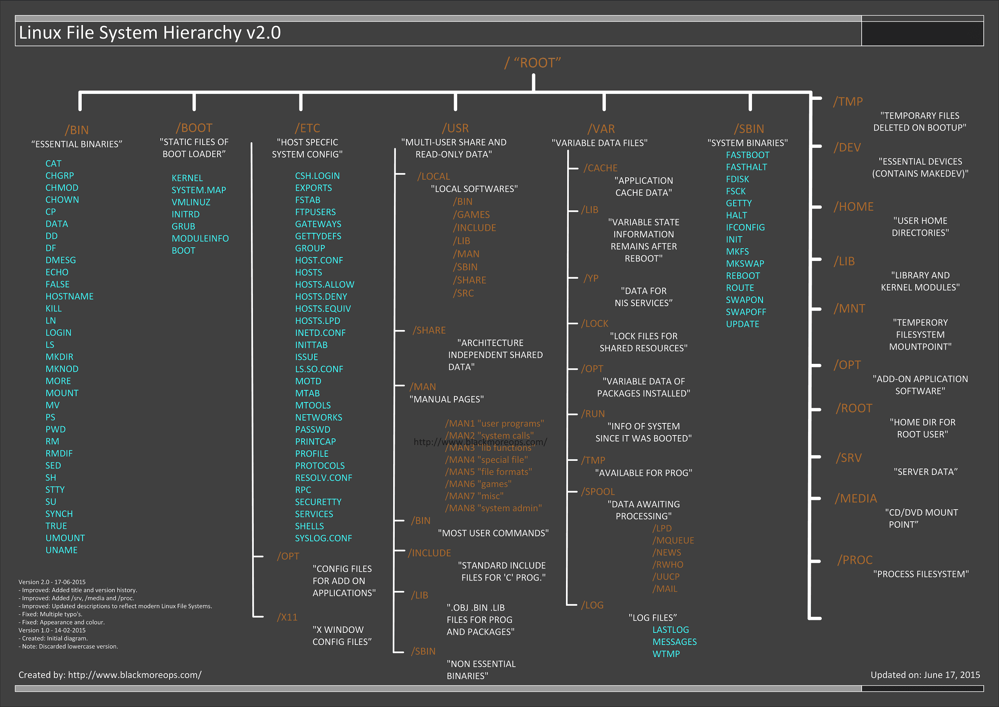

# Linux Projects #

### 参考资料 ###

**操作系统**  
>
1 [调试器工作原理（1）：基础篇](http://blog.jobbole.com/23463/)  
2 [调试器工作原理（2）：实现断点](http://blog.jobbole.com/23632/)  
3 [调试器工作原理（3）：调试信息](http://blog.jobbole.com/24916/)  
4 [定位 UNIX 上常见问题的经验总结](http://blog.jobbole.com/22133/)  
5 [Linux 内核 3.3 和 3.4 简介](http://blog.jobbole.com/24419/)  
6 [王垠：Unix的缺陷](http://blog.jobbole.com/25792/)  
7 [Linux 灾难恢复](http://blog.jobbole.com/27956/)  
8 [Linux kernel测试初探](http://blog.jobbole.com/31690/)  
9 [OSdev](https://wiki.osdev.org/Main_Page)  
10 [成为Linux内核高手的四个方法](http://blog.jobbole.com/54833/)  
11 [Linux 内存使用方法详细解析](http://blog.jobbole.com/45748/)  
12 [Linux内存点滴：用户进程内存空间](http://blog.jobbole.com/45733/)  
13 [Linux 的启动流程](http://blog.jobbole.com/46078/)  
14 [Linux 系统中随机数在 KVM 中的应用](https://www.ibm.com/developerworks/cn/linux/1404_caobb_kvmrandom/index.html?ca=drs-)  
15 [磁盘分区对齐详解与配置 – Linux篇](http://blog.jobbole.com/70419/)  
16 [编写属于你的第一个Linux内核模块](http://blog.jobbole.com/72115/)  [代码](https://github.com/vsinitsyn/reverse)  
17 [编写最简单的内核：HelloWorld](http://blog.jobbole.com/79249/)  
18 [浅析 Linux 初始化 init 系统（1）：sysvinit](http://blog.jobbole.com/85076/)  
19 [浅析 Linux 初始化 init 系统（2）： UpStart](http://blog.jobbole.com/85107/)  
20 [浅析 Linux 初始化 init 系统（3） Systemd](http://blog.jobbole.com/85070/)  
21 [Linux 内核里的“智能指针”](http://blog.jobbole.com/88279/)  
22 [linux-insides](https://0xax.gitbooks.io/linux-insides/content/)  
23 [Linux 内核内存管理（1）](http://blog.jobbole.com/88452/)  
24 [Linux资源管理之cgroups简介](http://blog.jobbole.com/88836/)  
25 [CGroup 介绍、应用实例及原理描述](http://blog.jobbole.com/89176/)  
26 [linux内核动态加载模块](http://blog.jobbole.com/89886/)  
27 [Linux 内核中断和中断处理（1）](http://blog.jobbole.com/90531/)  
28 [从2.x到4.x，Linux内核这十年经历了哪些重要变革](http://blog.jobbole.com/90963/)  
29 [深入理解Linux修改hostname](http://blog.jobbole.com/90999/)  
30 [Linux 内核同步机制](http://blog.jobbole.com/91784/)  
31 [Linux 内存管理: Kmalloc](http://blog.jobbole.com/91820/)  
32 [Linux 内存管理: Kmalloc(2)](http://blog.jobbole.com/91828/)  
33 [Linux 内存管理：Kmem_cache_init](http://blog.jobbole.com/91883/)  
34 [Linux内存管理：Vmalloc](http://blog.jobbole.com/91885/)  
35 [Linux内存管理：Malloc](http://blog.jobbole.com/91887/)  
36 [Linux 内存管理：内存映射](http://blog.jobbole.com/91891/)  
37 [Linux内存管理：DMA](http://blog.jobbole.com/91893/)  
38 [Linux 动态库相关知识整理](http://blog.jobbole.com/94497/)  
39 [Linux 下编译及调试 C 代码的简易指南](http://blog.jobbole.com/94383/)  
40 [Linux概念架构的理解](http://blog.jobbole.com/95853/)  
41 [Linux 内存寻址之分页机制](http://blog.jobbole.com/101211/)  
42 [Linux 内存寻址之分段机制](http://blog.jobbole.com/101210/)  
43 [Linux 系统结构详解](http://blog.jobbole.com/103511/)  
44 L[inux 死锁检测模块 Lockdep 简介](http://blog.jobbole.com/100078/)  
45 [Linux Netlink 基本使用](http://blog.jobbole.com/104334/)  
46 

**驱动**  

>
1 [深入浅出：Linux设备驱动之中断与定时器](http://blog.jobbole.com/86482/)  
2 [深入浅出：Linux设备驱动之异步通知和异步I/O](http://blog.jobbole.com/86493/)  
3 [深入浅出：Linux设备驱动中的阻塞和非阻塞I/O](http://blog.jobbole.com/86498/)  
4 [深入浅出：Linux设备驱动中的并发控制](http://blog.jobbole.com/86521/)  
5 [深入浅出：Linux设备驱动之字符设备驱动](http://blog.jobbole.com/86531/)  
6 [Linux Mount 挂载设备使用说明](http://blog.jobbole.com/92695/)  
7 [蜕变成蝶：Linux设备驱动中的并发控制](http://blog.jobbole.com/99675/)  
8 [蜕变成蝶：Linux设备驱动中的阻塞和非阻塞I/O](http://blog.jobbole.com/99707/)  
9 [蜕变成蝶：Linux设备驱动之字符设备驱动](http://blog.jobbole.com/99654/)  
10 [蜕变成蝶：Linux设备驱动之异步通知和异步I/O](http://blog.jobbole.com/99710/)  
11 [蜕变成蝶：Linux设备驱动之中断与定时器](http://blog.jobbole.com/99763/)  
12 [蜕变成蝶：Linux设备驱动之CPU与内存和I/O](http://blog.jobbole.com/100314/)  
13 [蜕变成蝶：Linux设备驱动之DMA](http://blog.jobbole.com/100403/)  
14 [蜕变成蝶：Linux设备驱动之按键设备驱动](http://blog.jobbole.com/100446/)  
15 [蜕变成蝶：Linux设备驱动之watchdog设备驱动](http://blog.jobbole.com/100603/)  
16 [乾坤合一：Linux设备驱动之USB主机和设备驱动](http://blog.jobbole.com/101638/)  

**汇编**  

>
1 [我的汇编学习之路（1）：指令](http://blog.jobbole.com/84776/)  
2 [我的汇编学习之路（2）：主要术语和概念](http://blog.jobbole.com/84815/)  
3 [Say hello to x86_64 Assembly [part 1]](https://0xax.github.io/asm_1/)  
4 [Linux GCC常用命令](http://blog.jobbole.com/103135/)  
5 [Linux 动态库与静态库制作及使用详解](http://blog.jobbole.com/103668/)  
6 

**文件系统**
>
1 [Linux中的两种文件锁---协同锁与强制锁](http://blog.jobbole.com/16882/)  
2 [syslog：类Unix系统常用的log服务](http://blog.jobbole.com/29633/)  
3 [理解 Linux 的硬链接与软链接](https://www.ibm.com/developerworks/cn/linux/l-cn-hardandsymb-links/index.html)  
4 [为初学者准备的 ln 命令教程（5 个示例）](http://blog.jobbole.com/113800/)  
5 [给 Linux 系统“减肥”](http://blog.jobbole.com/49497/)  
6 [Linux LVM简明教程](http://blog.jobbole.com/71858/)  
7 [Linux 网络文件系统的数据备份及恢复机制实现](https://www.ibm.com/developerworks/cn/linux/1406_liyang_nfsbackuprestore/index.html)  
8 [Linux 文件系统结构介绍](http://blog.jobbole.com/90400/)  
9 [哪个文件系统最适合你的 Linux 系统？](http://blog.jobbole.com/97505/)  
10 [Linux 的 core 文件](http://blog.jobbole.com/101648/)  
11 [Linux 信号应用之黑匣子程序设计](http://blog.jobbole.com/101619/)  
12 [Linux 编程中的文件锁之 flock](http://blog.jobbole.com/102538/)  
13 [Linux 系统中一些针对文件系统的节能技巧](http://blog.jobbole.com/104051/)  
14 

## Linux 编程 ##

>
1 [fork()函数与Linux中的多线程编程](http://blog.jobbole.com/102599/)   
2 [Linux 中的线程局部存储（1）](http://blog.jobbole.com/102540/)  
3 [Linux中的线程局部存储（2）](http://blog.jobbole.com/102746/)  
4 [Linux Socket编程（不限Linux）](http://blog.jobbole.com/95378/)  
5 [Linux 多线程编程（不限Linux）](http://blog.jobbole.com/103442/)  
6 [Linux 下 C++ 异常处理技巧](http://blog.jobbole.com/103596/)  
7 [Linux 平台相关代码的 C++ 解决方案](http://blog.jobbole.com/103640/)  
8 [面向 C++ 的测试驱动开发](http://blog.jobbole.com/104032/)  
9 [如何在 Linux 下检测内存泄漏](http://blog.jobbole.com/104042/)  
10 [Linux 环境多线程编程基础设施](http://blog.jobbole.com/104086/)  
11 [Linux 中 fcntl()、lockf、flock 的区别](http://blog.jobbole.com/104331/)  

  <b></b>
 

**网络原理**
>
1 [Linux系统IP路由基础（第1部分）](http://blog.jobbole.com/19235/)  
2 [Linux中最受欢迎的邮件传输代理（MTA）](http://blog.jobbole.com/21741/)  
3 [What is RADIUS Server and best free RADIUS Server for Linux](http://blog.jobbole.com/22367/)  
4 [在 Linux 上构建一个 RADIUS 服务器](https://www.ibm.com/developerworks/cn/linux/l-radius/)  
5 [小措施提高Linux服务器安全](http://blog.jobbole.com/25484/)  
6 [Linux Netcat命令：网络工具中的瑞士军刀](http://blog.jobbole.com/38067/)  
7 [配置SecureCRT连接本地虚拟机中的Linux系统](http://www.pythoner.com/196.html)  
8 [使用SecureCRT的SFTP在WINDOWS与LINUX之间传输文件](https://www.cnblogs.com/xwdreamer/p/3673397.html)  
9 [sftp-from-unix-server-to-window](https://unix.stackexchange.com/questions/140918/sftp-from-unix-server-to-window)  
10 [在Nginx下对网站进行密码保护](http://blog.jobbole.com/41036/)  
11 [10 个你需要了解的 Linux 网络和监控命令](http://blog.jobbole.com/49248/)  
12 [Linux 上的基础网络设备详解](https://www.ibm.com/developerworks/cn/linux/1310_xiawc_networkdevice/index.html#icomments)  
13 [给Linux系统/网络管理员准备的Nmap命令的29个实用范例](http://blog.jobbole.com/54595/)  
14 [Linux 网络堆栈的排队机制](http://blog.jobbole.com/62917/)  
15 [怎样在 Linux 中限制网络带宽使用](http://blog.jobbole.com/85605/)  
16 [写一个每秒接收 100 万数据包的程序究竟有多难？](http://blog.jobbole.com/87759/)  
17 [iptables深入解析：filter篇](http://blog.jobbole.com/89936/)  
18 [iptables深入解析：filter应用篇](http://blog.jobbole.com/89942/)  
19 [iptables深入解析：ct篇](http://blog.jobbole.com/89946/)  
20 [iptables深入解析：nat篇](http://blog.jobbole.com/90005/)  
21 [iptables深入解析：mangle篇](http://blog.jobbole.com/90008/)  
22 [iptables深入解析：应用层插件篇](http://blog.jobbole.com/90011/)  
23 [记一次Linux服务器上查杀木马经历](http://blog.jobbole.com/90098/)  
24 [linux下QOS：理论篇](http://blog.jobbole.com/90897/)  
25 [linux下QOS：应用篇](http://blog.jobbole.com/90899/)  
26 [一份快速实用的 tcpdump 命令参考手册](http://blog.jobbole.com/91631/)  
27 [Linux Shell 脚本实现 tcp/upd 协议通讯](http://blog.jobbole.com/93201/)  
28 [通过完整示例来理解如何使用 epoll](http://blog.jobbole.com/93566/)  
29 [Web 应用性能提升 10 倍的 10 个建议](http://blog.jobbole.com/94962/)  
30 [如何在Linux上按国别阻止网络流量?](http://blog.jobbole.com/96920/)  
31 [使用 libevent 和 libev 提高网络应用性能](http://blog.jobbole.com/103605/)  
32 [Linux netstat命令详解](http://blog.jobbole.com/103724/)  

**数据结构与算法**
>
1 [为什么 GNU grep 如此之快？](http://blog.jobbole.com/52313/)  
2 [几种压缩算法实现原理详解](https://blog.csdn.net/ghevinn/article/details/45747465)  
3 [What is the best text compression algorithm?](https://www.quora.com/What-is-the-best-text-compression-algorithm)  
4 [What is the current state of text-only compression algorithms?](https://stackoverflow.com/questions/236456/what-is-the-current-state-of-text-only-compression-algorithms)  
5 [Linux 内核数据结构：Radix 树](http://blog.jobbole.com/87675/)  
6 [Linux 内核数据结构：双向链表](http://blog.jobbole.com/87687/)  

## Docker ##

>
1 [8 个基本的 Docker 容器管理命令](http://blog.jobbole.com/114145/)  
2 [一位开发者的 Linux 容器之旅](http://blog.jobbole.com/94904/)

**Linux管理**
>
1 [你需要知道的16个Linux服务器监控命令](http://blog.jobbole.com/15430/)   
2 [使用Shell脚本对Linux系统和进程资源进行监控](http://blog.jobbole.com/22318/)  
3 [如何保证Linux服务器的安全](http://blog.jobbole.com/48195/)  
4 [4个Linux服务器监控工具](http://blog.jobbole.com/58003/)   
5 [给Linux系统/网络管理员准备的Nmap命令的29个实用范例](http://blog.jobbole.com/54595/)  
6 [Linux服务器性能评估](http://blog.jobbole.com/58714/)  
7 [监控 Linux 性能的 18 个命令行工具](http://blog.jobbole.com/59790/)  
8 [rm -rf 的“幸存者”](http://blog.jobbole.com/70971/)  
9 [用 Python 脚本实现对 Linux 服务器的监控](http://blog.jobbole.com/54563/)  
10 [SysAdmim 必备：系统性能大牛 Brendan Gregg 分享的 Linux 性能工具 ](http://blog.jobbole.com/76103/)  
11 [监控系统资源的6个Linux工具](http://blog.jobbole.com/81678/)  
12 [全能冠军：Linux系统性能和使用活动监控工具 sysstat](http://blog.jobbole.com/78595/)  
13 [Sysstat性能监控工具包中20个实用命令](http://blog.jobbole.com/78598/)  
14 [回收站功能在 Linux 中的实现](https://www.ibm.com/developerworks/cn/linux/1410_licy_linuxtrash/index.html)  
15 [检测Linux内存使用情况的free命令的10个例子](http://blog.jobbole.com/83912/)  
16 [为什么linux下多线程程序如此消耗虚拟内存](http://blog.jobbole.com/83878/)  
17 [Linux有问必答：如何检查Linux的内存使用状况](http://blog.jobbole.com/84480/)  
18 [如何在Linux上找出并删除重复的文件：FSlint](http://blog.jobbole.com/85749/)  
19 [Linux基础：如何找出你的系统所支持的最大内存](http://blog.jobbole.com/85709/)  
20 [Linux运维工程师入门须掌握的10个技术点](http://blog.jobbole.com/87542/)  
21 [用 Puppet 搭建易管理的服务器基础架构（1）](http://blog.jobbole.com/87679/)  
22 [用 Puppet 搭建易管理的服务器基础架构（2）](http://blog.jobbole.com/87680/)  
23 [Sysdig：Linux服务器监控和排障利器](http://blog.jobbole.com/97254/)  
24 [Linux主流架构运维工作简单剖析](http://blog.jobbole.com/97616/)  
25 [Linux企业运维高效技巧心得及分享](http://blog.jobbole.com/97568/)  
26 [一秒内诊断 Linux 服务器的性能](http://blog.jobbole.com/97540/)  
27 [Systemd 入门教程：命令篇](http://blog.jobbole.com/98667/)  
28 [Systemd 入门教程：实战篇](http://blog.jobbole.com/98671/)  
29 [Linux 守护进程的启动方法](http://blog.jobbole.com/98657/)  
30 [Linux 进程管理之四大名捕](http://blog.jobbole.com/100326/)  
31 [10 分钟服务器安全设置，Ubuntu安全设置入门](http://blog.jobbole.com/103344/)  
32 [从业 30 年的女系统管理员的经验分享](http://blog.jobbole.com/103561/)  
33 [“懒惰” Linux 管理员的 10 个关键技巧](http://blog.jobbole.com/104056/)  
34 

**Linux运维**
>
1 [CentOS 7下搭建高可用集群](http://blog.jobbole.com/98446/)  
2 [Linux企业运维高效技巧心得及分享](http://blog.jobbole.com/97568/)  

## 日志系统 ##

>
1 [在 Linux 中使用日志来排错](http://blog.jobbole.com/90740/)    

**命令行**  
>
1 [28个Unix/Linux的命令行神器](http://blog.jobbole.com/23638/)    
2 [8 个实用的 Linux netcat 命令示例](http://blog.jobbole.com/18131/)  
3 [阮一峰：读懂 diff](http://blog.jobbole.com/26251/)  
4 [命令行是你的至交好友](http://blog.jobbole.com/35885/)  
5 [awk内置字符串函数详解](https://www.linuxsong.org/2010/09/awk-string-function/) 
6 [linux shell 的here document 用法 (cat << EOF)](https://my.oschina.net/u/1032146/blog/146941)  
7 [UNIX 系统中的文本操作简介](http://blog.jobbole.com/19641/)  
8 [高效使用Top](http://blog.jobbole.com/38381/)  
9 [趣文：有趣的 Linux 命令](http://blog.jobbole.com/41129/)  
10 [quota命令](http://man.linuxde.net/quota)  
11 [对 Linux 新手非常有用的20个命令](http://blog.jobbole.com/45335/)  
12 [对中级 Linux 用户非常有用的 20 个命令](http://blog.jobbole.com/45377/)  
13 [高效Linux用户需要了解的命令行技能](http://blog.jobbole.com/46976/)  
14 [一些实用但不为人知的Unix命令](http://blog.jobbole.com/66590/)  
15 [37条常用Linux Shell命令组合](http://blog.jobbole.com/48173/)  
16 [妈咪，我找到了！15个实用的Linux find命令示例](http://blog.jobbole.com/48856/)  
17 [爹地，我找到了！15个极好的Linux find命令示例](http://blog.jobbole.com/48931/)  
18 [11 个很少人知道但很有用的 Linux 命令](http://blog.jobbole.com/50632/)  
19 [如何利用多核CPU来加速你的Linux命令](http://blog.jobbole.com/50643/)  
20 [Linux shell 用法和技巧](http://blog.jobbole.com/52455/)  
21 [超酷的Unix终端/控制台工具小集合](http://blog.jobbole.com/62140/)  
22 [为什么Linux的htop命令完胜top命令](http://blog.jobbole.com/69992/)  
23 [Linux的script命令——隐藏在终端的记录器](http://blog.jobbole.com/70563/)  
24 [自动补完不算什么，一键直达目录才是终极神器！](http://blog.jobbole.com/73611/)  
25 [对 Linux 专家非常有用的 20 个命令](http://blog.jobbole.com/45437/)  
26 [我希望早几年知道的5个Unix命令](http://blog.jobbole.com/48124/)  
27 [grep是什么？怎么用？](http://blog.jobbole.com/75410/)  
28 [10个重要的Linux ps命令实战](http://blog.jobbole.com/83610/)  
29 [Awk 20 分钟入门介绍](http://blog.jobbole.com/83844/)  
30 [Linux有问必答：如何在Linux下重命名多个文件](http://blog.jobbole.com/84475/)  
31 [一大波实用的 bash 别名和函数](http://blog.jobbole.com/84755/)  
32 [11个让你吃惊的 Linux 终端命令](http://blog.jobbole.com/86948/)  
33 [LINUX 101: 让你的 SHELL 更强大](http://blog.jobbole.com/88707/)  
34 [这篇文章可以帮你掌握命令行的艺术](http://blog.jobbole.com/90364/)  
35 [Linux Shell 字符串操作（长度/查找/替换）详解](http://blog.jobbole.com/92002/)  
36 [Linux Shell 通配符、元字符、转义符使用](http://blog.jobbole.com/92967/)  
37 [在 Unix 系统上查找数据的最佳工具和技巧](http://blog.jobbole.com/92811/)  
38 [Cheat—— 给Linux初学者和管理员一个终极命令行"备忘单"](http://blog.jobbole.com/97626/)  
40 [Linux Shell 文本处理工具集锦](http://blog.jobbole.com/99063/)  
41 [Linux 文件查找工具之find“大宝剑”](http://blog.jobbole.com/100925/)  
42 [如何隐藏你的 Linux 的命令行历史](http://blog.jobbole.com/103721/)  
43 [如何在 Linux 上录制你的终端操作](http://blog.jobbole.com/103737/)  

**面试**
>
1 [陈皓：一个 fork 的面试题](http://blog.jobbole.com/24686/)  
2 [20条Linux命令面试问答](http://blog.jobbole.com/84069/)  
3 [Linux Shell 脚本面试 25 问](http://blog.jobbole.com/86237/)  

**黑客** 
>
1 [一次Linux服务器被hack的过程分析](http://blog.jobbole.com/21294/)  
2 [Linux后门入侵检测工具，附bash漏洞解决方法](http://blog.jobbole.com/77663/)  
3 [如何在 Linux 下大量屏蔽恶意 IP 地址](http://blog.jobbole.com/84478/)  
4 [10大白帽黑客专用的 Linux 操作系统](http://blog.jobbole.com/97895/)  
5 [Linux TCP/IP 网络工具对比：net-tools 和 iproute2](http://blog.jobbole.com/97270/)  
6 [Linux fork 炸弹解析，Linux Fork Bomb](http://blog.jobbole.com/100935/)  

**Linux 思想**
>
1 [Unix编程艺术，Unix哲学](http://blog.jobbole.com/1295/)  
2 [陈皓：用Unix的设计思想来应对多变的需求](http://blog.jobbole.com/18797/)

**其它**
>  
1 [5个最佳免费Linux杀毒软件](http://blog.jobbole.com/23304/)  
2 [提问的智慧](http://blog.jobbole.com/28784/)  
3 [重做Unix命令，快速有效学习新语言](http://blog.jobbole.com/29844/)  
4 [开源史上最成功的八个开源产品](http://blog.jobbole.com/179/)  
5 [SpaceX：航天运载软件开发的经验教训](http://blog.jobbole.com/36780/)  
6 [如何在 Linux 上安装应用程序](http://blog.jobbole.com/113793/)  
7 [关于 shell 脚本编程的10 个最佳实践](http://blog.jobbole.com/16604/)  
8 [如何在安装双启动后卸载 Windows 或者 Linux](http://blog.jobbole.com/40278/)  
9 [Ubuntu桌面生存指南(1)：选择 Linux](http://blog.jobbole.com/29546/)  
10 [UNIX 高手的 10 个习惯](https://www.ibm.com/developerworks/cn/aix/library/au-badunixhabits.html)  
11 [UNIX 高手的另外 10 个习惯](https://www.ibm.com/developerworks/cn/aix/library/au-unixtips/)  
12 [每个极客都应该知道的Linux技巧](http://blog.jobbole.com/60549/)  
13 [每个Linux用户都应该知道的命令行技巧](http://blog.jobbole.com/54425/)  
14 [使用 Python 获取 Linux 系统信息](http://blog.jobbole.com/44644/)  
15 [Linux Shell 编程实战技巧](http://blog.jobbole.com/48717/)  
16 [使用大数据时，别忘了关注Linux内存管理器](http://blog.jobbole.com/52898/)  
17 [每一行代码都有记录](http://blog.jobbole.com/59359/)  
18 [Linux 的成功源自社区，而非技术](http://blog.jobbole.com/60332/)  
19 [Linus Trovalds谈Linux内核开发管理风格](http://blog.jobbole.com/61100/)  
20 [Linux鲜为人知的安全漏洞：不要将输出内容管道给你的shell](http://blog.jobbole.com/63818/)  
21 [Linux发展编年表](http://blog.jobbole.com/70439/)  
22 [我是怎样通过Sudo获取root权限的](http://blog.jobbole.com/68930/)  
23 [Linux 与 BSD 有什么不同?](http://blog.jobbole.com/71958/)  
24 [Linux平台的4个最佳开源代码编辑器](http://blog.jobbole.com/84112/)  
25 [经验谈：用cp命令复制大量文件](http://blog.jobbole.com/77698/)  
26 [18款开源/商用的Linux服务器控制面板](http://blog.jobbole.com/80575/)  
27 [守卫自由的 Linux 世界](http://blog.jobbole.com/90967/)  
28 [Linux 中 df 命令的11个例子](http://blog.jobbole.com/93595/)  
29 [如何用树莓派和Kali Linux搭建一个便携式的黑客工作站](http://blog.jobbole.com/95031/)  
30 [玩转 Windows 10 中的 Linux 子系统](http://blog.jobbole.com/104012/)  
31 

**人物传记**  
>
1 [Linux：黑客传说](http://blog.jobbole.com/1517/)  
2 [阮一峰：Linus Torvalds自传摘录 ](http://blog.jobbole.com/26418/) 

**博客**  
>
1 [developerWorks®Linux](https://www.ibm.com/developerworks/cn/linux/)  
2 [Learn Linux The Hard Way](https://github.com/wizardforcel/llthw-zh)  
3 [Linux 伯乐在线](http://blog.jobbole.com/tag/linux/)  
4 [开源中国](https://www.oschina.net/project)  
5 [Linux Foundation](https://www.linuxfoundation.org/)  

**学习资料**

>
1 [10本Linux免费电子书](http://blog.jobbole.com/8139/)  
2 [为学Linux，我看了这些书](http://blog.jobbole.com/45387/)  
3 [Linux Administration Handbook](https://github.com/KaneHui/LinuxProjects/blob/master/books/Linux%20Administration%20Handbook.pdf)    
4 [Linux Kernel Development 3rd Edition](https://github.com/KaneHui/LinuxProjects/blob/master/books/Linux%20Kernel%20Development%203rd%20Edition.pdf)  
5 The Art of Linux Kernel Design 2rd Edition  
6 [Linux内核学习四库全书](https://blog.csdn.net/21aspnet/article/details/6585602)  
7 [Linux 内核学习的经典书籍及途径？](https://www.zhihu.com/question/19606660)  
8 [我的Linux内核学习之路](https://blog.csdn.net/zhangjg_blog/article/details/20286559)  
9 [学习Linux/UNIX的在线免费书籍和课程](http://blog.jobbole.com/76316/)  
10 [Linux Shell 学习资料推荐](http://blog.jobbole.com/93127/)  
11 [Linux企业运维高效技巧心得及分享](http://blog.jobbole.com/97568/)  
12 [Linux 平台下阅读源码的工具链](http://blog.jobbole.com/101322/)  
13 [那些被岁月遗忘的 UNIX 经典著作](http://blog.jobbole.com/103989/)  