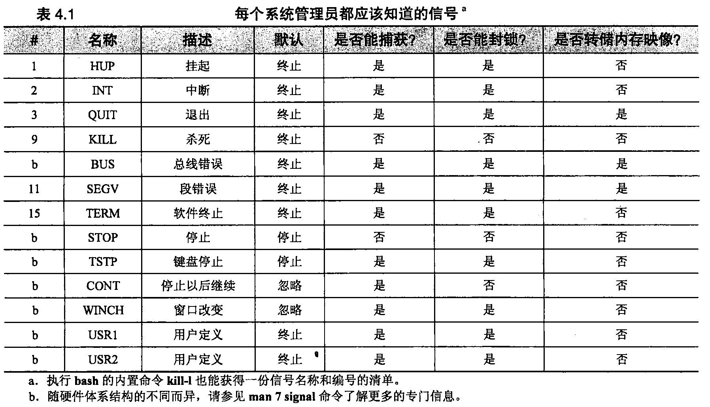
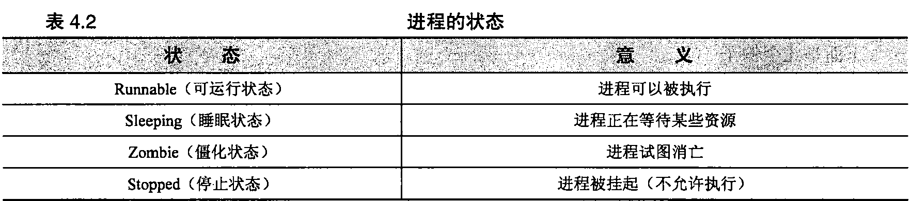

# 第4章 进程控制

进程是Linux用来表示正在运行的程序的一种抽象概念。程序的内存使用、处理器时间和I/O资源就是通过这个对象进行管理和监视的。

Linux和UNIX设计思想的一部分内容就是让尽可能多的工作在进程的上下文 (context)中完成，而不是由内核专门来进行处理。系统进程和用户进程都遵守同样 的规则，因此用户可以使用一套工具控制这两种进程。

### 4.1进程的组成部分 ###

一个进程由一个地址空间和内核内部的一组数据结构组成。地址空间是由内核 标记出来供进程使用的一组内存页面1。它包含进程正在执行的代码和库、进程变量、 进程堆桟以及在进程运行的同时内核所需要的各种其他信息。因为Linux是一种采 用虚拟内存的系统，因此内存页面在地址空间中的位置和它在机器的物理内存或交 换空间中的位置之间并不一定相关。

内核的内部数据结构记录了有关每个进程的各种信息，其中一些非常重要的信息有：

- 进程的地址空间映射
- 进程的当前状态(睡眠状态、停止状态、可运行状态等)
- 进程执行的优先级
- 进程已用资源的信息
- 进程已打开的文件和网络端口的信息
- 进程的信号掩码（一个记录，确定要封锁哪些信号）
- 进程的属主

这些属性有些可以由构成“线程组”的几个进程所共享，Linux中的线程组和传统UNIX中的多 线程进程类似。虽然它们共享同一个地址空间，但是一个线程组的成员们却有各自的执行权限和执行 状态。实际上，系统管理员所关注的进程很少使用多线程执行机制，而且即便是那些采用了多线程机 制的进程（比如BIND 9的named）, —般也不会要求管理员去关注线程那么细的粒度。

与进程有关的许多参数直接影响进程的执行：进程所获处理器的时间量、进程能够访问的文件等。 在下面各小节中，我们将讨论系统管理员最感兴趣的那些参数的意义及其重要性。这些属性对于所有 版本的UNIX和Linux来说都是相同的。

#### 4.1.1	PID：进程的ID号 ####

内核给每个进程分配一个独一无二的ID号。控制进程的大多数命令和系统调用需要用户指定PID 来标识操作的目标。PID按照创建进程的顺序来分配。

#### 4.1.2	PPID：父 PID ####

Linux没有提供创建新进程去运行某个特定程序的系统调用，现有进程必须克隆自身去创建一个 新进程。克隆出的进程能够把它正在运行的那个程序替换成另一个不同程序。

当一个进程被克隆时，原来的进程就叫做父进程，而克隆出的副本则叫做子进程。进程的PPID 属性就是克隆它的父进程的PID2。

当遇到无法辨认（以及可能运行失常）的进程时，父进程PID就成了一项很有用的信息。回溯该 进程的父进程，有助于了解它的目的和作用。

#### 4.1.3 UID和EUID:真实的和有效的用户ID ####

进程的UID就是其创建者的用户标识号，或者更确切地说，就是复制了父进程的UID值。通常， 只允许创建者（也称为属主）和超级用户对进程进行操作。有关UID的更多信息，请参见6.1节。

EUID是“有效（effective）”的用户ID,这是一个额外的UID,用来确定进程在任何给定的时刻 对哪些资源和文件具有访问权限。对于大多数进程来说，UID和EUID是一样的，例外的情况是setuid 程序。

为什么同时采用UID和EUID呢？这只是因为保持标识和权限之间的区别很有用，还因为setuid 程序可能不希望一直以扩大了的权限执行操作。可以设置和重置进程的有效UID以便启用或限制它所 享有的额外权限。

Linux还有一种“保存UID （saved UID）”，它是进程刚开始执行时刻，进程EUID的副本。除非进程采取措施删除这个保存下来的UID,否则它就留了下来，作为真实的或者有效的UID来用。因此， 编写严谨的setuid程序可以让其大部执行操作与它的特殊权限无关，只有在需要额外特权的特定时刻 才用上它们。

Linux还定义了一种非标准的进程参数FSUID,它控制着对文件系统权限的判断，但在内核之外 并不常用。

这种多UID体系的用意相当巧妙。如果用户需要深入了解细节，那么有一个特别好的资源——由David A. Wheeler 维护的免费网络在线图书 Secure Programming for Linux and Unix HOWTO。读书可以 从 www.dwheeler.com 得到。

#### 4.1.4 GID和EGID:真实的和有效的组ID ####

GID就是进程的组标识号。EGID与GID的关系跟EUID与UID的关系相同，因为它可以由一个 setgid程序来“转换”。Linux有一种保存(saved) GID,就像有保存UID—样。

进程的GID属性基本没什么用处了。从确定访问权限这样的目的来说，一个进程可以同时是多个 组的成员。完整的组清单区分GID和EGID独立保存。决定访问权限一般要考虑EGID和追加的组清 单，但不考虑GID。有关组的更多内容请**参见6.1节**。

只有当一个进程要创建新文件的时候，GID才会起作用。文件系统权限是如何设定的，决定了新 的文件可能要采用创建该文件的进程的GID。**参考5.4**节的内容了解更多资料。

#### 4.1.5谦让度 ####

进程的调度优先级决定了它所接收到的CPU时间有多少。内核使用动态算法来计算优先级，它 考虑一个进程近来已经消耗CPU的时间量以及考虑该进程已经等待运行的时间等因素。内核还会关注 为管理目的而设置的值，这种值通常叫做“谦让值(nice value)”或“谦让度(niceness)”，之所以这 么叫是因为它表明了管理员计划对待系统其他用户的友好程度。我们将在4.6节中详细介绍这个主题。

为了给响应快的应用提供更好的支持，Linux向传统的UNIX调度模型中增加了 “调度类 (scheduling class)”的概念。目前有三种调度类，每个进程都属于一种调度类。遗憾的是，实时类 (real-time class)既没有广泛使用，也没有很好地从命令行给予支持。系统进程都使用传统的基于谦让 度的调度机制。我们在本书里只讨论标准的调度机制。参考了解有关[实时调度机制](www.realtimelinuxfoundation.org)的更多知识。 

#### 4.1.6控制终端 ####

大多数不是守护进程(daemon)的进程都有一个与自己相关联的控制终端。控制终端决定了为标 准输入、标准输出和标准错误通道而提供的默认链接。当用户从shell启动一个命令时，他的终端通常就成为该进程的控制终端。控制终端的概念还影响到信号的发布，有关信号的概念将在4.3节中讨论。

### 4.2进程的生命周期 ###

为了创建一个新进程，一个进程就会用系统调用**fork**来复制自身。fork创建原进程的一个副本， 这个副本在很大程度上与父进程相同。新进程拥有一个不同的PID和它自己的记账信息。

fork具有能够返回两个不同值的特性。从子进程的角度来看，它返回0。另一方面，对于父进程 来说，则返回新创建的子进程的PID。由于这两个进程在其他方面是相團的，所以它们都必须检查返 回值来确定它们要扮演什么角色。

在fork以后，子进程经常使用exec族系统调用中的一个成员开始执行新的程序3。这些调用能改 变进程正在执行的程序正文(text),并把数据和堆栈段重新设定到预先定义的初始状态。exec各种不同形式的区别仅在于它们为新程序指定命令行参数和环境时采用的方式不同。

Linux定义fork的另一种实现**clone**。这个调用创建的进程组共享内存和I/O空间，这一特性与大 多数版本的UNIX上有的多线程机制类似，但是执行的每个线程都表现为一个完整的进程而不是一个 专门的“线程”。

当系统引导时，内核会自主创建并安装几个进程。其中最知名的就是init，它的进程号总是1。init 负责执行系统的启动脚本。除了内核创建的那几个进程以外，其他所有进程都是init的后代。有关init 守护进程的更多信息，请参考第2章。

init在进程管理中还担负着另外一个重要角色。当一个进程执行完毕时，它调用一个名为**_exit**的 例程来通知内核它已经做好“消亡”的准备了。它提供一个退出码（一个整数）表明它准备退出的原因。按照惯例，0用来表示正常的或者说"成功”的终止。

在允许进程完全消失以前，Linux要求该进程的消亡得到其父进程的确认，父进程是通过调用 wait来确认的。父进程接收到子进程退出码的一个副本（或者是_个通知，在子进程不是自愿退出的情况下，说明子进程被终止的原因）.如果父进程愿意，它还可以得到子进程对资源使用情况的一个总结。

如果父进程比子进程的生命期长并能负责地调用wait清理死亡的进程,那么这种方案可以工作得 很好。但是，如果父进程比子进程先消亡.那么内核则会意识到将来不会有wait调用处理子进程了， 于是就调整子进程使它这个“孤儿”成为init的子进程。内核要求init接受这些“孤儿”进程，并在 它们消亡的时候执行所需的wait调用淸除它们。

### 4.3信号 ###

信号是进程级的中断请求。系统定义了大约30种不同种类的信号，使用这些信号的方式可以有 以下几种：

- 作为一种通信手段在进程之间发送信号
- 当键入特殊的按键时，例如＜Control-C＞»＜Control-Z＞,可以由终端驱动程序发送信号去终止、 中断或挂起进程
- 可以由管理员（使用kill）发送信号来达到各种结果
- 当进程出错，例如出现被零除的错误时，可以由内核发送信号
- 可以由内核发送信号，通知一个进程有某种"受关注的”条件出现，比如一个子进程死亡或者在I/O通道上有数据

当收到信号时，可能发生两种情况之一。如果接收进程己经为这个特定的信号指派了一个信号处理例程，那么就使用和传递该信号的上下文有关的信息来调用这个信号处理例程，否则，内核代表该 进程采取某种默认措施。根据信号的不同，采取的默认措施也不同。许多信号会终止进程，有些信号 也会产成一次内存转储（译者注：core dump就是一个进程的内存映像。它可以用来调试进程。core 代表老式计算机上用作主存储器的磁芯"magneticcore”。现代计算机已经不再使用磁芯存储器了，或许称之为memory dump会更恰当些，但是导线core —词却沿袭下来，而且人们常常把core同kernel 这个词混淆，以为是内核或核心的同义词，但实际上两者的含义大相径庭）。

在一个程序内为信号指定信号处理例程的做法通常叫做“捕获"该信号。当信号处理例程完成时，执行流程从接收到信号的位置重新开始。

为了防止收到信号，程序可以要求忽略（ignore）信号或者封锁（block）信号。被忽略的信号被简单地丢弃，它对进程没有什么影响。被封锁的信号排队等待发送，但内核不要求进程对该信号采取 措施，一直到该信号被明确地解除封锁为止。处理新的不被封锁的信号的信号处理器只被调用一次， 即使在封锁接收的同时多次接收到该信号的情况下，也只调用一次。

表4.1列出了所有管理员都应该知道的信号。信号名称采用大写的约定来源于C语言的传统，有时候还可能看到信号名称带有前缀SIG（例如，SIGHUP）,也是出于类似原因。

  <b></b>

还有其他一些信号没有在表4.1中列出来，其中大多数用来报告一些含糊的错误，例如“illegal instruction （非法指令）”。对这类信号的默认处理方式是终止其执行并产生一个内存转储。通常 也允许捕获和封锁信号，因为有些程序可能足够聪明，先尝试清除导致错误的任何问题，再继 续运行。

BUS和SEGV信号也是错误信号。我们之所以把这两个信号包括在表中，是因为这两个信号非常 常见：一个程序崩溃的次数中有99%最终都可以归结为是这两种错误中的一种导致的。这两个信号本 身并没有特定的诊断值，它们都表明有不正确地使用或访问内存的企图。

KILL和STOP信号不能够被捕获、封锁或忽略。KILL信号清除接收到它的进程。STOP信号挂起正在执行的进程，一直到该进程接收到CONT信号为止。CONT信号可以被捕获和忽略，但不能够被封锁。

TSTP信号是STOP信号的一个“软”版本，把它描述为对“停止”的请求是最合适不过的了。这是当用户在键盘上键入＜Control-Z＞时由终端驱动程序生成的信号。捕获到这个信号的程序通常清除 它们的状态，然后给自己发送一个STOP信号来完成停止操作。另外，TSTP可以被简单地忽略，以 防止程序被来自键盘的输入所停止。

终端模拟器在其配置参数（例如虚拟终端中的行数）改变时，都将发送一个WINCH信号。这项 约定可以让那些理解模拟器的程序（比如文本编辑器）根据相应的变化而自动对自身进行重新配置。如果不能够让窗口正确地改变大小，那么请确认WINCH是否正确地产生和发送了6。

信号KILL、INT、TERM、HUP和QUIT听起来似乎表示同一回事，但实际上它们的使用方法非常不同。遗憾的是，人们竟然为这些信号选择了那样含义模糊的术语，下面是确切的解释。

- KILL不可以封锁，它在内核的层面上终止进程。进程实际上从来就不能够“接收”到这个信号。
- INT是当用户键入＜Control-C＞时由终端驱动程序发送的信号。这是一个终止当前操作的请求。 如果捕获了这个信号，一些简单的程序应该退出，或者只是让自己被杀死，这也是程序没有 捕捉到这个信号时的默认处理方法。拥有命令行模式的那些程序应该停止它们正在做的事情， 清除状态，并等待用户的再次输入。
- TERM请求彻底终止某项执行操作。它期望接收进程清除自己的状态并退出。
- HUP有两种常见的解释。第一种，它被许多守护进程理解为一个重置的请求。如果一个守护 进程不用重新启动就能够重新读取它自己的配置文件并调整自己以适应变化，那么HUP信号 通常可以用来触发这种行为。第二种，HUP信号有时候由终端驱动程序生成，试團用来"清除”（也就是“杀死”）跟某个特定终端相连接的那些进程。例如，当一个终端会话结束时， 或者当一个调制解调器连接被不经意地断开（因而得名为“挂断”）时，就可能出现这种情况。 各种不同的系统在具体的处理细节上有些区别。C shell系列（tcsh等）中的shell通常让后台 程序不受HUP信号的影响，这样，它们可以在用户注销后继续运行。Bourn风格shell （ksh、 bash等）的用户可以使用nohup命令来模仿这种行为。
- QUIT与TERM类似，不同之处在于，如果没有被捕获的话，它的默认行为是产生一个内存转储。有一些程序把这个信号解释为其他意思。
- 信号USR1和USR2没有设定意义。程序可以按照自己需要的方式，任意使用这两个信号，例如，Apache web服务器把信号USR1解释为一次要求妥善重启的请求。

### 4.4 KILL和KILLALL:发送信号 ###

顾名思义，kill命令最常见的用法是终止一个进程。kill能够发送任何信号，但在默认情况下，它发送一个TERM信号。kill可以被普通用户用在他们自己的进程上，或者被超级用户用在任何进程上。语法是：

	kill [-signal] pid

这里的就是要发送信号的编号或符号名称（如表4.1所示），P似就是目标进程的进程标识 号。pid为-1会把这个信号广播给除了 init以外的所有进程。  
没有信号编号的kill命令不保证进程会被杀死，因为TERM信号可能被捕获、封锁或忽略。下面的命令：

	kill - KILL pid

将“保证"进程的消亡，因为信号9, +即KILL不能够被捕获到。我们给“保证”加引号是因为 进程的生命力有时候能够变得相当“旺盛”，以致于连KILL也不能够影响到它们（通常是由于有些退化的I/O虚假锁定，例如等待已经停止旋转的磁盘）。重新启动系统通常是解决这些“不听话”的进程 的惟一方法。

大多数shell都内建有遵循上述语法规则的kill实现。根据独立的kill命令的man手册页的说法， 信号名称或者编号之前实际上都有-s标志（例如，kill-s HUP pid）。但是因为有些shell不理解这种语法，我们建议读者还是坚持采用-HUP的形式，独立的kill命令也理解它。那样一来，用户就不需要关心正在用的是哪一个版本的kill 了。

如果用户不知道要发信号的进程的PID, —般应该用ps命令査出来，ps命令将在**4.7节**介绍。另一种做法是使用killall命令，该命令替用户査出进程的PID。例如，要刷新守护进程xinetd的配置，可以运行

	$ sudo killall -USR1 xinetd

注意，如果用户的输入匹配多个进程，那么就会把killall信号发给所有匹配的进程。普通的kill命令实际上有类似的功能，但是在匹配命令名上似乎没有killall那么聪明。还是坚持用killall吧。

### 4.5进程的状态 ###

进程不会仅仅因为其存在就自动地具有获得CPU时间的资格。管理员需要注意4种最基本的执 行状态，这些状态将在表4.2中列出。

  <b></b>

处于可运行状态的进程只要有CPU时间可用，就准备执行。处于这种状态的进程已经得到它需 要的全部资源，而只是在等待获得CPU时间去处理它的数据。一旦进程执行了一个不能够立即完成的 系统调用（例如请求读取文件的一部分），Linux将把这个进程转入睡眠状态。

处于睡眠状态的进程等待特定的事件发生。交互式的shell和系统守护进程把它们的大多数时间花 费在睡眠、等待终端输入或网络连接上。由于正在睡眠的进程被有效地阻塞，直到它的请求被满足为止，所以，除非它接收到一个信号，否则它将得不到CPU时间。

有些操作让进程进入到一种不能中断的睡眠状态。这种状态通常是临时性的，从ps命令的输出 看不到（在STAT列用一个D来指示，参见4.7节）。不过，在个别不对劲儿的情形下，会让这种状态保持下去。最常见的原因是，以“hard”选项通过NFS安装文件系统时，服务器出现问题。因为处于 不能中断睡眠状态的进程甚至不能被唤醒去处理一个信号，那么也就不能去杀死它们。为了清除这样的进程，必须纠正底下的问题，或者重启系统。

僵进程是已经执行完毕但还没有让它们的状态被收集起来的进程。如果看到有僵进程挂在那里，那么就要用ps査看它们的PPID，找出它们的来源。

处于停止状态的进程从管理上来说是被禁止运行的。进程一接收到STOP或TSTP信号，就进入 停止状态，并可以使用CONT信号来重新启动处于停止状态的进程。处于停止状态与睡眠状态类似， 但除了让另外某个进程来唤醒（或者终止）进程以外，它是不能够脱离停止状态的。

### 4.6 nice和renice:影响调度优先级 ###

进程的"谦让度”是以数字形式给内核的暗示，通过它来表明一个进程在同其他进程竞争CPU 时应该如何对待这个进程。它的这个奇怪名称源自于这样的事实：它确定了您准备对待系统上其他用 户的谦让程度。髙谦让值表示进程具有低优先级：您准备很友好地对待其他进程。低谦让值或者负值 表示进程具有髙优先级：对其他进程就不那么谦让了。谦让值的允许范围是-20〜+19。

除非用户采取特殊动作，否则，新创建的进程就从它的父进程那里继承谦让值。进程的属主可以增加其谦让值，但不能够降低谦让值，哪怕是让进程返回到默认谦让值也不行。这种限制防止了具有 低优先级的进程派生出高优先级的子进程。超级用户可以任意设置谦让值。

如今己经很少通过手工设置进程的优先级了。在20世纪70、80年代那些功能并不强大的系统上，影响性能的最重要因素就是在CPU上运行的是什么进程。现在，由于多数台式机具备了功能足够强大的CPU,调度程序通常能够很好地完成服务所有进程的工作。在需要快速响应的情况下，开发人员可以使用新增的调度类型做更进一步的控制。I/O性能还没有跟上不断加速的CPU,所以现在大多数系统上的主要瓶颈己经变成了磁盘驱动器的速度问题了。遗憾的是，一个进程的谦让值并不会影响内核对其内存或I/O的管理，髙谦让度的进程仍然比例不当地垄断了这些共享资源中的一部分。

进程的谦让值可以在创建进程时用nice命令来设置，并可以在执行时使用renice命令进行调整。nice带一个命令行作为参数，而renice带PID或用户名作为参数。让人迷惑的是，renice需要一个绝对优先级，而nice需要的则是优先级增量，然后把它加上shell的当前优先级，或者从shell的当前优 先级中减去。

下面举几个例子：

	$ nice -n 5 **/bin/longtask 	//把优先级條低（提髙谦让度）5
	$ sudo renice -5 8829 			 //把谦让值设为-5 
	$ sudo renice 5 -u boggs			//把boggs的进程的谦让值设为5

C shell和另外一些常见的shell中（但不是bash）内置了一种nice版本，使得情况变得复杂起来。 如果不键入nice命令的完整路径，将得到nice的shell版本而不是操作系统的版本。这可能会令人困惑，因为shell的nice和操作系统的nice几乎总是使用不同的语法。shell的nice要求它的优先级增量 用+incr或者-incr来表达，而独立的nice命令则要求用-n标志，后跟优先级增量(实际上情况甚至更糟：独立的nice命令把nice-5解释成值为正5的増量，而shell的内置nice命令会把同一形式解释成值
为负5的増量)。

在现代世界中，最常见的使用nice的进程是xntpd，它是时钟同步守护进程。由于CPU的及时性对它的任务非常重要，因此它通常运行在比默认值低12左右的谦让值上（也就是说，它的优先级比 普通进程更高）。

如果某个进程“发狂"而使得系统的负荷平均值达到65的话，在能够运行命令去调查问题以前, 可能需要使用nice来启动一个高优先级的shell,否则，命令可能永远得不到运行的机会。

### 4.7 PS:监视进程 ###

ps是系统管理员监视进程的主要工具。用户可以用它显示进程的PED、UID,优先级和控制终端。它还给出了有关一个进程正在使用多少内存、己经消耗了多少CPU时间以及它的当前状态（运行中、 已停止、在睡眠等）的信息。在ps中，僵进程显示为＜defunct＞。

[ps aux 输出参数含义详解](https://my.oschina.net/stefanzhlg/blog/317294)

### 4.8 TOP：更好地监视进程 ###

由于ps这样的命令只提供系统过去时间的一次性快照，因此，要获得系统上正在发生事情的“全景" 往往是非常困难的。top命令对活动进程以及其所使用的资源情况提供定期更新的汇总信息。

[linux top命令详解](https://blog.csdn.net/sanshiqiduer/article/details/1933625)  

### 4.9 /PROC文件系统 ###

Linux版的ps和top命令都从/proc目录读取进程的状态信息，内核把有关系统状态的各种有意义的信息都放在这个伪目录里。虽然这个目录叫做/proc （下面的文件系统类型也叫做“proc”），但是它里面的信息却并不局限于进程信息——内核产生的所有状态信息和统计数据都在这里。用户可以通 过向/proc下的适当文件写入数据的方法来某&参数————**参见28.4节**的例子。

虽然使用诸如vmstat和ps这样的前端命令是访问某些信息最方便的办法，但是有些不那么常用的信息就必须从/proc目录下直接读取。应该花时间多浏览一下这个目录，以熟悉里面的各项内容。 man proc命令也能给出一些有用处的技巧和奇门。

由于内核随时都在创建/proc下文件的内容（在读它们的同时），所以/proc下的大多数文件在用Is -1 命令列出时都显示为空。用户应该用cat或者more去看这些文件里的内容是什么。但是要注意—— 有几个文件包含或者链接到了二进制数据，如果直接去看的话，会搞乱终端模拟程序的显示。

进程特有的信息都分别被放到了按PID起名字的子目录里。例如，/proc/1 一定是包含init信息的目录。

[Linux /proc/pid目录下相应文件的信息说明和含义](https://blog.csdn.net/enweitech/article/details/53391567)  
[Linux下的proc目录详解](https://blog.csdn.net/hackstoic/article/details/49966491)  

- 在cmdline和environ文件里的各个部分用空字符（null）而不是换行符（newline）分隔用户可 以借助命令**tr "\000" "\n”**过滤这些文件- 的内容，使之可读性更好。
- 子目录fd里以符号链接形式表示进程打开的文件。连接到管道或者网络套接口的文件描述符没有 相关联的文件名。内核提供一种通用的描述形式作为链接目标。
- maps文件用于确定一个程序链接到哪些库或者依赖于哪些库。

### 4.10 STRACE：追踪信号和系统调用 ###

在传统的UNIX系统上，判断一个进程实际正在做什么相当困难。用户可能不得不根据从文件系统以 及ps这样的工具取得的间接数据和经验来推测。与此相对照，Linux能让用户通过strace命令直接观察一个进程，进程每调用一次系统调用，以及每接收到一个信号,这个命令都能显示出来。用户甚至可以把strace 附在一个正在执行的进程上，监视一会儿该进程，再从进程上脱离，整个过程都不会影响那个进程。

虽然系统调用出现在相当底层的地方，但是用户通常都可以从strace的输出里相当清楚地了解到 进程的活动情况。例如，下面的记录是由strace附在一个活动的top进程上获得的：

	$ sudo strace -p 5810
	
	gettimeofday((1116193814, 213881]L {300, 0])			  = 0
	
	open(7proc", O_RDONLY|O_NONBLOCK]O_LARGEFILE|O_DIRECTORY) = 7 

	fstat64(7, {st_mode=SJFDIR|0555, st_size=O,...]}		  = 0
	
	fcntl64(7, F.SETFD, FD_CLOEXEC)							  = 0
	
	getdents64(7, /* 36 entries */, 1024)					  = 1016
	
	getdents64(7, /* 39 entries */, 1024)					  = 1016
	
	stat64("/proc/1", {st_mode=S_IFDIR|0555, st_size=O}		  = 0
	
	open("/proc/1/stat,,1 O_RDONLY)							  = 8
	
	read(8, "1 (init) S 0 0 0 0 -1 4194560 73”…，1023)		  = 191
	
	close(8)												  =0

strace不仅能够显示进程每次调用的系统调用名，它还能解析参数，给出由内核返回的结果代码。   
在本例中，top先检査当前时间。然后打开/proc目录，用fstat获得其信息，然后读取该目录的内容，由此获得当前正在运行的进程清单。top接着用stat获得代表init进程的那个目录的信息，然后打开/proc/1/stat读取init的状态信息。

### 4.11失控进程 ###

失控进程有两类：一类是过度占用了某种系统资源（例如CPU时间或磁盘空间等）的用户进程，另一类是突然发狂并呈现狂暴行为的系统进程。第一种失去控制的类型未必是一种故障，它可能仅仅 是资源被过度占用了。系统进程总是被要求应该具有合理的行为方式。要了解有关失控进程的更多信 息，请**参见25.4节**。

通过查看ps或者top的输出，能够确认是哪些进程占用了过多的CPU时间。如果明显发现某个 用户进程正在消耗的CPU时间比预计的合理值多，那么请调査这个进程。在一台服务器或者一个共享 系统上，第一步是联系该进程的属主，询问正在发生的事情。如果找不到属主，那么需要自己到周围 去找找。尽管管理员通常应该避免查看用户的主目录，但在试图跟踪某个失控进程的源代码来査明它 正在做什么的时候，这种做法是可以接受的。

之所以要在针对进程做出反应以前，先査明该进程正试图要做的事情，原因有两个。第一，该进 程可能不但是合法的，而且对用户来说非常重要，这时候仅仅因为进程碰巧占用了大量的CPU时间而 杀死它们并不合理。第二，进程可能是恶意的或具有破坏性的，如果是这样的话，管理员已经知道进 程正在做的是什么事情（例如破译口令），因此就能够制止破坏行为。

如果不能够确定失控进程存在的原因，那么可以采用STOP信号把它挂起，并发送电子邮件给该 进程的属主，解释所发生的事情。以后可以采用CONT信号来重新启动该进程。请注意，有些进程在 长期睡眠以后可能被损坏，因此这种处理方法并不一定完全无风险。例如，某个进程醒来以后，可能 会发现它的某些网络连接已经被断开。

如果某个进程使用CPU过量，但看起来又是在做合理的事情并工作正常，那么应该用renice命 令给它更髙的谦让值（也就是更低的优先级），并告诉该进程的属主以后再调整回该进程的谦让值。

相对于系统的物理存储器而言，过多占用内存的进程会导致严重的性能问题。用户可以使用top 来检査进程占用内存的多少。top输出的VIRT列给出了每个进程分配的虚拟内存量，RES列给出了当 前映射到特定内存页的那部分内存（驻留集）。

这两个数字都包括了像库这样的共享资源，从而让它们可能有误导性。在DATA列里能找到进程 专门的内存消耗量更为直接的测定值。为了在top的输出里加上这一列的显示，要在运行top之后键入f，从列表中选择DATA。DATA值表明了每个进程的数据和堆栈段占用的内存量，所以这个值对单个进程的针对性相当强（模块共享的内存段）。在观察随时间的增加情况的同时，也要观察绝对的 内存量。

那些产生输出信息的失控进程能够填满整个文件系统，从而导致出现大量问题。当文件系统被填 满时，控制台上将记录大量的消息，而试图向文件系统写入数据则会产生错误消息。

在这种情况下，要做的第一件事情是停止正在填满磁盘的那个进程。如果管理员在磁盘上一直保持着数量合理的空余空间作为回旋余地，那么当磁盘突然填满时，就能相当肯定地知道是出现了问题。 没有类似于ps那样的命令可以告诉管理员哪个进程正在以最快的速度消耗掉磁盘空间，但有几种工具 可以用来找到那些当前已打开的并且有进程正在使用它们的文件。更多的信息请参见后面对**fuser**和 **lsof**的介绍。

作为管理员，可能想把所有看起来有问题的进程都挂起，一直到自己找到导致故障的那个进程为止。但当确定问题症结所在以后，要记得把其他没有问题的进程重新启动起来。一旦找到导致故障的 那个进程，就要删除该进程创建的所有文件。

一个古老而又有名的"恶作剧”程序是从shell启动一个无限循环，做下面的事情：

	while 1
		mkdir a dir 
		cd a dir 
		touch a file	
	end

有时，如果因为系统留下了己登录进入系统的终端，使得放开了对系统的访问，就可能会有人来运行这个循环，它并不消耗多少实际的磁盘空间，但它填满了文件系统的索引节点表（inode table）, 从而阻止其他用户创建新文件。对此，管理员除了清除错误结果并警告用户保护好自己的账号以外. 并没有其他更多的措施可用，因为这个程序遗留下来的目录树通常非常大，用rm -r 命令处理起来很费劲，所以可能需要编写一个脚本，先进入该目录树的底部，然后以回溯的方式删除各级目录。

如果问题出现在/tmp中，并且您已经把/tmp设置为一个单独的文件系统，那么可以采用mkfs 命令来重新初始化/tmp，而不用试着删除所有的单个文件。有关文件系统管理的更多信息，**请参见第7章**。

### 4.12推荐读物 ###

BOVET, DANIEL P. AND MARCO CESATI. Understanding the Linux Kernel (3rd Edition). Sebastopol, CA: O’Reilly Media, 2006.

### 4.13习题 ###

- E4.1解释一个文件的UID和一个正在运行的进程的真实UID以及有效UID之间的关系。 除了文件的访问控制之外，进程的有效UID有什么用途？

- E4.2假定您所负责的站点中，有一个用户己经启动了一个长期运行的进程，它消耗了机 器的很大一部分资源。

	a）	您如何意识到某个进程正在消耗资源？

	b）	假定异常的进程可能是合法的，不应该杀死它，给出您要把它“冻结”起来（在 您调査期间，暂时停止它的运行）应该使用的命令。

	c）	随后，您发现这个进程属于您的老板，必须继续运行下去。给出您要继续执行这 个任务应该使用的命令。

	d）	另一种可能是假定需要杀死这个进程。您会发送什么信号？为什么？如果您要保 证这个进程确实已经被杀死了，该怎么做？

- E4.3找出一个能导致内存泄漏的进程（如果手头没有，就自己写一个）。用ps或者top 来监视程序运行时的内存使用情况。

- E4.4编写一个处理ps输出的Perl脚本，确定在系统上正在运行的进程总的VSZ和RSS 值。这些数字和系统物理内存和交换空间的实际量有什么要的关系？