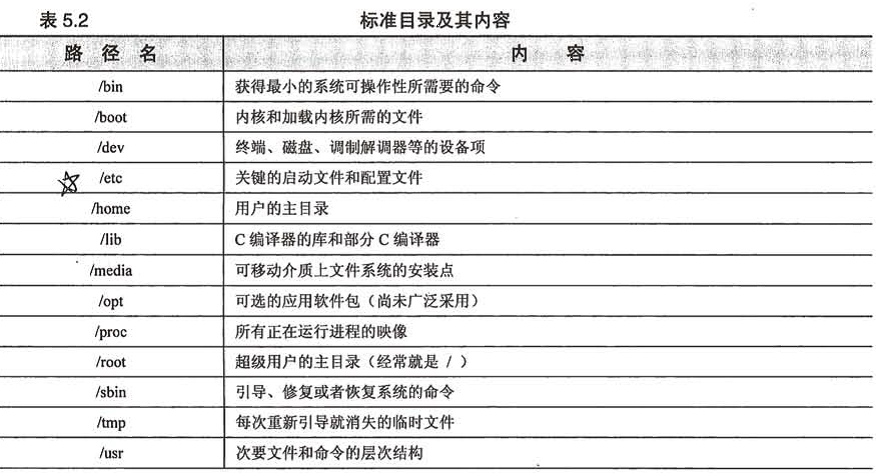
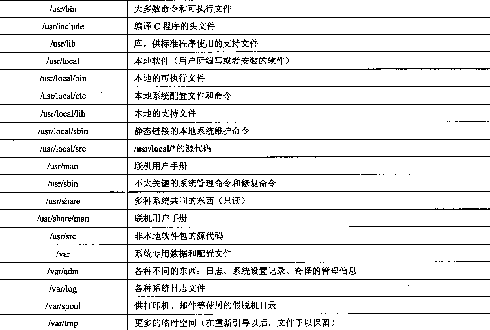
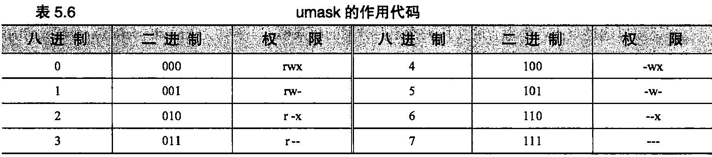
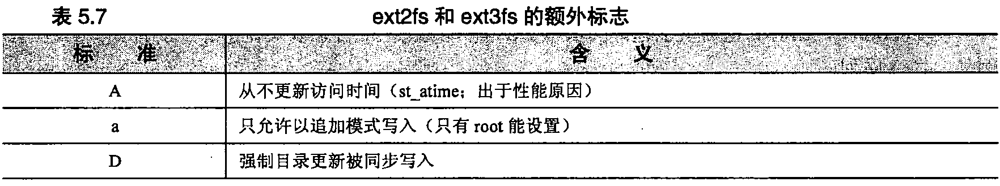
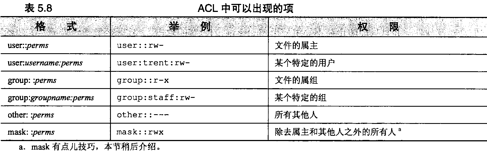

# 第5章 文件系统

在Linux“文件系统”中，我们可以找到下面这些：

- 进程
- 串打端口（串口）
- 内核数据结构和调整参数
- 进程间的通信通道

尽管文件系统的基本目的是表示和组织系统的存储资源，但程序员一直渴望在处理其他类型对象时，避免重新设计表示结构。事实已经多次证明，把那些对象映 射到文件系统的名字空间里是自然和方便的做法。这种统一既有优点（一致的编程 接口、易于从shell访问），也有一些缺点（有“自作自受”之嫌的文件系统实现）。

可以认为文件系统包括4种主要的组成部分：

- 名字空间——给事物取名，并按一种层次结构组织它们；
- API——用来遍历和操作对象的一套系统调用；
- 安全模型——用来保护、隐藏和共享事物的方案；
- 实现一把逻辑模型同实际硬件联系到一起的软件。

Linux定义了一个抽象的内核级接口，能够适应多种不同的后端文件系统。文件树的有些部分由 传统的基于磁盘的实现来处理；其他部分则由内核中单独的驱动程序来负责，例如，NFS文件系统由 一个驱动程序来处理，这个驱动程序把被请求的操作转发到另外一台计算机的服务器。NFS （网络文 件系统）将在第16章介绍。

遗憾的是，体系结构上的界线划分并不清晰，因此还有许多特殊的情形。例如，设备文件的存在 给程序提供了一种同内核内部的驱动程序进行通信的方式。这些设备文件不是真正的数据文件，但它们由基本的文件系统驱动程序来处理，并且它们的特征都存储在磁盘上。如果现在根据过去几十年的 经验重新实现文件系统的话，那么在细节方面会有些区别。

另外还有一个因素使问题变复杂（但最终还是有益的），即Linux支持不只一种基于磁盘的文件系统。现在最好的一类文件系统包括：作为大多数Linux发行版本默认文件系统的ext3fs,还有ReiserFS 、IBM的JFS和SGI的XFSo ext3fs之前的 ext2fs比较老了，但所有的发行版本都支持它，将来很长一段时间里也仍然会保持对它的支持。

在Linux上也实现了许多外来的文件系统,比如在微软Windows上使用的文件系统FAT和NTFS, 以及CD-ROM上使用的ISO-9660文件系统。Linux支持的文件系统数量超过了任何一种别的UNIX 变体。它提供的丰富选择赋予了用户更多的灵活性，而且更易于和别的系统共享文件。

文件系统讨论起来是个内容很丰富的话题，我们要从几个不同的角度来介绍。本章告诉读者可以从系统上的什么地方找到什么样的文件，还告诉读者文件的特性、权限位的含义，以及一些查看和设置属性的基本命令的用法。在第7章里，读者会找到有关文件系统方面技术性更强的内容，比如磁盘分区。**第16章**将介绍Linux上常用的文件共享系统。读者还可以看看**第26章**，这一章讨论Linux为 了和运行微软Windows的计算机共享文件所使用的软件。

虽然Linux上有那么多种不同文件系统的实现，可本章内容读起来就好像只有一种Linux文件系 统一样，是不是有点奇怪呢。因为对于大多数现代的文件系统来说，要么是为了能以更快和更可靠的方式提供传统文件系统的功能，要么就是通过在标准文件系统的语义上加一层来增加更多的特性（有 的文件系统两者都有），所以我们对诸多文件系统的实现不怎么了解。

### 5.1路径名称 ###

文件系统表现为单个统一的层次结构（这种单一层次结构的系统和Windows所采用的不一样，Windows保留了特定于磁盘的名字空间概念）:从目录/开始并通过若干数量的子目录继续向下扩展，/也叫做根目录。

为了找到某个特定文件而必须遍历的一系列目录，再加上文件名就形成了 “路径名"。路径名既 可以是绝对的（/tmp/foo），也可以是相对的（book4/filesystem）。相对路径认为是从当前目录开始。 用户可能习惯于把当前目录看作是shell的特色，但实际上每个进程也都拥有一个当前目录。

术语文件（file）、文件名（filename）、路径名（pathname）、路径（path）或多或少都可以互换使用（或者至少在本书中可以互换使用）。文件名和路径可以用来指绝对路径和相对路径，路径名通常表示绝对路径。

文件系统的深度可以任意。不过，路径名每部分的长度一定不能超过255个字符，并且单个路径总长不能超过4095个字符。要访问超过这个长度的路径名，就必须cd到中间的目录并使用相对路径(这里再说明一下以防不清楚：多数文件系统的磁盘格式本身并没有对路径名称的总体长度进行限制。但是，访问文件系统的系统调用不允许它们的字符串参数的长度超过4095个字符)。

除了名称在长度上有限制和不能够包含字符或空值以外，对文件和目录的命名基本上没有什么其他限制。特别是在一定程度上允许使用空格。由于UNIX长期以来有着以空白来分隔命令行参数 的传统，所以当文件名中出现空格时，老软件可能会出现问题。

在文件名中有空白的情况过去主要出现在与Mac和PC共享的文件系统上，但是现在已经蔓延到 Linux的文化之中，在一些标准的软件包里也能看到这样的文件名了。没别的办法，负责系统管理的 脚本必须做好处理空白的准备。

在shell和在脚本中，只需用引号扩起带有空白的文件名，就能保持其完整性。例如，命令：

	$ less "My excellent file.txt"

会把My excellent file.txt当作是less的单个参数。还可以用反斜线转移空格。常用shell所带的文件名补全功能（通常绑定到＜tab＞键上）就能替用户做转移。

在编写脚本的时候，要知道一个很有用的工具，这就是find命令的-print0选项。这个选项和xargs-0 一起使用就能让find/xargs命令组合不管文件名是否包含有空白都能争取执行。例如，下面的命令：

	$ find /home -size +1M -print0 | xargs -0 ls -1

找到/home分区下大小超过1MB的每个文件，按ls命令的长格式列出。

### 5.2安装和卸载文件系统 ###

文件系统由更小一些的块所组成，这些块儿也叫文件系统，每个这样的块都是由一个目录及其子目录和文件所组成的。正常情况下，根据上下文就可以明确判断出正在讨论的是哪种类型的“文件系统”，但为了清楚起见，我们将使用术语“文件树"来指文件系统的整个结构，而保留“文件系统"一 词用来表示附加到文件树的块。

大多数文件系统是磁盘分区，但正如我们前面提到的那样，文件系统可以是遵循适当API的任何 事物：网络文件服务器、内核组件、基于内存的磁盘模拟器等。Linux甚至有一个不错的“loopback（环回）”文件系统，能让用户安装单个文件，就好像它们是独立的设备一样。

使用mount命令把文件系统附加到文件树上。mount把现有文件树中的一个目录映射为新加入的文件系统的根，这个目录叫做安装点（mountpoint）。只要有另一个文件系统被安装在安装点上，那么 就不能再访问到这个安装点以前的内容了。不过安装点通常是一些空目录。

例如，命令：

	mount /dev/hda4 /users

将把存储在磁盘分区上由/dev/hda4表示的文件系统安装到路径/users下。随后可以使用ls /users 来査看这个文件系统的内容。

根据惯例，安装在某个特定系统上的文件系统清单保存在/etc/fstab文件中。包含在这个文件中的 信息让这些文件系统在引导时先检査（fsck-A）再自动安装（mount-a）到系统中。它还充当了磁盘上文件系统布局的文档资料这一角色，并可以使用像mount/usr这样的简写命令（文件系统要安装的位置可以在fstab中査到）。有关fstab文件的完整讨论，请参见7.4节。

umount命令用来卸载文件系统。在大多数系统上，不能卸载正处于“busy（繁忙）”状态的文件系统。在该文件系统中不能有任何打开的文件，也不能有任何进程的当前目录，并且如果文件系统包含有可执行的程序，那么这些程序也不能够处于运行状态。

2.4.11版以后的Linux内核定义了一种“lazy（缓慢）”的卸载方式（用umount-l命令调甩），在从目录名的层次结构中删除某个文件系统的时候，先要让当前所有对该文件系统内文件的访问都关闭，才能真正卸载这个文件系统。首先，不能保证当前的访问都会自行关闭。其次，“半卸载”状态也给使用文件系统的程序带来了不一致的文件系统语义。它们可以通过已有的文件句柄执行读写操作，却不 能打开新文件或者执行其他文件系统操作。

如果内核抱怨说用户正在试图卸载处于繁忙状态的文件系统，可以运行fuser命令来查明原因。 当以-mv标志加一个安装点为参数来调用fuser命令时，它会显示出正在使用该文件系统上的文件或 目录的每个进程的PID:

	$ fuser -mv /usr

			USER	PID	ACCESS	COMMAND
	/usr	root	444	....m	atd
			root	499	....m	sshd
			root	520	....m	lpd

ACCESS列的字母代码表示每个进程对umount命令产生的反应。表5.1介绍了每种代码的含义。

  <b></b>

为了准确地判断带来麻烦的进程是什么，只要用fuser返回的PID清单运行一下ps就行了。例如:

	$ ps -fp "444 499 520"

	UID		PID	PPID C	STIME	TTY	TIME		CMD
	
	daemon	444	1	0	April	?	00:00:00	/usr/sbin/atd
	
	root	499	1	0	April	?	00:00:23	/usr/sbin/sshd
	
	lp		520	1	0	April	?	00:00:00	[lpd]

引号强迫shell将PID清单作为一个参数传递给ps。

fuser也能报告特定文件（与整个文件系统相反）的使用，语法是fuser -v filename。fuser也接受 -k选项，杀死每个带来麻烦的进程（或者向它们发送一个信号）。危险——您必须是root（或者使用 sudo,参见 3.4.2 节）。

fuser的替代工具是程序lsof，它是由普渡大学（Purdue University）的Vie Abell编写的。lsof在许多不同的UNIX和Linux变体上都能运行，这使得它很适合由必须在多种系统上运行的脚本调用。 lsof是一种比fuser更复杂和先进的程序，它的输出相应地也详细一些。

脚本在搜索特殊信息的时候也可以直接去读/proc下的文件。不过，更简单、移植性更好的一种做法是使用lsof -F命令让lsof的输出有格式，从而易于分析。再加上其他命令行标志来限定只请求所需的信息。

### 5.3文件树的组织 ###

  <b></b>

UNIX家族的文件系统还从来没有被很好地组织过。各种互不兼容的命名约定在同时使用，整个名字空间中随意散落着不同类型的文件。在许多情况下，文件是按照其功能而不是按照被修改的可能性进行划分的，这使得操作系统的升级变得困难起来。例如，/etc目录中既包含了一些从来就不需要 定制的文件，又包含了一些完全是本地性的文件。如何知道哪些文件在升级过程中应该保存呢？是的， 管理员确实必须知道……

像/var这样的新增目录已经帮助解决了一些问题，但是大多数系统仍然处于缺乏组织的状态。尽管如此，每一个文件还都有其从文化意义上看是合适的位置。在Linux下，不要弄乱文件树的默认结构尤其重要，因为软件包和它们的安装工具经常对文件的位置做出大胆的假设（就像其他系统管理员 那样！）。

根文件系统包括根目录和最小的一组文件和子目录，包含内核的那个文件位于根文件系统中的 /boot目录下，它的名字通常以vmlinuz开头(以前/boot—度常作为一个独立的文件系统.这样做大多是因为内核必须放在靠近启动盘的开头处，好让BIOS能访问到. 现代的PC不再有这个问题了，/boot更常作为根文件系统的一部分)。存放设备文件的/dev目录（除了/dev/pts,它单独安装）、存放关键系统文件的/etc目录、存放重要工具的/sbin和/bin目录，有时候还有用来存放临时文件的/tmp 目录都是根文件系统的一部分。**有关配置内核的更多信息请参见第28章**。

目录/usr和/var也非常重要。/usr是存放大多数标准程序的地方，它还有其他一些内容，例如在 线用户手册和绝大多数数库文件。把/usr作为单独的文件系统并非严格要求，但出于管理上的方便， 几乎总是这么设置。为了让系统能够最终启动到多用户模式，必须有/usr和/var这两个目录。参考7.4 节了解为什么最好进行分区，以及进行分区的一些指导。

/var存放有假脱机目录、日志文件、记账信息和其他各种快速增长或变化的东西以及随主机不同 而有所不同的东西。由于/var包含有日志文件，而日志文件会随着故障出现的次数增多而增长，所以，如果可行的话，把/var放置在它自己的文件系统上是一个好主意。

用户的主目录应该保存在单独的文件系统上，这个单独的文件系统通常安装在根目录中。还可以 用单独的文件系统存储占用空间较大的东西，例如源代码库和数据库等。

表5.2中列出了一些比较重要的标准目录，

处于不断发展中的文件系统层次结构标准（Filesystem Hierarchy Standard）正在努力编制标准目录，使之合理，并加以说明，在要确定该把什么东西放在哪儿的时候，最好参考一下这个资源。我们在11.6 节开始讨论设计本地文件系统结构时还要考虑的其他一些问题。

### 5.4文件类型 ###

Linux定义了7种文件类型。即使在开发人员把精彩的新内容添加到文件树中（比如在/proc下列出的进程信息）的时候，仍然必须让新内容看起来像下面7种类型之一：

- 普通文件
- 目录
- 字符设备文件
- 块设备文件
- 本地域套接口
- 有名管道（FIFO）
- 符号链接

用户可以用命令ls -ld来判断现有文件的类型。ls命令输出的第一个字符表示类型。下面的例子表明/usr/include 是一个目录：

	$ Is -Id /usr/include

	wxr-xr-x 27 root root	4096 Jul 15 20:57 /usr/include

ls使用表5.3中给出的代码来表示文件的各种类型。

  <b></b>

rm是删除不要文件的通用工具。不过，怎样删除一个名为-f的文件呢？它在大多 数文件系统中都是一个完全合法的文件名，但是rm-f却不能起作用，因为-f被解释成了一个rm的标 志。答案是，要么用更完整的路径名（比如./-f）来指出文件，要么用rm的--参数来告诉它后面的所 有东西都是文件名而不是选项（例如，rm--f）

在采用模式匹配的时候，使用rm的-i选项，让rm确认每个文件的删除操作是一个好主意。这项功能可以防止删除 偶然匹配模式但又是“好”的任何文件。例如，要删除一个名为foo<Control-D>bar的文件，可以使用：

	$ ls
	
	foo?bar foose kde-root
	
	$ rm -i foo*
	
	rm: remove 'foo\004bar? y 
	rm: remove 'foose? n

注意，ls将控制字符显示为一个问号，这会有点儿欺骗性(ls -b命令以八进制数显示特殊字符，如果需要特意辨别它们的话，这个命令就可以帮上忙。<Control-A>是1 （八进制为 \001）、<Control-B>是2,以此类推)。如果忘记了 “？”是一个shell要进行模式匹配的字符，而试着用rm foo?bar，那么可能会删除不只一个文件（虽然本例中不是这样）。-i 应该是常用的选项！

为了删除名字最难对付的文件，可能需要求助rm -i *这条命令。

还有一种方法能删除名字古怪的文件，就是通过访问文件系统的其他接口，比如emacs的dired 模式，或者像Nautilus这样的可视化工具。

#### 5.4.1普通文件 ####

普通文件只是一个装字节的包而已；Linux并没有就其内容规定任何结构。文本文件、数据文件、 可执行程序和共享库都作为普通文件存储，普通文件既能顺序存取，也能随机存取。

#### 5.4.2目录 ####

目录包含按名字对其他文件的引用。用户可以使用mkdir命令来创建目录，使用rmdir命令来删除空目录，使用rm-r命令来删除非空目录。

特殊项"."和".."分别代表目录本身和它的父目录，它们不可以移动。由于根目录没有父目录， 所以"/."和"/.."是等价的（都等同于/）。

文件的名称实际上存储在它的父目录中，而不是和文件本身存储在一起。事实上，在同一时间，不只一个目录（或者是单个目录中的不只一个目录项）能够引用一个文件，并且引用可以拥有不同的名称。这样的安排产生了这样的错觉：一个文件同时存在于多个位置。

这些多出来的引用（链接）跟原来的文件是没有什么区别的；在Linux看来，它们都是等同的。 Linux维护着指向每个文件的链接的计数，在该文件的最后一个链接被删除之前不释放该文件的数据块。Linux的链接不能够跨过文件系统的边界。

现在，这种类型的引用通常叫做"硬链接”，以此把它们同符号链接区分开来，符号链接将在下面介绍。我们采用ln命令来创建硬链接，采用rm命令来删除硬链接。

如果记住ln是cp的镜像，那么就很容易记住ln的语法。命令cp oldfile newfile创建oldfile的一个副本，该副本叫做newfile。 ln oldfile newfile让名称newfile成为对oldfile新增的一个引用。

要理解硬链接并不是文件的一种独特类型，这一点很重要。文件系统只是允许不只一个目录项指 向某个特定的文件，而不是定义了一个单独的称为硬链接的“事物”。除了文件的内容之外，所有链接 之间还共享这个文件的根本属性，比如归属关系和访问权限。

#### 5.4.3字符设备文件和块设备文件 ####

设备文件让程序能够同系统的硬件和外围设备进行通信。在配置内核的时候，那些知道怎样同系 统的每个设备进行通信的模块就被链入内核（这些模块也可以被内核动态地加载）。用于某个特定设备的模块叫做设备驱动程序，它负责管 理该设备的凌乱细节。有关设备及其驱动程序的更多信息，请**参见第28章**。

设备驱动程序提供了一个标准的通信接口，该接口看起来就好像是一个普通文件。当内核接到一 个对字符或块设备文件的请求时，它就简单地把这个请求传递给适当的设备驱动程序。不过，区分设 备文件和设备驱动程序是很重要的。设备文件只是用来同设备驱动程序进行通信的结合点。它们并不 是设备驱动程序本身。

字符设备文件让与之相关的驱动程序做它们自己的输入和输出缓冲。块设备文件由处理块数据 I/O的驱动程序使用，并要求内核为它们提供缓冲。以前，有些类型的硬件既可以表示为块设备文件， 也可以表示为字符设备文件。但是现在很少有这样的配置了。

设备文件用两个数字来表示其特征，这两个数字分别叫做主设备号和次设备号。主设备号告 诉内核该文件访问哪个驱动程序，次设备号告诉驱动程序对哪个物理单元寻址。例如，Linux系统上的主设备号6表示并行端口驱动程序。第一个并行端口 C/dev/lp0）的主设备号为6,次设备号为0。

有些设备驱动程序以它们高兴的方式来解释传给它们的次设备号。例如，磁带驱动程序经常使用 次设备号来确定关闭该设备文件时是否应该回卷磁带。

设备文件可以使用mknod命令来创建，使用rm来删除。不过基本上没有必要手工创建设备文件。 大多数发行版本使用udev根据内核对硬件的检测结果自动创建和删除设备文件。通过限制/dev目录 下虚设的设备文件数量，以及确保分配给文件的设备号符合内核期望的做法，udev就能保持/dev目录 的整洁。参见第28章了解更多这方面的知识。

万一需要手工创建设备文件时，有个叫做/dev/MAKEDEV的老脚本作为udev的备用工具挺不错 的。这个脚本能为各类设备定出符合规范的设备文件名和设备号，因此用户不必亲自去检查结果。例如，**MAKEDEV pty**这条命令能给伪终端创建设备文件。

如果需要得知一个驱动程序的主次设备号，在该驱动程序的手册页中第4节（例如，**man 4 tty**）里就能找到这方面的信息。

#### 5.4.4本地域套接口 ####

套接口 （socket）就是在进程之间让它们以"干净卫生”的方式进行通信的连接。Linux提供了几 种不同类型的套接口，其中大多数涉及使用网络。本地域套接口只能从本地主机访问，并且是通过文件系统对象而不是网络端口来使用。它们有时称为“UNIX域套接口（UNIX domain socket）”。

尽管套接口文件对于其他进程是可见的目录项，但是通信连接之外的进程不能够读写它们。使用 本地域套接口的一些标准工具有打印系统、X Windows系统和syslog。有关系统日志的更多信息，请 参见第10章。

本地域套接口由系统调用socket创建，当套接口不再有任何用户时，可以使用rm命令或系统调 用unlink来删除它。

#### 5.4.5有名管道 ####

与本地域套接口类似，有名管道能让运行在同一主机上的两个进程之间进行通信。它们也称为 “FIFO文件”（FIFO是“first in, first out［先入先出］”的缩写）。有名管道使用mknod来创建，使用rm 命令来删除。

#### 5.4.6符号链接 ####

符号链接或者叫做“软”链接通过名字指向文件。当内核在查找路径名的过程中遇到符号链接时， 它就把它的注意力重定向到作为该链接的内容而存储的路径名上。硬链接和符号链接之间的区别在于： 硬链接是直接引用，而符号链接是通过名称进行引用，符号链接跟它们指向的文件是不同的。

符号链接使用In-s来创建，使用rm来删除。由于符号链接能够包含任意的路径，所以它们可以指向其他文件系统上的文件或者指向不存在的文件。几个符号链接还可以形成一个环。

符号链接既可以包含绝对路径，也可以包含相对路径，例如:

	# ln -s archived/secure /var/log/secure

S个命令釆用相对路径把/var/log/secure链接到/var/achived/secure。它用一个目标路径“archived/ secure”创建了一个符号链接/var/log/secure，结果见下面这条ls命令的输出：

	$ ls -l /var/log/secure
	
	lrwxrwxrwx 1 root root 18 2005-07-05 12:54 /var/log/secure -> archived/secure
(ls显示的符号链接的文件权限为lrwxrwxrwx,这个权限是虚设的。创建、删除链接或者跟随链接的权限都由包含链接的目录控制，而读写和执行链接目标的权限由目标自己的权限决定。因此，符号链接不需要（也没有）它自己的任何权限信息)

整个/var/log目录可以移动到另外某个位置而不会让这个符号链接不起作用（建议不要移动那个目录）。

认为ln -s的第一个参数与自己的当前工作目录有关是一个常见错误。In不把它解析为一个文件名，它只是被逐字用作符号链接的目标。

### 5.5文件属性 ###

在传统的UNIX和Linux文件系统模型中，每个文件都有一组9个权限位用来控制谁能够读写和 执行该文件的内容。这9位和另外影响到可执行程序运行的3个权限位一起，构成了文件的“模式” （mode）.

这12个模式位和4位的文件类型信息一起保存在一个16位的字中。这4个文件类型位在文件创建时设定并且不能修改，但是12个模式位可以由文件的属主或超级用户使用chmod（改变模式）命令来修改。使用ls -l（对于目录来说，使用ls -ld）可以査看这些位的值。5.5.4节中给出了一个例子。

#### 5.5.1 权限位 ####

9个权限位用来确定可以由谁对文件执行什么样的操作。（尽管Linux现在在所有主要的文件系统上都支持访问控制列表，参见5.6节），传统的UNIX不能逐个用户地去设置权限，而是为文件的属主、文件的属组和其他每个人设置访问权限集合。每个集合有3位：读取位、写入位和执行位。

采用八进制数字来讨论文件的访问权限很方便，因为一个八进制数字的每一位代表3位，而每组权限位中正好有3位。最前面的3位（对应的八进制值为400、200和100）控制属主的访问权限。第二个三位组（40、20和10）控制组的访问权限。最后面的三位组（4、2和1）控制其他每个人的访问 权限。在每个三位组中，髙位是读取位，中间位是写入位，低位是执行位。

每个用户只能够划归为这3个三位组中的一组，使用最具体的权限。例如，一个文件的属主（owner）拥有的访问权限由属主权限位而不是组权限位所确定。"其他"（other）和"组"（group）类别有可能拥有比属主更多的访问权限，但这样的配置很少使用。

在普通文件上，读取位允许打开该文件并读取它的内容。写入位允许修改或删截该文件的内容。 不过，能否删除和重命名（或者删除后再重建）该文件则由该文件父目录上的权限设置所控制（因为 名字到数据空间的映射关系实际上存储在父目录中）。

执行位允许执行文件。可执行文件有两种类型：一种是二进制的，CPU能够直接运行它；另外一种是脚本，脚本必须由shell或其他某种程序来解释。按照惯例，脚本以下面形式的一行代码开始：

	#!/usr/bin/perl

这行代码指定了一个合适的解释程序。没有指定解释程序的那些非二进制可执行文件（由用户的 shell）假定为bash或者sh脚本文件（内核能够理解#!语法，碰到它后会直接开始操作•不过，如果没有完全和正确地指定解释程序，那么内核将拒绝执行文件• 接下来shell会通过调用ih来再次尝试执行这个脚本）。

对于目录来说，当分析路径名时，执行位（在这种上下文环境中，也经常叫做“搜索[search]”位 或“扫描[scan]”位）的作用是控制是否能够进入或通过该目录，而不是控制能否列出它的内容。读取 位和执行位的组合的作用才是控制是否列出目录中的内容，写入位和执行位的组合则允许在目录中创 建、删除和重新命名文件。

#### 5.5.2	setuid 和 setgid 位 ####

八进制值为4000和2000的两位是setuid位和setgid位。如果在可执行文件上设置这两位，那么它们能让程序访问运行它们的用户本来无权访问的文件和进程。可执行文件的setuid/setgid机制在3.1 节介绍。

在某个目录上设置了 setgid位以后，在这个目录中新创建的文件具有该目录的属组权限而不是创建该文件的用户的默认属组。这项约定使得在几个用户之间（只要这些用户都属于一个共同的组）共享一个目录中的文件变得更加简单。对setgid位的这种解释跟它在可执行文件上设置时的含义没有什 么关系，但不要混淆了这两种意义。

您还可以在非可执行的纯文本文件上设置setgid位，在该文件被打开时请求特殊的锁定操作，但很少用。

#### 5.5.3粘附位 ####

八进制值为1000的位叫做“粘附位”。在早期的UNIX系统上，它作为限定符对于可执行文件来说很重要。不过，粘附位的含义现在已经过时了，现代操作系统已经悄然地忽略了它。

如果在目录上设置了这个粘附位，那么除非您是该目录的属主、该文件的属主或者是超级用户，否则文件系统不会允许删除或重新命名该目录中的文件。在这个目录上拥有写入权限是不够的。这项约定有助于让像/tmp之类的目录变得多少有些隐私性和安全性。

#### 5.5.4查看文件属性 ####

文件系统为每个文件维护大约40项单独的信息，但其中的大多数只是对于文件系统本身有用。作为系统管理员，主要关心的是链接数、属主、属组、模式、大小、最后访问时间、最后修改时间和 类型=所有信息可以使用ls -l（或者对于目录来说是ls -ld）来査看。

文件系统还为每个文件维护了属性改变的时间。给这个时间起的习惯名称（ctime，代表change time）使得一些人以为它是文件的创建时间。遗憾的是，它不是，它只是记录文件属性（属主、模式 等）最后改变的时间（注意跟修改文件内容的时间区分开来）。

考虑下面的例子：

	$ Is -1 /bin/gzip
	
	-rwxr-xr-x	3 root root	57136 Jun 15	2004 /bin/gzip

第一个字段指定该文件的类型和模式。第一个字符是短划线，因此这个文件是普通文件。参考表5.3了解其他文件类型的代码。

这个字段中接下来的9个字符就是3组权限位。这些组的顺序是“属主-属组-其他”，每组中位的 次序是“读-写-执行”=尽管这些位只有二进制的值，但Is用字母来显示它们：字母r表示读取、字母 w表示写入、字母x表示执行。在这个例子中，属主对该文件拥有全部的访问权限，其他每个人只拥有读取和执行的权限。

如果已经设置了 setuid位，那么，表示属主的执行权限的x将用一个s来替代。如果setgid位已经被设置的话，那么表示组执行权限的x也会被s所替代。如果该文件的粘附位己经被打开，那么权 限的最后那个字符（就是规定“其他人”执行权限的字符）显示为t。如果设置了 setuid、setgid或粘 附位中的一个，但又没有设置其相应的执行位，那么这些位就显示为S或T。

列表中的下一个字段是该文件的链接数目。在示例中是3,表示/bin/grip是这个文件3个名字中的 一个（另外两个名字是/bin/gunzip和/bin/zcat）。每次建立一个该文件的硬链接时，链接数目就增加1。

所有目录将至少拥有两个硬链接：来自父目录的链接和来自目录本身内部的特殊文件的链接。符号链接不影响链接数目

在ls输出中接下来的两个字段是文件的属主和属组。在这个例子中，该文件的属主是root,该文件又属于组root。文件系统实际上保存的是用户ID和组ID的编号，而不是字符串名。如果不能够确定数字ID号对应的文字（名字），那么这些字段将包含数字ID号。如果拥有该文件的用户或组己经 从/etc/passwd或/etc/group文件中删除的话，那么可能会出现这种情况。出现这种情况还可能预示着 NIS或者LDAP数据库（如果用到这个数据库的话）有问题，具体请参见第17章。

接下来的字段是文件以字节为单位的大小。示例中的文件长度是57136字节，大约56K，接下来的字节是文件最后被修改的日期:2004年6月15日。列表中最后那个字段是该文件的名称/bin/gzip。

如果是设备文件，ls的输出稍微有些不同，例如：

	$ Is -1 /dev/tty0
	
	crw-rw		1 root root 4,	0 Jun 11	20:41 /dev/tty0

大多数字段是一样的，但不显示文件的大小，而是显示其主设备号和次设备号。/dev/tty0是设备驱动程序4（在这个系统上，是终端驱动程序）所控制的第一个虚拟控制台。

ls有一个选项-i，它用于查看硬链接，这个选项让ls显示每个文件的“索引节点号”。我们没有必要过多地深究有关文件系统实现的具体细节，我们只是说索引节点号是列出文件系统里所有文件的一 张表中的一个索引。索引节点就是目录项所指向的东西，同一文件的硬链接项具有相同的索引节点号。 要勾勒出链接复杂的网状关系，需要使用Is -li命令来给出链接数目和索引节点号，和find —起来找到匹配结果。

系统自动跟踪修改时间戳、链接数目和文件大小信息的变化。相反地，权限位、归属关系和属组 权只有当它们分别采用chmod、chown和chgrp命令修改时才改变。

其他一些应该知道的Is重要选项有：-a列出一个目录的所有项（包括名字以点开头的文件），-t按照时间对文件排序（或者-tr，按照时间逆序排列），-F以区分目录和可执行文件的方式显示文件名，-R逆序显示，以及-h以方便人们阅读的形式显示文件大小（例如，8K或者53M）。

#### 5.5.5	chmod：改变权限 ####

chmod命令改变文件的权限。只有文件的属主和超级用户才能够修改它的权限。如果想要打开setuid、setgid或粘附位，则要使用4个而不是3个八进制位，由3个特殊位来构成第一个八进制位。

表5.4说明了每个三位组的8种可能组合，其中的r、w和x分别代表读取、写入和执行。

  <b></b>

例如，chmod 711 myprog赋予属主所有的极限，而只给其他每个人赋予执行权限（如果myprog是一个shell脚本，那么它需要同时打开读取和执行的权限=为了让解释程序运行这个脚本，这个脚本必须像文本文件一样被打开和读取=二进制文件是由内核直接执行的，因此不需要打开读取权限）。

chmod的助记语法的全部信息可以在chmod的手册页中找到。其规则的一些示例如表5.5所示。

  <b></b>

使用助记语法的困难之处在于要记住o代表“owner（属主）”还是“other （其他人）”（正确答案 是其他人）。只要类比UID和GID记住u和g，那么就只剩下一种可能了。

您还可以通过类比一个现有的文件来指定要分配的权限模式。例如，chmod -reference=filea fileb 让fileb的权限模式和filea的权限模式一样。

chmod可以使归地更新某个目录下文件的权限。不过，这可比它看上去更需慎重对待，因为包含进来可能不是全都有相同的属性（例如，有些文件可能是可执行文件，而 别的文件可能是文本文件）。采用-R选项时使用助记语法格外有用，因为没有明确设置的任何位，其 值都保持不变。例如：

$ chmod -R g+w mydir

给mydir及其所有内容増加了属组的写入权限，同时又不会弄错目录以及程序的执行位。

#### 5.5.6 chown:改变归属关系和组 ####

chown命令改变文件和文件的属组所有权。chown的语法跟chmod类似，只不过它的第一个参数以user:group的形式指定了新的属主和属组。属主和属组之一都可以为空。如果没有属组，也就不需要冒号（:）了，但是带上冒号，会让chown命令把user的属组设为默认组。出于历史原因，user.group 这样的形式也能接受，但是由于用户名可以包括点，所以这种形式不够通用。

要改变一个文件的属组，您必须是该文件的属主而且属于目标属组的成员，或者必须是超级用户。您必须是超级用户才能改变文件的属主。

类似chmod, chown也提供了递归的-R标志，能够改变一个目录以及在它之下所有文件的设定。例如，命令序列：

	#	chmod 755 ~matt
	
	#	chown -R matt:staff ~matt

可以在复制了默认启动文件以后用来建立一个新用户的主目录。一定不要采用类似下面的命令来chown新用户的点文件（.）：

	#	chown -R matt:staff -*matt/.*

这个模式将匹导致其父目录的归属关系被修改，而且很可能还会造成其他用户主目录 归属关系被修改。

传统的UNIX系统使用一个单独的命令（chgrp）去改变一个文件的属组。Linux也一样提供了chgrp 命令。它的用法与chown命令基本相同。

#### 5.5.7 umask:分配默认的权限 ####

用户可以使用内建的shell命令umask来影响分配给新创建文件的默认权限。umask用一个三位数字的八进制值形式来指定，这个值代表要“剥夺”的权限。当创建文件时，它的权限就设置为创建 程序请求的任何权限去掉umask禁止的权限。因此umask的三位数字所对应的权限如表5.6所示。

例如，umask 027允许属主具有所有权限，但禁止属组的写入权限，并且不允许其他任何用户有 任何权限。默认的umask值是022,它不允许属组和其他用户有写入权限。

  <b></b>

没有办法强制用户拥有某个特定的umask值，因为用户能够把这个值重设为他们想要的任何值。 但是，在给新用户提供的.cshrc和.profile样本文件中，可以提供一个合适的默认值。有关启动文件的 更多信息请参见第6章。

#### 5.5.8额外的标志 ####

Linux的ext2fs和ext3fs文件系统定义了一些补充属性，您可以打开它们来请求获得特殊的文件 系统语义一“请求”是操作字，因为许多标志实际上还没有实现。例如，一个标志让文件只能追加 （append）,另一个标志让文件不可变动和不可删除。

既然这些标志不能用于ext*系列以外的其他文件系统，所以Linux使用了特殊命令lsattr和chattr 来查看和改变它们。表5.7列出了当前能用的标志（目前大约只占在手册页中提到的那些标志的50%）。

除了 “不作备份”标志可能有所例外，还不清楚它们中间别的功能可以提供多少日用价值。"不可改变”和“仅限追加”标志多被认为能让系统对黑客或者恶意代码损坏的抵抗力更强。遗憾的是，它们会搞乱软件，并且只能防止还不知道使用chattr-ia的黑客的攻击(在20.6节介绍的“权力（capability）”机制使得关闭这些附加标志位变得更困难.但是这项功能目前还没有广泛使用)。实际经验已经表明，这些标 志往往黑客用得比防黑客的还多。

启动同步写的S和D选项也应引起特别注意，由于它们迫使与某个文件和目录有关的所有文件系 统页面都要随变动而立即写出到硬盘上，所以似乎能在发生崩溃的时候提供额外的保护,防止数据丢 失。但是同步更新的操作次序不固定，而且已经知道这会把fsck搞糊涂，因此，可能导致受损文件系 统的恢复更困难而不是更可靠，随ext3fs提供的文件系统日志机制通常是更好的选项。j选项强制对特定文件的数据做日志，但这样会带来一些性能上的开销。

### 5.6访问控制列表 ###

9位的属主/属组/其他人访问控制系统己得到证明是强大的，足以满足大多数管理方面的需求。虽然这种系统有明显的局限性，但是它却非常好地保持了UNIX简洁和可预测的传统（有人可能会说是 “前传统”）。

事实上，在所有非UNIX的操作系统上都采用了一种实质上更为复杂的方式来管理对于文件的访问：访问控制列表（access control list）,简称ACL。ACL不限长度，可以包含用于多个 用户或者用户组的权限规定。更先进的系统能让系统管理员指定部分权限的集合或者否定方式 的权限。有些系统还有继承特性，可以一次依靠多个ACL来指定访问权限。这些系统显然比传 统的UNIX模型功能更强，但是对于系统管理员和软件开发人员来说，它们的复杂性也增加了一个数量级，

因为在POSIX规范中增加了 ACL,所以许多UNIX的变体也开始支持一种相当标准的ACL机制, 这种机制和传统的UNIX 9位权限模式平行地发挥作用。在Linux下，ext2、ext3、ReiserFS、XFS和 JFS都支持ACL。通常在默认情况下会禁用它们，在调用mount命令时加h, acl选项就可以启用ACL。 **参考7.4.5节**了解有关mount命令的更多知识，

为了内容的完整性，我们在这里介绍Linux的ACL模型。但是不要被其华丽的外表所迷惑一 ACL不一定比传统的文件权限更好，在行的系统管理员应该在一定程度上谨慎地使用它们。不仅因为它们用起来复杂而且费事，而且它们在和NFS、备份系统以及文本编辑器这样的程序联用的时候也会 造成问题。ACL在不断变化，所以随着时间推移在变得不可维护。

使用ACL表面上看起来圾能让人接受的理由或许就是增强与其他操作系统的兼容性。具体来说，用来和Windows系统共享文件的Samba软件能够识别ACL,实实在在地在Linux和Windows的ACL 之间进行转换。**参考26.6节了解有关Samba的更多信息**。

#### 5.6.1	ACL 概述 ####

Linux的ACL主要是对标准的9位权限模型直接进行扩展。读写和执行权限只是系统能够处理的 权力(capability)。而像setuid和粘附位这样的功能还是通过传统的模式位专门处理。

ACL可以按照用户和用户组的任意组合独立地设置rwx权限位。表5.8列出了 ACL各组成项的 样子。

  <b></b>

user和group可以用名字或者UID/GID来标识。一个ACL能包含的组成项的数量随着文件系统 实现的不同而不同，范围从XFS的最低25项，到ReiserFS和JFS的最多可以没有限制。ext2和ext3 文件系统可以有32项，对于在任何情况下都能管理来说，这或许是一个比较合理的上限。

getfacl命令可以显示一个文件当前的ACL, setfacl命令可以修改或者设置文件当前的ACL。setfacl -b file 命令可以清除 ACL, setfacl -m aclspec file 可以修改或者扩展 ACL，而 setfacl -x aclspec yz/e可以删除ACL中的特定项(使用-x选项时省略权限说明部分)。只要在aclspec中用逗号分隔ACL项，就能够在其中包含多个ACL项。

带有ACL的文件仍然保留有它们原来的权限模式位，但是会自动在两套权限设置之间强制保持 一致，使它们一定不发生冲突。下面的例子展示了 ACL项随着chmod命令对权限模式位的修改而自 动更新的情况：

	$ touch /tmp/example
	
	$ ls -1 /tmp/example
	
	-rw-rw-r- 1 garth garth 0 Jun 14 15:57 /tmp/example
	
	$ getfacl /tmp/example
	
	getfacl: Removing leading '/' from absolute path names
	
	#	file: tmp/example
	
	#	owner: garth
	
	#	group: garth user::rw-group::rw-other::r-
	
	$ chmod 640 /tmp/example
	
	$ getfacl —omit-header /tmp/example
	
	user::rw-
	
	group::r--
	
	other::---

这种强制保持一致的做法让不知道ACL的老软件在有ACL的情况下也能很好地工作。不过有一点问题。虽然前面例子中group::这个ACL项似乎对应了传统权限模式的中间一组权限位，但情况不一定总是这样。

为了理解其中的原委，假定有个老程序清除了传统权限模式中所有三组权限位中的写权限位（例 如，chmod ugo-w file）。这样做的目的很清楚，就是不让任何人能够写这个文件。但是如果产生的ACL将会是下面这个样子该怎么办？

	user::r-
	
	group::r-
	
	group:staff:rw-
	
	other::r-

从老程序的角度来看，文件不能修改，但是staff组中的任何成员实际上都对文件有写权。为了减 少出现二义性和误会的机会，Linux采用了下面的规则。

- ACL项user::和other::定义为等价于传统文件模式中“owner（属主）”和“other（其他人）” 的权限位。权限模式改变，对应的ACL项也改变。反之亦然。

- 在所有情况下，对于文件的属主以及没有以别的方式提到的用户，给它们赋予的有效访问权 限就是在user::和other::这两个ACL项中分别指定的权限。

- 如果一个文件没有显示规定的ACL,或者一个ACL只包含一个user::、一个group::和一个other:: 项，那么这几个ACL项等同于传统的三组权限位。上面给出的getfacl的例子就属于这种情况。（这样的ACL称为“最小” ACL，实际上不需要按一个逻辑上独立的ACL来实现。）

- 在更复杂的ACL里，传统的组权限位对应于一个称为“mask”的特殊ACL项，而不是group:: 那个ACL项。ACL的mask项限制了 ACL能够赋予所有有名字的用户、所有有名字的组以 及默认组的访问权限。

换句话说，mask规定了 ACL能够给单个组和用户访问权限的上限。它在概念上类似于umask, 不同之处在于ACL的mask始终有效，而且规定的是允许的权限，而不是不允许的权限。给有名字的 用户、有名字的组以及默认组的ACL项包括mask中没有出现的权限位，但是内核会忽略它们。

因此，传统的权限模式位不会描述不了 ACL所允许的访问权限。而且从传统权限模式的组权限位中清除一位，也会清除ACL mask中对应的位，因而让除了该文件的属主以及处于“other”类的用 户之外的所有人都没有该权限。

扩充前面例子里的ACL，使它包括对某个特定用户和组的ACL项，setfacl会自动提供一个合适 的 mask：

	$ setfacl -m user::r,user:trent:rw,group:admin:rw /tmp/example
	
	$ ls -1 /tmp/example
	
	-r--rw——+ 1 garth staff 0 Jun 14 15:57 /tmp/example
	
	$ getfacl —omit-header /tmp/example
	
	user::r--
	
	user:trent:rw-
	
	group::r-
	
	group:admin:rw-
	
	mask::rw-
	
	other::--

如前所示，setfacl命令产生了一个mask,让ACL中赋予的所有权限都发生作用。如果不想手工设置mask,可以在给setfacl命令的ACL项清单中包含这个mask,或者使用-n选项避免setfacl命令重复产生它。

在尝试访问文件的时候，要把有效UID同该文件属主的UID进行比较。如果它们两者一样，那么ACL中的user:项权限就决定了能否访问。否则，如果匹配某个特定于用户的ACL项，那么那个ACL项连同ACL的mask就一起决定了能否访问。如果没有特定于某个用户的ACL项，那么文件系统就尝试找到一个有效的组ACL项，能提供所请求的访问。这样的ACL也要和ACL的mask一起处理。如果没有找割匹配项，那么再用other::这个ACL项。

如果在一个有ACL的文件上使用传统的chmod命令来控制组的访问权限，那么要注意修改只对mask有影响。继续用前面的例子来说明：

	$ chmod 770 /tmp/example
	
	$ ls -1 /tmp/example
	
	-rwxrwx—+ 1 garth staff 0 Jun 14 15:57 /tmp/example
	
	$ getfacl —omit-header /tmp/example
	
	user::rwx
	
	user:trent:rw-
	
	group::r--
	
	group:admin:rw-
	
	mask::rwx
	
	other::--

这里ls命令的输出有点误导性。尽管表面上看给组权限，但是没有人因为是组成员而有权执行该文件。为了让组有这样的权限，必须编辑ACL本身。

#### 5.6.2默认项 ####

除了表5.8列出的ACL项之外，目录的ACL可以包括一个“default（默认）”项，加到在目录下新创建的文件和子目录的ACL上。子目录能接收主动和默认形式的ACL项。因此，最初的默认项最后会向下加给几层子目录。

在复制了默认项之后，父子ACL之间就不再有联系。如果父亲的默认项发生变化，不会反映到现有子目录的ACL上。

### 5.7习题 ###

- E5.1什么是umask?创建一个umask，对于属组或者其他人什么权限也不给。

- E5.2硬链接和符号（软）链接之间有什么不同？什么时候适用哪一种链接？

- ★E5.3阅读/etc/fstab文件的手册页。编写一行配置，在启动时自动安装一个Windows NTFS 分区/dev/hdal。使用/mnt/win_c作为安装点。

- ★E5.4在安装一个Linux系统的时候，对硬盘驱动器分区用来给每个文件系统（/var、/nsr 等）分配足够的空间很重要。“Foobar Linux”发行版本（译者注：这是作者为举例 而随便杜撰的一个发行版本）使用下面的默认设置：

	/	100MB
	
	/var 50MB /boot 10MB <swap> 128MB /usr 剩余的空间在一个繁忙的服务器上采用这样的安排会有什么样的潜在问题？

- ★E5.5为什么说将有些分区（比如/var、/home和交换分区）放到一个和其他数据文件以及 程序不同的单独驱动器上是个好主意？ /trap呢？对于列出的每种文件系统给出有针对性的理由。

- ★E5.6写一个脚本，找到一个文件系统上所有的硬链接=

- ★E5.7给出完成下面任务的命令：

	a）	把README的权限设置为对属主有读/写权，而其他每个人有读权；
	
	b）	在不需要改变（或者知道）目前权限的情况下，打开一个文件的setuid位;
	
	c）	列出当前目录的内容，按照修改时间排序，把最近修改的文件放在最后；
	
	d）	将一个叫做shared的文件的属组从“user”改成“friends”。