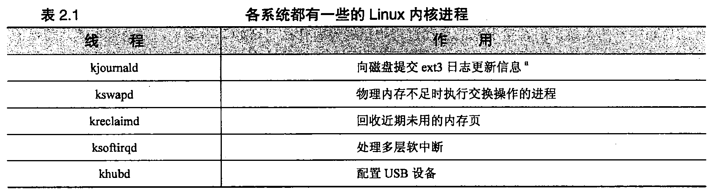
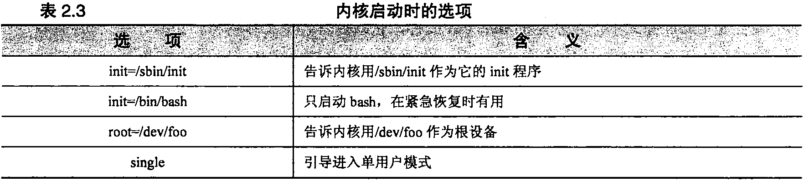
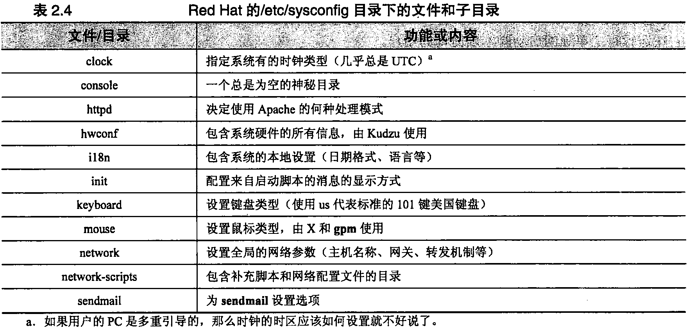

# 第2章 引导和关机

### 2.1 引导 ###

- 引导（bootstrapping）是“启动计算机”的标准术语
- 在引导过程中，内核被加载到内存中并开始执行，各种初始化任务得以执行以后，用户就能够使用系统了
- 当打开计算机时，计算机执行存储在ROM中的引导代码，这些代码接下来尝试确定如何加载并启动内核。内核检测系统的硬件，然后产生系统的init进程，这个进程总是PID 1
- 当出现操作提示符以前，要完成几项工作：系统必须检查并安装文件系统，而且系统的守护进程必须启动起来，这些步骤是有init进程按顺序运行的一系列shell脚本来管理的。启动脚本由于它们的命名方式而经常被称作“rc 文件”，“rc”代表“run command”，启动脚本的存放位置以及执行方式随操作系统的不同而异。

#### 2.1.1 自动引导和手工引导 ####

- Linux系统既可以自动方式也可以手工方式来引导。区别在于，手工方式下，系统先自动执行一些过程，然后到某一时刻后，在运行大多数初始化脚本以前，把控制权交给操作员。这时候，计算机处于“单用户模式”，大多数系统进程还没有运行，其他用户还不能够登录进入系统。
- 当出现某些故障而打断了自动引导过程时，例如，出现损坏的文件系统或者出现没有正确配置的网络接口时，我们需要掌握手工引导的方法。

#### 2.1.2 引导过程的步骤 ####

Linux系统典型的引导过程有下面6个不同的阶段组成：
  
- 加载并初始化内核  
- 检测和配置设备  
- 创建内核线程  
- 操作员干预（仅用于手工引导）  
- 执行系统启动脚本  
- 多用户模式运行  

系统管理员对以上**大多数步骤**几乎没有什么控制权，我们通过编辑系统启动脚本来影响大多数的引导配置

#### 2.1.3 初始化内核 ####

[^_^]:
    参考28章了解有关内核的知识。

- Linux内核本身就是一个程序，系统引导过程中的第一项任务就是把这个程序载入内存，以便执行它。内核的路径名通常是/vmlinuz 或者 /boot/vmlinuz（参考第28章）
- Linux系统实现了一种有两个阶段的加载过程。在第一阶段中，系统ROM把一个小的引导程序从磁盘载入到内存中。然后，这个程序再安排载入内核
- 内核执行内存检测来确定有多少RAM可用，内核的一些内部数据结构按静态方式分配其内存量，因此，当内核地洞时，它就为自己划分出一块固定大小的实存空间。这块空间保留给内核使用，用户级进程不能使用。内核在控制台上打印一条消息，报告物理内存的总量以及用户进程可用的内存量

#### 2.1.4 配置硬件 ####

- 内核执行的第一批任务之一包括检查机器的环境以确定机器有什么硬件。我们需要告诉内核，它会找到哪些硬件设备。当内核开始执行时，它试图找到并初始化已经告诉它的每一个设备。大多数内核为它们所找到的每个设备打印出一行专门信息。
- 内核配置期间提供的设备信息经常不够明确。在这样的情况下，内核通过探测设备总线和向适当的驱动程序寻求信息来尝试确定它所需要的其他信息。没有检测到设备的驱动程序或者那些没有响应探测的驱动程序将被禁用。如果某个设备（比如手机）后来连接到系统上，那么还是有可能随时加载或启用它的驱动程序的。

#### 2.1.5 内核线程 ####

- 一旦完成了基本的初始化任务，内核就在用户空间创建几个“自发”的进程，但这些进程不是通过系统正规的fork机制锁创建的（**参见4.2节**）
- 自发进程的数量和特性随系统的不同而不同
- Linux上，没有PID 为 0的进程，和进程init（PID一定为1）一起的是几个内存和内核处理进程，如表2.1所列出的进程。这些进程的PID（进程号）都比较小，在PS命令的输出中，它们的名字都被中括号括了起来（如[kacpid]）,有时候这些进程的名字以一个斜线加一个数字结尾，如[kblockd/0]，这个数字表明现场在哪个处理器上运行。（**参见4.7节**）
- 只有init是真正完整的用户进程。其他进程实际上都是内核的组成部分，为了调度或者结构上的原因而进行了装扮，使他们看上去像是进程。
- 创建完毕自发进程，内核在引导阶段的任务就完成了。但处理基本操作（比如接受登录）的进程还一个都没有创建，而且大多数Linux守护进程也都没有启动。这些任务都是由init直接或者间接负责的。

  <b></b>

#### 2.1.6 操作员干预 ####

- 如果系统以单用户模式进行引导，那么在init启动时，内核所给出的命令行标志（就是”single“这个单词）会通知init实际要引导的是单用户模式。
- 进程init最后会把控制权交给sulogin，后者是login的一个“中间但不可控”的特殊版本（**参考2.4节和第三章**）
- 用户可以按下CRTL+D而不是输入口令来绕过单用户模式而继续进入到多用户模式
- 在单用户shell中执行命令的方式和登录到已完全引导的系统上执行命令的方式类似。但在Debian和Ubuntu系统上，这时通常只安装了 root分区。为了使用不在/bin、/sbin或/etc下 的程序，用户必须手工安装其他文件系统（**文件系统和安装参考第5章**）
- 在许多单用户环境下文件系统的根目录是按只读方式安装的。如果/tmp是根文件系统的一部分， 那么许多要使用临时文件的命令（例如vi）都不能执行。为了解决这个问题，必须先把根文件系统（/） 以读写方式重新安装，再开始单用户模式的交互操作。下面这条命令通常就能实现这个技巧  
		mount -o rw,remount /
- Red Hat和Fedora的单用户模式比正常的模式要稍微多做些工作。在出现shell的命令行提示之前，这两种发行版本都会尝试安装所有的本地文件系统。虽然这样做乍看起 来挺有用，但是如果系统中包含一个有错的文件系统，那么就会发生问题。
- 正常的自动引导过程会运行fsck命令，检査并修复文件系统。在以单用户模式启动系统时，可能 需要手工执行fsck。
- 当单用户shell退出时，系统将尝试继续引导进入多用户模式。

#### 2.1.7 执行启动脚本 ####

- 启动脚本就是普通的 shell脚本，由init根据一定的算法来选择并运行它们（**详见2.5节**）

#### 2.1.8 多用户运行 ####

- 在初始化脚本运行过以后，系统就是完全运行的系统了，不过现在用户还不能登录进来
- 即使在引导完成以后，init还继续担当重要的角色。init拥有一个单用户和几个多用户“运 行级”，运行级决定启用系统的哪些资源（**运行级参见2.5节**）

### 2.2 引导PC ###

至此，我们已经看到了引导过程的一般流程。现在我们回顾几个更重要的（并且是更复杂的）步骤：  

- pc的引导过程是一次长时间的考验，理解这个过程需要相当多的背景信息。在引导一台机器的时候，它是从执行存储在ROM中的代码开始的。根据机器类型的不同，这些代码的确切位置和特性 也不相同。在明确为UNIX或其他专有操作系统而设计的机器上，这些代码通常是固件，它知道怎样 使用连接到机器的设备，知道怎样和网络进行基本通信，还知道怎样理解基于磁盘的文件系统。像这 样知道一切的固件对于系统管理员来说是非常方便的。例如，只要键入新内核的文件名，这种固件就 知道怎样定位并读取该文件。
- 在PC上，这种初始化的引导代码通常叫做BIOS （Basic Input/ Output System,基本输入输出系统），同专有机器的固件相比，它极为简单。实际上，PC拥有几种级别的BIOS:—个用于机器本身， 一个用于显示卡，另一个用于SCSI卡（如果系统有SCSI卡的话），有时候还有一个用于其他外设（比 如网卡）。
- 内置的BIOS知道主板上一些设备的信息，如IDE控制器（和磁盘）、键盘、串口和并口等。SCSI 卡通常只知道与它们相连的设备。让这些设备一起工作所需的复杂交互操作在前几年都已经标准化了，所以几乎无需进行手工干预。
- 现代的BIOS要比以前的稍微聪明一些。它们通常允许用户在启动的时候按下一个或两个特殊键 来进入一种配置模式。大多数BIOS都可以在启动时告诉用户有哪些特殊键。
- BIOS通常让用户选择想从什么设备进行引导，这听起来似乎很有用，其实不然。用户通常可以 指定“请尝试从软驱引导，然后尝试从CD-ROM引导，然后尝试从硬盘引导”诸如此类的顺序。遗憾 的是，BIOS —般被局限于从第一个IDE CD-ROM驱动器或第一个IDE硬盘引导。以前只有运气非常 好，才可能会给您一个能够识别是否有SCSI卡的BIOS.
- 一旦机器确定从什么设备来启动，那么它将尝试加载磁盘开头512个字节的信息。这512字节的 段叫做MBR （Master Boot Record,主引导记录）。MBR包含一个程序，该程序告诉计算机从磁盘的 哪个分区加载第二个引导程序（引导加载程序，boot loader）.（**有关PC风格的磁盘分区和MBR的更多信息参见第7章**）。
- 默认的MBR是一个简单的程序，它告诉计算机从磁盘上的第一个分区获取引导加载程序。Linux 提供了一种更为复杂的MBR,它知道怎样去处理多操作系统和多内核。
- —旦MBR已经选定从什么分区进行引导，它就试图加载针对那个分区的引导加载程序。之后， 就由引导加载程序负责加载内核。

### 2.3 引导加载程序： LILO和GRUB ###

如今的Linux世界里有两种流行的引导加载程序可供选择：LILO 和GRUB。LILO是传统的Linux引导加载程序，它非常稳定而且有很好的文档，但却迅速被GRUB的锋芒盖过。GRUB已经成为Red Hat、SUSE和Fedora系统馱认的引导加载程序，实际上，如今的 Red Hat和Fedora发行版本根本都不带LILO。另一方面，Debian仍然使用LILO作为其引导加载程序。

#### 2.3.1 GRUB：全面统一的引导加载程序 ####

- 对于在同一主机上运行多个操作系统（比如Windows、OpenBSD、FreeBSD等）的用户，或者对 于积极从事内核开发的用户来说，GRUB （Grand Unified Boot loader）在他们中间格外流行。GRUB 对于频繁改变系统配置的用户来说也很有帮助。每次改变LILO的配置之后，必须重新把它安装到引 导记录（即MBR）里，GRUB与此不同，它会在启动时读入自己的配置文件，省却了上述容易忘记的管理步骤。
- 用户通过运行grub-install把GRUB安装到引导驱动器上。这条命令的参数是要引导的设备名。 GRUB给物理磁盘命名的方法和Linux的习惯标准不一样。 遗憾的是，GRUB自己有一套给物理磁盘设备命名的方法，和标准的Linux约定不一样。GRUB设备 名看上去类似于，(hd0,0)：第一个数值表示物理驱动器号(从0开始)，第二个数值表示分区号(也是从0开始)。在本例中， (hd0,0)等同于Linux设备/dev/hda1。因此，如果用户想要在主(primary)设备上安装GRUB，那么应该使用命令：  
>
	grub-install  '(hd0,0)'  
	必须用引号来避免shell用它自己的方式来解释括号。  
	在默认情况下，GRUB从/boot/grub/grub.conf读取它的默认引导配置。下面是一个grub.conf文 件的例子：  
	default=0	
	timeout=10	
	splashimage=(hdO)0)/boot/grub/splash.xpm.gz title Red Hat Linux (2.6.9-5)	
	root (hd0,0)
	kernel /boot/vmlinuz-2.6.9-5 ro root=/dev/hda1
	这个例子只配置了一个操作系统，如果GRUB在10s内(timeout=10)没有接收到任何来自键盘的输入，那么就自动引导(default=0)。  
	“Red Hat Linux”配置的根文件系统是GRUB设备(hd0,0)。 GRUB从/boot/vmlinuz-2.6.9-5加载内核，而且在加载内核的时候  
	显示文件/boot/grub/splash.xpm.gz 作为“闪屏"(译者注：即通常所说的启动画面)。

- GRUB支持一种功能强大的命令界面，而且能随时编辑配置文件中的配置项。在GRUB的启动画面键入c就可以进入命令行模式。从命令行可以启动grub.conf文件里没有列出的操作系统，可以显 示系统信息,还可以执行对文件系统的基础测试。用户还能够在命令行上享受到类似shell的特色功能， 包括命令补全、光标移动等等。通过grub.conf文件能做到的事情，也能通过GRUB命令行实现。
- 在命令行上按T<Tab>键就可以看到可能命令的快捷清单。表2.2给出了比较有用的一些命令（**详细信息参考[官方手册](www.gnu.org/software/grub/manual/)**）。

  <b></b>

#### 2.3.2 LILO：传统的Linux引导加载程序 ####

LILO要用lilo命令来配置和安装。lilo命令根据文件/etc/lilo.conf的内容安装配置信息。要改变引导配置，只要更新/etc/lilo.conf并重新运行lilo即可。引导过程每次发生变化时，都必须重新配置LILO——具体来说，当用户每次想要添加一个新的引导分区以及每次有一个新的内核要引导时，都要重新配置LILO。  
下面是Linux系统的一个基本的lilo.conf文件，它既拥有一个工作内核，也有一个备粉内核:

	boot=/dev/hda	#	Put boot loader on MBR  
	root=/dev/hda1	#	Specify root partition  
	install=/boot/boot.b  
	map=/boot/map  
	delay=20	#	2 sec for user interrupt  
	image=/vmlinuz	#	Kernel to boot  
		  label=linux	#	Label to refer to this entry  
		  read-only  
	image=/vmlinuz-backup # Backup entry   
	  	  label=backup   
	  	  read-only

- 每种可能的引导情形都有一个标签。在引导时，用户通过输入合适的标签就可以告诉LILO使用 哪一个标签来引导。出现在lilo.conf中的第一个标签成为默认的引导标签。
- 在默认的情况下（名为linux）弓I导内核文件/vmlinuz。“read-only”标记指出内核应该以只读方式安装它的根文件系统。一定要有这个选项，启动脚本在适当的时候将以读写方式来重新安装这个分区。这个系统还配置成可以从备份内核/vinlinuz-backup进行引导。有这么一个备选方案总是一个好主意，内核配置受损的话会致使系统无法启动。
- 不带任何参数去运行lilo命令将生成并安装引导加载程序，而且告诉用户有哪些引导项可供使用。 它在默认的引导映像旁边打一个星号。不过，如果用户已经在lilo.conf文件中犯了某个错误，lilo通常要到引导加载程序安装到半途中才会发现这个问题。当这种情况发生时，引导加载程序就陷入一种混乱状态。在您成功地运行了lilo命令之前不要重新启动系统。
- 为了避免陷入这种状态，可以运行lilo -t来测试配置而不真的去安装它。如果一切看上去正常，那么就可以运行lilo进行实际安装。  

针对上述配置文件运行lilo,其输出如下：

	# lilo	

	Added linux*		
	Added backup
当系统引导时，LILO显示下面的提示符：  

	LILO:
等待2秒（20个1/10秒，用delay标记来设置），然后引导/vmlinuz内核并把第一个IDE硬盘 的第一个分区安装为根分区。按下<TAB>键，可以看到已经定义好的引导方案：

	LILO: <Tab> 
	linux backup 
	LILO:
要使用另外一种方案进行引导，只要在提示符处输入它的标签即可。

#### 2.3.3 内核选项 ####

LILO和GRUB都能把命令行选项传给内核。这些选项往往用来修改内核参数的取值，命令内核探测特殊的设备，指定init所在的路径，或者指派一个特定的根设备。表2.3给出了几个例子。

  <b></b>

#### 2.3.4 PC上的多重引导 ####

- 由于PC上可以运行多种操作系统，因此配置一台机器使它能够引导几种不同的系统就成为相当 常见的做法。要实现这一点，需要配置一个引导加载程序能认出磁盘上所有不同的操作系统
- 每个磁盘分区都可以拥有自己的第二阶段的引导加载程序。但是，整个磁盘却只有一个MBR。 在建立多重引导配置时，必须决定哪一个引导加载程序将成为“主"引导加载程序。不管如何，您所做出的选择将取决于涉及到的各个操作系统的特性。对于有一个Linux分区的系统来说，LILO和GRUB 通常是最佳选择。在多重引导的情况下，GRUB要比LILO更好。

#### 2.3.5	GRUB的多重引导配置 ####

多重引导的GRUB系统和单一引导的GRUB系统很相像。先装好所有想要的操作系统，然后再 对/boot/grub/grub.conf做相应的修改。弓I导Windows的grub.eonf配置看上去和引导UNIX或者Linux系统的配置不一样：

	title Windows XP

		  rootnoverify (hd0,0) 

		  chainloader +1
chainloader这个选项从一个指定的位置加载引导加载程序(本例中是主IDE驱动器上第一个分区 的第一个扇区rootnoverify选项确保GRUB不会尝试安装指定的分区。这个选项避免了 GRUB 被它所不能理解的分区搞糊涂，比如NTFS分区或者GRUB所能读取的范围之外的其他分区。
下面的grub.conf文件能够从分区1引导Windows XP，从分区2引导Red Hat Enterprise Linux, 还能从分区3引导Fedora:

	default=0
	
	timeout=5
	
	splashimage=(hd0,2)/boot/grub/splash.xpm.gz
	
	hiddenmenu
	
	title Windows XP	
		  rootnoverify (hd0,0) 
		  chainloader +1
	
	title Red Hat 
		  root (hd0,l) 
		  kernel /boot/vmlinuz
	
	title Fedora	
		  root (hd0,2)
		  kernel /boot/vmlinuz

#### 2.3.6 LILO的多重引导配置 ####

要配置一个使用MBR中LILO的多重引导系统（例如，Linux和Windows XP共存的情况），可以拿前面给出的标准LILO配置作为基础,然后返回去向/etc/lilo.conf中添加用于其他操作系统的条目。下面是从第一个IDE硬盘的第一个分区引导Windows所需的lilo.conf配置项：

	other = /dev/hda1 
	label = windows 
	table = /dev/hda

从第一个分区引导Windows,从第二个分区引导Linux,从第三个分区引导FreeBSD的完整的lilo.conf文件如下：

	boot = /dev/hda	#	install on the MBR of 1st IDE drive
	delay = 20	#	Wait 2 sec. for user’s boot choice
	default = linux	# If no input, boot linux from 2nd partition
	
	image = /boot/vmlinuz-2.6.9	
			root = /dev/hda2 label = linux
			read-only
	
	other = /dev/hdal # boot from 1st partition 
			label = windows 
			table = /dev/hda
	
	other = /dev/hda3 # boot from 3rd partition 
			label = freebsd 
			table = /dev/hda

- 把这些配置项加到liloxonf文件以后，需要重新运行lilo命令。记得先运行lilo -t,测试一下这个配置文件。（**有关分区的信息参见7.4节**）  
- 发行商（或者是志愿者）经常发布针对Linux发行版本的补丁，内核也不例外。安全漏洞、bug 以及新功能都会定期补充到内核中来。但是和其他软件包不一样的是，内核补丁并不对原来内核进行 更新，而是与现有的内核平行安装。随着时间的推移，LILO和GRUB的启动菜单中就会充满各种不 同版本的内核。使用默认的选择通常是安全的，但是如果系统在打过补丁之后无法启动了，就要意识 到可能要简单地对此做些修正。

### 2.4 引导单用户模式 ###

单用户模式是一种在不影响其他用户（或者不被其他用户影响）的情况下，修改系统配置或者实施维护工作的好方式。单用户模式也是在受损系统上展开恢复工作所采用的模式。  

向引导加载程序传递参数是进入单用户模式最常用的做法。不过，用户也可以在其他运行级内通过执行telinit 1命令进入单用户模式。除非正在调试和引导有关的问题，否则没必要重新启动系统。  

文件系统的根目录在系统引导时以只读方式安装，这是一种预防系统不稳定的手段。如果需要通 过修改位于根文件系统中的一个配置文件或者命令来解决问题，或者需要执行一条会修改这些文件的 命令，那么上述手段就会妨碍我们达到预期的目的。为了解决这个问题，可以用下面的命令重新按读 写模式安装根文件系统：

	# mount -o remount-w /

GRUB和LILO在系统引导过程中进入单用户模式的确切步骤不一样。

#### 2.4.1用GRUB引导单用户模式 ####

在GRUB下，不需要使用命令行就能进入单用户模式。GRUB的作者们认识到，引导选项应该很 容易就能修改，并且用“a”键作为相应的工具来设定引导选项，在GRUB的启动画面中，加亮显示 所需的内核，按下“a”键后添加引导选项即可。要引导单用户模式，就在现有的内核选项之后再加上 single标志。下面是_个典型的配置例子：

	grub append> ro root=LABEL=/ rhgb quiet single

#### 2.4.2用LILO引导单用户模式 ####

各个发行版本提供了不同的访问LILO命令行的途径。如果在偏爱GRUB的Red Hat、Fedora 或者SUSE上安装了 LILO,那么就就要从绚丽的全彩色启动界面上选择“command line”这个菜单 选项。Debian和Ubuntu的用户则应该在BIOS刚执行完内存检査和其他系统自检之后马上按下shift键不松手。  

在LILO提示符处，键入想要引导的配置的标签名（按照lilo.conf中指定的名字），后跟-s或者single。例如，Debian自带的默认配置叫做“linux”，所以要引导该配置进入单用户模式，应该使用:

	LILO: linux single

### 2.5启动脚本 ###

从单用户模式退出以后（或者，在自动引导过程中要运行单用户shell的时刻），init执行系统的启动脚本。这些脚本实际上只是由sh （实际是bash）解释的普通shell脚本。在不同的系统中，这些 脚本的确切位置、内容和组织结构有相当大的区别。  
经常在启动脚本中执行的一些任务如下：

- 设置计算机的名称
- 设置时区
- 采用fsck检査磁盘（只在自动模式下)
- 安装系统的磁盘
- 从/trap目录删除旧文件
- 配置网络接口
- 启动守护进程和网络服务

大多数启动脚本的内容相当详尽，而且能打印出正在做的每件事情的描述。如果系统在引导过程 中出现问题而挂起，或者用户正试图确定错误在某个脚本中的位置时，这种打印信息的啰嗦做法将会 有莫大帮助。  

在以前的系统上，系统管理员常做的一件事是修改启动脚本，使得脚本为特定的环境做合适的事 情。不过，由于软件打包的粒度更细，而且会频繁从Internet进行更新.迫使系统采用了一种更可靠 的方式.现在，系统装了由各个软件安装的大量启动小脚本，这些脚本从若干独立的文件读它们的 本地配置信息。这些本地配置文件通常采用微小sh脚本的形式来设置shell变量的值，然后启动脚本 再用这些变量的取值。

#### 2.5.1 init和运行级 ####

传统的init定义了 7个“运行级（run level）",每一个级别都代表系统应该补充运行的某些特定服务：

- 0级是完全关闭系统的级别；
- 1级或S级代表单用户模式；
- 2〜5级是多用户级别；
- 6级是“重新引导（reboot）”的级别。

0级和6级比较特殊，因为系统实际上不能留在这两个级别里，进入这两个级别的效果是关闭系统或者重新引导系统。在大多数系统上，正常的多用户运行级别是2或3级。运行级5经常用于X Windows的登录进程，比如xdm。运行级4很少使用，运行级1和S的定义在每种系统上是不同的。  

单用户模式传统上是init的级别1。它关闭所有的多用户和远程登录进程，确保系统运行在最小 软件组合的模式下。不过，由于单用户模式提供对系统的超级用户访问权限,.因此只要引导系统进入 到单用户模式，管理员都要让系统提示用户输入root的口令。创建S运行级是为了解决下面的需要： 它产生一个进程提示输入root的口令。在Linux上，这一级别只是用来提示输入root的口令，而它本 身并不是最终的运行目的。

/etc/inittab文件告诉init在它的每个运行级上要做什么事情。它的格式随系统的不同而异，但基本思想是：inittab规定了系统进入到每一级别时要运行（或者要保持运行）的命令。

在机器引导时，init从运行级0开始，一级一级往上运行到在/etc/inittab中所设置的默认运行级别。为了完成在每一对相邻运行级别之间的过渡，init运行在/etc/inittab中为这种过渡而说明的一些操作。当机器关闭时，以相反的顺序执行同样的处理过程。  

遗憾的是，inittab文件的语义有点儿不那么完善，为了把inittab文件的功能映射成为某种更为灵活的形式，Linux系统实现了另一层抽象，它通常采用“改变运行级”脚本的形式（通常为 /etc/init.d/rc）,由inittab来调用。这一脚本接下来执行位于与运行级有关的目录下的其他脚本，从而 把系统带入到新的状态。（[ubuntu中没有/etc/inittab文件探究](https://blog.csdn.net/gavinr/article/details/6584582)）  

现在，大多数Linux发行版本默认启动到运行级5,对于不需要运行X的服务器来说这个级别并不合适。默认运行级很容易修改。下面这个从SUSE主机上的inittab文件中截取的片段设置默认启动到运行级5:

	id:5:initdefault

系统管理员通常不必直接处理/etc/inittab,因为几乎对于任何应用程序来说，基于脚本的接口就足够了。

启动脚本的主拷贝位于/etc/initd这个目录下。每个脚本负责一个守护进程或者系统的某个特定方面。这些脚本都认识参数start和stop,从而知道它们所处理的服务是应该启动还是应该停止。大多数脚本还认识参数restart,通常该参数等同于在stop后面再接start。作为系统管理员，要启动和停止各个服务，只要手工运行与之有关的init.d脚本就可以了。  
例如，下面是一个简单的启动脚本，它可以启动、停止或重新启动sshd:

	#! /bin/sh

	test -f /usr/bin/sshd || exit 0 
	case "$1" in
	
		start)
		
			echo -n "Starting sshd: sshd"	
			/usr/sbin/sshd	
			echo "."
			;;
		stop)
		
			echo -n "Stopping sshd: sshd" 
			kill `cat /var/run/sshd.pid`
			echo "."
			;;
		
		restart)
		
			echo -n "Stopping sshd: sshd" 
			kill `cat /var/run/sshd.pid`
			echo "."
			echo -n "Starting sshd: sshd"
			
			/usr/sbin/sshd	
			echo "."
		*)
			echo "Usage: /etc/init.d/sshd start|stop|restart" 
			exit 1
			;;
	esac

尽管/etc/init.d中的脚本能够启动和停止各个服务，但是由init运行的主控制脚本需要知道其他一 些信息，这些信息说明了要进入任何指定的运行级别需运行哪些脚本（并带什么参数）。当主脚本把系统引入到一个新的运行级别时，它不是直接在initd目录下找，而是查找叫做rclevel.d的目录，这里 的level就是要进入的运行级别编号（例如，rc0.d, rc1.d等）。

在典型情况下，这些rclevel.d目录包含的符号链接都链接到了 init.d目录中的脚本上。这些符号 链接的名称都以S或K开头，后跟一个数字以及该脚本所控制的服务名（例如，S34named）。当init**从低的运行级别向髙**的运行级别过渡时，它按照**数字递增**的顺序运行所有以S(表示Strart)开头的、带有start参数的脚本。当init**从髙的运行级别向低**的运行级别过渡时，它按照**数字递减**的顺序运行所有以K（表示kill）开头的、带有stop参数的脚本。

这一机制让系统管理员可以细粒度地控制启动服务的顺序。例如，在网络接口启动之前先启动SSH就没有意义。在Fedora系统上，虽然network和sshd都配置了在运行级2启动，但是network 的脚本序号为10,而sshd的脚本序号为55，所以network肯定先运行。在加入新服务的时候，一定要考虑到这种依赖关系。要告诉系统什么时候启动一个守护进程，我们必须在适当的目录下创建符号链接。例如，要告诉系统在运行级2期间启动CUPS并在系统关闭以前妥善地停止这个守护进程，那么创建下面这一对链接就够了：

	#	In -s /etc/init.d/cups /etc/rc2.d/S80cups	
	#	In -s /etc/init.d/cups /etc/rc0.d/K80cups

第一行命令告诉系统：当进入运行级2时，把运行启动脚本/etc/initd/cups作为最后要做的事情之一，并且带start参数去运行这个脚本。第二行告诉系统：当关闭系统时，要较早运行/etc/initd/cups, 并且带stop参数来运行这个脚本。有些系统以不同方式处理系统关闭（shutdown）和重新引导（reboot）, 所以我们需要在/etc/rc6.d目录中也放一个符号链接，以确保当系统重新引导时，该守护进程能够被正确关闭。

#### 2.5.2	Red Hat和Fedora的启动脚本 ####

在每个运行级上，init都把新运行级作为参数来调用脚本/etc/rc.d/rc。/etc/rc.d/rc—般运行在"正 常”模式下，在这种模式下，它只做它自己的事情。它也可以运行在“确认”模式下，在这种模式下， 它在运行每个单独的启动脚本以前询问用户。

Red Hat和Fedora有一个chkconfig命令来帮助用户管理服务。这条命令可以在系统中增删启动脚本，也可以管理这些脚本执行的运行级，还能列出一个脚本目前为哪些运行级做了配置。

Red Hat还有一个rc.local脚本，和在BSD系统上看到的非常类似。rc.local是作为启动过程的一部分而运行的最后一个脚本。以前initscripts这个软件包会覆盖rc.local的内容。不过现在已经不这样了，向rc.local中添加用户自己定制的启动内容也很安全。  
下面是Red Hat启动会话的一个例子：

	[kernel information]
	
	INIT: version 2.85 booting
	
	Setting default font (latarcyrhev-sunl6):	[ OK ]
	
				Welcome to Red Hat Linux
	
			Press 'I' to enter interactive startup.
	
	Starting udev:	[ OK ]
	
	Initializing hardware... storage network audio done
	
	Configuring kernel parameters:	[ OK ]
	
	Setting clock (localtime): Tue Mar 29 20:50:41 MST 2005: [ OK ]

—旦看到“Welcome to Red Hat Enterprise Linux”送则消息，用户就可以接“i”键进入“确认”模式。 遗憾的是，Red Hat并没有让用户确认是否已经按下了正确的键。它继续安装本地文件系统、激活交换分区、加载键映射文件并定位它的内核模块。只有当它切换到运行级3时，才真正开始提示用户进行确认：
	
		Welcome to Red Hat Enterprise Linux WS 
			Press 'I' to enter interactive startup.
	
	Starting udev:	[ OK ]
	
	Initializing hardware... storage network audio done Configuring kernel parameters:	[ OK ]
	
	setting clock (localtime): tue mar 29 20:50:41 mst 2005:	[ OK ]
	
	Setting hostname rhel4:	[ OK ]
	
	Checking root filesystem
	
	/dev/hdal: clean, 73355/191616 files, 214536/383032 blocks [OK ]
	
	Remounting root filesystem in read-write mode:	[	OK	]
	
	Setting up Logical Volume Management:	[	OK	]
	
	Checking filesystems
	
	Mounting local filesystems:	[	OK	]
	
	Enabling local filesystem quotas:	[	OK	]
	
	Enabling swap space:	[	OK	]
	
	INIT: Entering runlevel: 3
	
	Entering interactive startup
	
	Start service kudzu (Y) es/(N)o/(C)ontinue ? [Y]

交互式启动模式和单用户模式在引导过程中的起点是相同的。当启动过程被中断而使得用户不能够安全地到达这个起点时，就可以使用应急软盘或者光盘去引导。

也可以给LILO传递参数init=/bin/sh，用技巧让它在init启动以前运行一个单用户的shell2。如果采用后面这种方案，那么必须手工完成全部的启动工作，包括手工用fsck命令检査本地文件系统以及安装它们。

Red Hat引导过程的大多数配置应该通过操作/etc/sysconfig中的配置文件来完成。表2.4总结了 /etc/sysconfig目录中各项的功能。

  <b></b>

我们将对表2.4中的几个选项进行进一步的说明：  

- hwconf包含了所有的硬件信息。Kudzu服务检査它来看看用户是否已经添加或者删除了任何硬件，并询问用户对所做的改动采取什么措施。用户很可能想在一个工作系统上禁用这个服务，因为只要这个服务检测硬件配置有了变化，它都会延迟引导过程，造成为每个硬件变化额外多等30s以上的时间。
- network-scripts目录包，含与网络配置有关的补充信息。用户需要改动的惟一地方是名为 ifcfg-interface的文件。例如，network-scripts/ifcft-eth0包含接口eth0的配置参数。它设置接口的IP地址和连网参数。（**有关配置网络接口的更多信息请参见第12.7节**）

- sendmail文件包含两个变量：DAEMON和QUEUE。如果DAEMON变量设置为yes，那么系统将在系统引导时就以守护进程模式（-bd）启动sendmail。QUEUE告诉sendmail，在两次邮件排队操作（-q）之间间隔多长时间；默认是一小时。

#### 2.5.3	SUSE的启动脚本 ####

虽然SUSE的启动脚本类似于RHEL和Fedora的启动脚本,但是SUSE的启动脚本确 实是它比其他Linux变体显得耀眼的一个领域。

同Red Hat和Fedora系统里的情况一样,init在每个运行级都要把新运行级作为参数来调用/etc/init.d/rc脚本。针对软件的脚本都在/etc/init.d目录下，它们的配置文件则在/etc/sysconfig目录下。 /etc/init.d/README里可以找到对SUSE引导过程很好的介绍。

虽然SUSE和RHEL/Fedora都把它们的引导配置文件放在了/etc/sysconfig目录下，但是在这个目录下的具体文件则大有不同。(首先，SUSE的文件一般都有很好的文档说明。)通过设置shell的环境变量就能调用配置选项，而这些变量接下来供/etc/init.d里的脚本访问。有些子系统比别的子系统需要更多的配置，那些需要多个配置文件的子系统有专门的子目录，比如sysconfig/network 目录。  
windowmanager文件是sysconfig目录下的一个典型例子：

windowmanager文件是sysconfig目录下的一个典型例子：

	## Path：	Desktop/Window manager
	## Description:
	## Type:	string(kde,fvwm,gnome,windowmaker)
	## Default:	kde
	## Config:	profiles,kde,susewm
	# 
	# Here you can set the default window manager (kde, fvwm, ...)
	# changes here require at least a re-login
	DEFAULT_WM="kde"
	## Type:	yesno
	## Default:	yes
	#
	# install the SUSE extension for new users
	# (theme and additional functions)
	#
	
	INSTALL_DESKTOP_EXTENSIONS=”yes”

每个变量前面都有**YaST**(YaST是SUSE特有的一种图形化配置工具，它可以维护一个SUSE系统许多方面的配罝,参考第11章了解更多信息
)可以读懂的配置信息，还有对这个变量用途的详细说明。例如，在 windowmanager文件里，DEFAULT_WM这个变量设置了由X使用的桌面窗口管理器。

SUSE在/etc/sysconfig/network目录下的网络配置文件组织得格外不错。这个目录既包含全局配置文件(设置与所有网络接口有关的配置选项)，也有特定于网络的文件。例如，network/routes这个 文件保存有全局的路由信息，在一个典型安装的SUSE系统上，它的内容类似下面的情况:

	#	Destination Dummy/Gateway Netmask Device
	
	default	192.168.10.254 0.0.0.0 eth0

仅当一个特定网络接口启动且正在运行的时候应该出现的路由，在一个叫做ifroute-ifname的文 件里指定。例如，对于名为eth1的接口，这个文件就成了 ifroute-eth1,其内容可以是：

	#	Destination	Dummy/Gateway Netmask Device
	
	10.10.0.0/24	10.10.0.254

如果愿意，Netmask和Device也能指定，但是启动脚本会推断出正确的值。

SUSE也带一个管理启动脚本的chkconflg命令。它和Red Hat提供的版本完全不同，不过它仍然 是一个有效的工具.在偏好手工管理脚本的情况下应该使用它。

不论选择使用YaST还是chkconfig,或者手工维护启动脚本，浏览/etc/sysconfig目录并且琢磨一下它的内容将会是一个好主意。

下面是一个典型的SUSE引导会话的例子：

	[kernel information]
	
	INIT: version 2.85 booting
	
	System Boot Control: Running /etc/init.d/boot
	
	Mounting /proc filesystem	done
	
	Mounting sysfs on /sys	done
	
	Mounting /dev/pts	done
	
	Boot logging started on /dev/ttyl(/dev/console) at Tue Mar 29 14:04:12 2005 Mounting shared memory FS on /dev/sh	done
	
	Activating swap-devices in /etc/fstab...
	
	Adding 1052248k swap on /dev/hda2. Priority:42 extents:1	done
	
	Checking root file system...

#### 2.5.4	Debian和Ubuntu的启动脚本 ####

如果说SUSE是对管理启动脚本有良好设计、良好执行规划的典型，那么Debian却正 好相反。Debian的脚本脆弱、缺少文档。

在每个运行级中，init都以新的运行级作为参数来调用脚本/etc/init.d/rc。每个脚本负责找到它自己的配置信息，这些信息可能是在/etc、/etc/default、以及/etc下其他子目录里，或者在脚本自身中的什么地方。

如果用户正在查找系统的主机名，那它保存在/etc/hostname里，供脚本/etc/init.d/hostname.sh读 取。网络接口和默认网关的参数保存在/etc/network/interfaces里，由从/etc/init.d/networking里调用的 ifup命令读取。有些网络选项也会在/etc/network/options中设置。

Debian和Utuntu有一种神秘的启动脚本管理程序，其形式为update-rc.d。虽然它的man手册警告说不要以交互的方式使用它，但是我们发现它虽然有点儿不友好，但还是能用的，可以替代chkconfig。例如，要在运行级2、3、4和5都启动sshd，而在运行级0、1和6停止它，就可以用：

	$ sudo /usc/sbin/update-rc.d sshd start 0123 stop 456

### 2.6重新引导和关机 ###

Linux的文件系统缓冲一般在内存中变化，只是偶尔才把它们写回磁盘。这种方案使得磁盘I/O 速度更快，但是当系统被粗暴地中止时，这种方案也更容易使文件系统丢失数据。

传统的UNIX和Linux机器要非常小心地处理关机方式才行。现代的系统已经变得不那么敏感了 （尤其是当用户使用一个像ext3fs这样强健的文件系统时），但有可能的话，妥善关机总是一个好主意。 不恰当的关机可能产生隐蔽的小问题，从而导致重大灾难事故。

在面向消费级用户的操作系统上，重新引导操作系统是适合处理几乎任何故障的第一课。而在Linux系统上，最好首先考虑清楚，然后再重新引导机器。Linux的故障更微妙、更复杂一些，因此， 盲目地重新引导系统只会在很小比例的场合下起作用。还有，Linux系统引导所花费的时间很长，这 对于多用户来说是不太方便的。

当添加一种新硬件或现有硬件出现问题甚至不能够复位时，通常需要重新引导系统。如果所修改的 配置文件只有在引导过程中才使用的话，那么，要让改动起作用，也必须重新引导系统。如果系统出现 故障，使得用户不能够登录进入系统去正确地诊断故障，这时显然除了重新引导系统以外别无选择。

只要修改启动脚本，就应该重新引导系统，以确保系统能够成功地运行起来。如果时隔几个星期之后才发现问题，那么就不太可能回想起最近所做修改的细节。

引导系统本质上只能用一种方法来完成，与此不同的是，关闭或重新引导系统有许多种方法。这些方法如下：

- 关闭电源（尽量避免）
- 使用shutdown命令（最安全、周到、彻底）
- 使用halt和reboot命令（最简单）
- 使用telinit来改变init的运行级别
- 使用poweroff命令告诉系统关闭电源

[What is the difference between these commands for bringing down a Linux server?](https://unix.stackexchange.com/questions/195898/what-is-the-difference-between-these-commands-for-bringing-down-a-linux-server)

### 2.7 习题 ###

- E2.1 为什么在安装LILO引导加载程序之前先运行lilo -t很重要？该怎样引导一个名字不是vmlinuz的内核？    

- E2.2 为什么不应该用计算机机箱上的电源开关来关闭Linux系统？有什么别的替代方法吗？  

- E2.3 用GRUB的命令行引导一个grub.conf文件中没有的内核。   

- E2.4 试描述运行级的概念。列出Linux中定义的运行级，并简短描述以下每个运行级。运行级1和S之间有什么关系？

- E2.5 编写一个启动脚本，启动名为“foo”的守护进程（/usr/local/sbin/foo），它是一项网络服务。说明如何把它融入系统，在引导时刻自动启动。

- E2.6 取得并安装Dan Farmer和Wietse Venema所写的程序mactime（TCT工具集的一部分）。运行mactime，创建一个与系统文件相关联的时间戳初始化数据库。重启机器。再次运行mactime，判断因为引导机器而被修改的文件有哪些。哪些文件访问了而没有被修改？（需要root权限）

- E2.7 如果一个系统处于运行级4，而用户运行了命令telinit 1，init会采取哪些步骤？命令最终的结果将会是什么？

- E2.8 绘制一张依赖关系图，画出在你的Linux系统上启动别的守护进程之前，必须启动哪些守护进程？

- E2.9 顺序列出创建一个能工作的多OS系统——包含Linux和Windows——所用到的步骤。使用GRUB和Windows的引导加载程序。
 
### 2.8 参考资料 ###

- [Linux 的启动流程](http://www.ruanyifeng.com/blog/2013/08/linux_boot_process.html)
