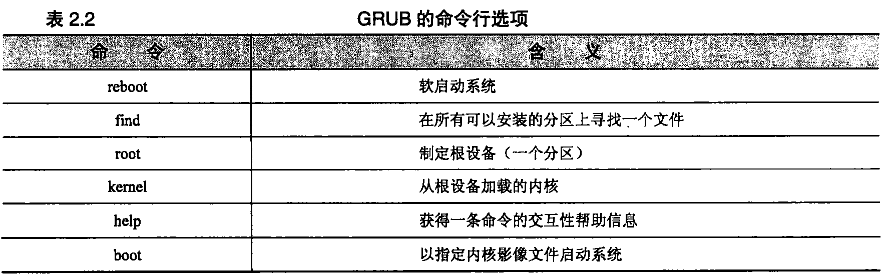

[^_^]:
    目录页从第13页开始

# 第一部分 —— 基本管理技术 #

从系统管理员的角度全面介绍Linux，涉及运行单机Linux系统所需要的大部分知识和技术。  

## 第 1 章 从何处入手 ##
[^_^]:
    第一章从第43页开始
### 1.1 读者的知识背景 ###

- 需要具备一定的**Linux/Unix**基础  
- 掌握**Vim**或者其它编辑器的基本用法  
- 能够阅读并修改[Perl](http://www.runoob.com/perl/perl-tutorial.html)、和**sh**脚本  
- 掌握一定的**Python**基础  
- 建议学习**expect**  

### 1.2 Linux同Unix的关系 ###

- [Linux和Unix的区别详解](http://www.yunweipai.com/archives/148.html)  

### 1.3 历史上的Linux ###

- [Linux历史](https://zh.wikipedia.org/wiki/Linux%E5%8E%86%E5%8F%B2)  

### 1.4 Linux的发行版本 ###

- [Linux发行版：CentOS、Ubuntu、RedHat、Android、Tizen、MeeGo](https://blog.csdn.net/ithomer/article/details/9729933)  

### 1.5 从哪里获取信息 ###

- 熟悉**man**命令  
- 了解**info**命令  
- 了解特定发行版的文档  

### 1.6 如何找到、安装软件 ###

- 熟悉**which**、**whereis**、**locate**命令  
- 通过apt-get或者rpm安装软件包

### 1.7 系统管理员的基本任务 ###

- 增加、删除以及管理用户账号  
系统管理员负责为新用户增设账号，将不再活动的用户账号删除。增删用户的处理过程可以自动进行，蛋仔增设新用户之前，仍然必须做出某些管理决定（把用户的主目录放在什么位置、在那些机器上创建账号等）。  
当某个用户不应该再访问系统时，必须禁用该用户的账号。由该账号拥有的所有文件必须备份、保存起来，以使系统不会随着时间的增长，积累不想要的信息。  

- 增删硬件  

- 执行备份   
执行备份可能是系统管理员最重要的工作了，这也是经常被忽视或者不经心去做的工作。备份可以自动进行并授权给下属去做，但系统管理员仍然要确保备份工作在按计划正确进行。

- 安装、更新、测试软件   

- 监视系统  
大型设备需要时刻进行监视。日常的监视活动包括确保电子邮件和Web服务正常工作、查看日志文件来掌握故障的早期迹象、确保本地网络都连接正确，并监视系统资源（例如磁盘空间）的可用性。  

- 故障诊断  
  
- 维护本地文档       
维护硬件、软件、系统的相关文档。

- 时刻警惕系统安全  
系统管理员必须实施某种安全策略并定期检查，以确保系统安全没有收到侵害。在安全要求低的系统上，这项工作人物可能仅仅包括对非授权访问进行粗略的检查。在安全要求高的系统上，这可能包括仔细布置陷阱和审计程序的监视网。

- 帮助用户  

### 1.8 推荐读物 ###

- Linux and the Unix Philosophy  
- The Daemon，the GNU & the Penguin

### 1.9 习题 ###

- E1.1 在您的站点上，有一个系统级的配置文件来控制man的行为吗？如果想要在/doc/man中保存本地的文档，应该在这个文件中加入哪些行？必须在/doc/man中使用什么样的目录结构来让它成为man手册页中层次结构中的一部分？    

- E1.2 man和info之间的主要区别是什么？他们各自有什么优点？  

- E1.3 Linux内核的当前发展状态如何？热点问题是什么？关键人物都有谁？项目是怎么进行管理的？   

- E1.4 研究几种Linux发行版本（参考1.4节的清单，以此作为出发点），为下列每种应用推荐一个发型版本。解释做出选择的理由。  
	a) 在家办公的单个用户；
	b）大学的计算机科学实验室；
	c）企业的Web服务器。   

## 第 2 章 引导和关机 ##
[^_^]:
    第二章从58页开始，先熟悉第5、28、29章，有助于理解本章的知识。

### 2.1 引导 ###

- 引导（bootstrapping）是“启动计算机”的标准术语
- 在引导过程中，内核被加载到内存中并开始执行，各种初始化任务得以执行以后，用户就能够使用系统了
- 当打开计算机时，计算机执行存储在ROM中的引导代码，这些代码接下来尝试确定如何加载并启动内核。内核检测系统的硬件，然后产生系统的init进程，这个进程总是PID 1
- 当出现操作提示符以前，要完成几项工作：系统必须检查并安装文件系统，而且系统的守护进程必须启动起来，这些步骤是有init进程按顺序运行的一系列shell脚本来管理的。启动脚本由于它们的命名方式而经常被称作“rc 文件”，“rc”代表“run command”，启动脚本的存放位置以及执行方式随操作系统的不同而异。

#### 2.1.1 自动引导和手工引导 ####

- Linux系统既可以自动方式也可以手工方式来引导。区别在于，手工方式下，系统先自动执行一些过程，然后到某一时刻后，在运行大多数初始化脚本以前，把控制权交给操作员。这时候，计算机处于“单用户模式”，大多数系统进程还没有运行，其他用户还不能够登录进入系统。
- 当出现某些故障而打断了自动引导过程时，例如，出现损坏的文件系统或者出现没有正确配置的网络接口时，我们需要掌握手工引导的方法。

#### 2.1.2 引导过程的步骤 ####

Linux系统典型的引导过程有下面6个不同的阶段组成：
  
- 加载并初始化内核  
- 检测和配置设备  
- 创建内核线程  
- 操作员干预（仅用于手工引导）  
- 执行系统启动脚本  
- 多用户模式运行  

系统管理员对以上**大多数步骤**几乎没有什么控制权，我们通过编辑系统启动脚本来影响大多数的引导配置

#### 2.1.3 初始化内核 ####

[^_^]:
    参考28章了解有关内核的知识。

- Linux内核本身就是一个程序，系统引导过程中的第一项任务就是把这个程序载入内存，以便执行它。内核的路径名通常是/vmlinuz 或者 /boot/vmlinuz（参考第28章）
- Linux系统实现了一种有两个阶段的加载过程。在第一阶段中，系统ROM把一个小的引导程序从磁盘载入到内存中。然后，这个程序再安排载入内核
- 内核执行内存检测来确定有多少RAM可用，内核的一些内部数据结构按静态方式分配其内存量，因此，当内核地洞时，它就为自己划分出一块固定大小的实存空间。这块空间保留给内核使用，用户级进程不能使用。内核在控制台上打印一条消息，报告物理内存的总量以及用户进程可用的内存量

#### 2.1.4 配置硬件 ####

- 内核执行的第一批任务之一包括检查机器的环境以确定机器有什么硬件。我们需要告诉内核，它会找到哪些硬件设备。当内核开始执行时，它试图找到并初始化已经告诉它的每一个设备。大多数内核为它们所找到的每个设备打印出一行专门信息。
- 内核配置期间提供的设备信息经常不够明确。在这样的情况下，内核通过探测设备总线和向适当的驱动程序寻求信息来尝试确定它所需要的其他信息。没有检测到设备的驱动程序或者那些没有响应探测的驱动程序将被禁用。如果某个设备（比如手机）后来连接到系统上，那么还是有可能随时加载或启用它的驱动程序的。

#### 2.1.5 内核线程 ####

- 一旦完成了基本的初始化任务，内核就在用户空间创建几个“自发”的进程，但这些进程不是通过系统正规的fork机制锁创建的（**参见4.2节**）
- 自发进程的数量和特性随系统的不同而不同
- Linux上，没有PID 为 0的进程，和进程init（PID一定为1）一起的是几个内存和内核处理进程，如表2.1所列出的进程。这些进程的PID（进程号）都比较小，在PS命令的输出中，它们的名字都被中括号括了起来（如[kacpid]）,有时候这些进程的名字以一个斜线加一个数字结尾，如[kblockd/0]，这个数字表明现场在哪个处理器上运行。（**参见4.7节**）
- 只有init是真正完整的用户进程。其他进程实际上都是内核的组成部分，为了调度或者结构上的原因而进行了装扮，使他们看上去像是进程。
- 创建完毕自发进程，内核在引导阶段的任务就完成了。但处理基本操作（比如接受登录）的进程还一个都没有创建，而且大多数Linux守护进程也都没有启动。这些任务都是由init直接或者间接负责的。

  <b></b>

#### 2.1.6 操作员干预 ####

- 如果系统以单用户模式进行引导，那么在init启动时，内核所给出的命令行标志（就是”single“这个单词）会通知init实际要引导的是单用户模式。
- 进程init最后会把控制权交给sulogin，后者是login的一个“中间但不可控”的特殊版本（**参考2.4节和第三章**）
- 用户可以按下CRTL+D而不是输入口令来绕过单用户模式而继续进入到多用户模式
- 在单用户shell中执行命令的方式和登录到已完全引导的系统上执行命令的方式类似。但在Debian和Ubuntu系统上，这时通常只安装了 root分区。为了使用不在/bin、/sbin或/etc下 的程序，用户必须手工安装其他文件系统（**文件系统和安装参考第5章**）
- 在许多单用户环境下文件系统的根目录是按只读方式安装的。如果/tmp是根文件系统的一部分， 那么许多要使用临时文件的命令（例如vi）都不能执行。为了解决这个问题，必须先把根文件系统（/） 以读写方式重新安装，再开始单用户模式的交互操作。下面这条命令通常就能实现这个技巧  
		mount -o rw,remount /
- Red Hat和Fedora的单用户模式比正常的模式要稍微多做些工作。在出现shell的命令行提示之前，这两种发行版本都会尝试安装所有的本地文件系统。虽然这样做乍看起 来挺有用，但是如果系统中包含一个有错的文件系统，那么就会发生问题。
- 正常的自动引导过程会运行fsck命令，检査并修复文件系统。在以单用户模式启动系统时，可能 需要手工执行fsck。
- 当单用户shell退出时，系统将尝试继续引导进入多用户模式。

#### 2.1.7 执行启动脚本 ####

- 启动脚本就是普通的 shell脚本，由init根据一定的算法来选择并运行它们（**详见2.5节**）

#### 2.1.8 多用户运行 ####

- 在初始化脚本运行过以后，系统就是完全运行的系统了，不过现在用户还不能登录进来
- 即使在引导完成以后，init还继续担当重要的角色。init拥有一个单用户和几个多用户“运 行级”，运行级决定启用系统的哪些资源（**运行级参见2.5节**）

### 2.2 引导PC ###

至此，我们已经看到了引导过程的一般流程。现在我们回顾几个更重要的（并且是更复杂的）步骤：  

- pc的引导过程是一次长时间的考验，理解这个过程需要相当多的背景信息。在引导一台机器的时候，它是从执行存储在ROM中的代码开始的。根据机器类型的不同，这些代码的确切位置和特性 也不相同。在明确为UNIX或其他专有操作系统而设计的机器上，这些代码通常是固件，它知道怎样 使用连接到机器的设备，知道怎样和网络进行基本通信，还知道怎样理解基于磁盘的文件系统。像这 样知道一切的固件对于系统管理员来说是非常方便的。例如，只要键入新内核的文件名，这种固件就 知道怎样定位并读取该文件。
- 在PC上，这种初始化的引导代码通常叫做BIOS （Basic Input/ Output System,基本输入输出系统），同专有机器的固件相比，它极为简单。实际上，PC拥有几种级别的BIOS:—个用于机器本身， 一个用于显示卡，另一个用于SCSI卡（如果系统有SCSI卡的话），有时候还有一个用于其他外设（比 如网卡）。
- 内置的BIOS知道主板上一些设备的信息，如IDE控制器（和磁盘）、键盘、串口和并口等。SCSI 卡通常只知道与它们相连的设备。让这些设备一起工作所需的复杂交互操作在前几年都已经标准化了，所以几乎无需进行手工干预。
- 现代的BIOS要比以前的稍微聪明一些。它们通常允许用户在启动的时候按下一个或两个特殊键 来进入一种配置模式。大多数BIOS都可以在启动时告诉用户有哪些特殊键。
- BIOS通常让用户选择想从什么设备进行引导，这听起来似乎很有用，其实不然。用户通常可以 指定“请尝试从软驱引导，然后尝试从CD-ROM引导，然后尝试从硬盘引导”诸如此类的顺序。遗憾 的是，BIOS —般被局限于从第一个IDE CD-ROM驱动器或第一个IDE硬盘引导。以前只有运气非常 好，才可能会给您一个能够识别是否有SCSI卡的BIOS.
- 一旦机器确定从什么设备来启动，那么它将尝试加载磁盘开头512个字节的信息。这512字节的 段叫做MBR （Master Boot Record,主引导记录）。MBR包含一个程序，该程序告诉计算机从磁盘的 哪个分区加载第二个引导程序（引导加载程序，boot loader）.（**有关PC风格的磁盘分区和MBR的更多信息参见第7章**）。
- 默认的MBR是一个简单的程序，它告诉计算机从磁盘上的第一个分区获取引导加载程序。Linux 提供了一种更为复杂的MBR,它知道怎样去处理多操作系统和多内核。
- —旦MBR已经选定从什么分区进行引导，它就试图加载针对那个分区的引导加载程序。之后， 就由引导加载程序负责加载内核。

### 2.3 引导加载程序： LILO和GRUB ###

如今的Linux世界里有两种流行的引导加载程序可供选择：LILO 和GRUB。LILO是传统的Linux引导加载程序，它非常稳定而且有很好的文档，但却迅速被GRUB的锋芒盖过。GRUB已经成为Red Hat、SUSE和Fedora系统馱认的引导加载程序，实际上，如今的 Red Hat和Fedora发行版本根本都不带LILO。另一方面，Debian仍然使用LILO作为其引导加载程序。

#### 2.3.1 GRUB：全面统一的引导加载程序 ####

- 对于在同一主机上运行多个操作系统（比如Windows、OpenBSD、FreeBSD等）的用户，或者对 于积极从事内核开发的用户来说，GRUB （Grand Unified Boot loader）在他们中间格外流行。GRUB 对于频繁改变系统配置的用户来说也很有帮助。每次改变LILO的配置之后，必须重新把它安装到引 导记录（即MBR）里，GRUB与此不同，它会在启动时读入自己的配置文件，省却了上述容易忘记的管理步骤。
- 用户通过运行grub-install把GRUB安装到引导驱动器上。这条命令的参数是要引导的设备名。 GRUB给物理磁盘命名的方法和Linux的习惯标准不一样。 遗憾的是，GRUB自己有一套给物理磁盘设备命名的方法，和标准的Linux约定不一样。GRUB设备 名看上去类似于，(hd0,0)：第一个数值表示物理驱动器号(从0开始)，第二个数值表示分区号(也是从0开始)。在本例中， (hd0,0)等同于Linux设备/dev/hda1。因此，如果用户想要在主(primary)设备上安装GRUB，那么应该使用命令：  
>
	grub-install  '(hd0,0)'  
	必须用引号来避免shell用它自己的方式来解释括号。  
	在默认情况下，GRUB从/boot/grub/grub.conf读取它的默认引导配置。下面是一个grub.conf文 件的例子：  
	default=0	
	timeout=10	
	splashimage=(hdO)0)/boot/grub/splash.xpm.gz title Red Hat Linux (2.6.9-5)	
	root (hd0,0)
	kernel /boot/vmlinuz-2.6.9-5 ro root=/dev/hda1
	这个例子只配置了一个操作系统，如果GRUB在10s内(timeout=10)没有接收到任何来自键盘的输入，那么就自动引导(default=0)。  
	“Red Hat Linux”配置的根文件系统是GRUB设备(hd0,0)。 GRUB从/boot/vmlinuz-2.6.9-5加载内核，而且在加载内核的时候  
	显示文件/boot/grub/splash.xpm.gz 作为“闪屏"(译者注：即通常所说的启动画面)。

- GRUB支持一种功能强大的命令界面，而且能随时编辑配置文件中的配置项。在GRUB的启动画面键入c就可以进入命令行模式。从命令行可以启动grub.conf文件里没有列出的操作系统，可以显 示系统信息,还可以执行对文件系统的基础测试。用户还能够在命令行上享受到类似shell的特色功能， 包括命令补全、光标移动等等。通过grub.conf文件能做到的事情，也能通过GRUB命令行实现。
- 在命令行上按T<Tab>键就可以看到可能命令的快捷清单。表2.2给出了比较有用的一些命令（**详细信息参考[官方手册](www.gnu.org/software/grub/manual/)**）。

  <b></b>

#### 2.3.2 LILO：传统的Linux引导加载程序 ####

LILO要用lilo命令来配置和安装。lilo命令根据文件/etc/lilo.conf的内容安装配置信息。要改变引导配置，只要更新/etc/lilo.conf并重新运行lilo即可。引导过程每次发生变化时，都必须重新配置LILO——具体来说，当用户每次想要添加一个新的引导分区以及每次有一个新的内核要引导时，都要重新配置LILO。  
下面是Linux系统的一个基本的lilo.conf文件，它既拥有一个工作内核，也有一个备粉内核:

	boot=/dev/hda	#	Put boot loader on MBR  
	root=/dev/hda1	#	Specify root partition  
	install=/boot/boot.b  
	map=/boot/map  
	delay=20	#	2 sec for user interrupt  
	image=/vmlinuz	#	Kernel to boot  
		  label=linux	#	Label to refer to this entry  
		  read-only  
	image=/vmlinuz-backup # Backup entry   
	  	  label=backup   
	  	  read-only

### 2.7 习题 ###

- E2.1 为什么在安装LILO引导加载程序之前先运行lilo -t很重要？该怎样引导一个名字不是vmlinuz的内核？    

- E2.2 为什么不应该用计算机机箱上的电源开关来关闭Linux系统？有什么别的替代方法吗？  

- E2.3 用GRUB的命令行引导一个grub.conf文件中没有的内核。   

- E2.4 试描述运行级的概念。列出Linux中定义的运行级，并简短描述以下每个运行级。运行级1和S之间有什么关系？

- E2.5 编写一个启动脚本，启动名为“foo”的守护进程（/usr/local/sbin/foo），它是一项网络服务。说明如何把它融入系统，在引导时刻自动启动。

- E2.6 取得并安装Dan Farmer和Wietse Venema所写的程序mactime（TCT工具集的一部分）。运行mactime，创建一个与系统文件相关联的时间戳初始化数据库。重启机器。再次运行mactime，判断因为引导机器而被修改的文件有哪些。哪些文件访问了而没有被修改？（需要root权限）

- E2.7 如果一个系统处于运行级4，而用户运行了命令telinit 1，init会采取哪些步骤？命令最终的结果将会是什么？

- E2.8 绘制一张依赖关系图，画出在你的Linux系统上启动别的守护进程之前，必须启动哪些守护进程？

- E2.9 顺序列出创建一个能工作的多OS系统——包含Linux和Windows——所用到的步骤。使用GRUB和Windows的引导加载程序。
 
#### 2.8 参考资料 ####

- [Linux 的启动流程](http://www.ruanyifeng.com/blog/2013/08/linux_boot_process.html)

## 第 3 章 ##

## 第 4 章 ##

# 第二部分 —— 网络管理技术 #

描述了Linux系统使用的各种协议，介绍了用来安装、扩展和维护网络所使用的各种技术。在这个部分中还介绍了高层网络软件。各章的专题内容包括域名系统、网络文件系统、路由技术、sendmail和网络管理。

# 第三部分 —— 其它管理技术 #

包括各种各样的补充信息，例如Linux的打印系统。
