[^_^]:
    目录页从第13页开始

# 第一部分 —— 基本管理技术 #

从系统管理员的角度全面介绍Linux，涉及运行单机Linux系统所需要的大部分知识和技术。  

## 第 1 章 从何处入手 ##
[^_^]:
    第一章从第43页开始
### 1.1 读者的知识背景 ###

- 需要具备一定的**Linux/Unix**基础  
- 掌握**Vim**或者其它编辑器的基本用法  
- 能够阅读并修改[Perl](http://www.runoob.com/perl/perl-tutorial.html)、和**sh**脚本  
- 掌握一定的**Python**基础  
- 建议学习**expect**  

### 1.2 Linux同Unix的关系 ###

- [Linux和Unix的区别详解](http://www.yunweipai.com/archives/148.html)  

### 1.3 历史上的Linux ###

- [Linux历史](https://zh.wikipedia.org/wiki/Linux%E5%8E%86%E5%8F%B2)  

### 1.4 Linux的发行版本 ###

- [Linux发行版：CentOS、Ubuntu、RedHat、Android、Tizen、MeeGo](https://blog.csdn.net/ithomer/article/details/9729933)  

### 1.5 从哪里获取信息 ###

- 熟悉**man**命令  
- 了解**info**命令  
- 了解特定发行版的文档  

### 1.6 如何找到、安装软件 ###

- 熟悉**which**、**whereis**、**locate**命令  
- 通过apt-get或者rpm安装软件包

### 1.7 系统管理员的基本任务 ###

- 增加、删除以及管理用户账号  
系统管理员负责为新用户增设账号，将不再活动的用户账号删除。增删用户的处理过程可以自动进行，蛋仔增设新用户之前，仍然必须做出某些管理决定（把用户的主目录放在什么位置、在那些机器上创建账号等）。  
当某个用户不应该再访问系统时，必须禁用该用户的账号。由该账号拥有的所有文件必须备份、保存起来，以使系统不会随着时间的增长，积累不想要的信息。  

- 增删硬件  

- 执行备份   
执行备份可能是系统管理员最重要的工作了，这也是经常被忽视或者不经心去做的工作。备份可以自动进行并授权给下属去做，但系统管理员仍然要确保备份工作在按计划正确进行。

- 安装、更新、测试软件   

- 监视系统  
大型设备需要时刻进行监视。日常的监视活动包括确保电子邮件和Web服务正常工作、查看日志文件来掌握故障的早期迹象、确保本地网络都连接正确，并监视系统资源（例如磁盘空间）的可用性。  

- 故障诊断  
  
- 维护本地文档       
维护硬件、软件、系统的相关文档。

- 时刻警惕系统安全  
系统管理员必须实施某种安全策略并定期检查，以确保系统安全没有收到侵害。在安全要求低的系统上，这项工作人物可能仅仅包括对非授权访问进行粗略的检查。在安全要求高的系统上，这可能包括仔细布置陷阱和审计程序的监视网。

- 帮助用户  

### 1.8 推荐读物 ###

- Linux and the Unix Philosophy  
- The Daemon，the GNU & the Penguin

### 1.9 习题 ###

- E1.1 在您的站点上，有一个系统级的配置文件来控制man的行为吗？如果想要在/doc/man中保存本地的文档，应该在这个文件中加入哪些行？必须在/doc/man中使用什么样的目录结构来让它成为man手册页中层次结构中的一部分？    

- E1.2 man和info之间的主要区别是什么？他们各自有什么优点？  

- E1.3 Linux内核的当前发展状态如何？热点问题是什么？关键人物都有谁？项目是怎么进行管理的？   

- E1.4 研究几种Linux发行版本（参考1.4节的清单，以此作为出发点），为下列每种应用推荐一个发型版本。解释做出选择的理由。  
	a) 在家办公的单个用户；
	b）大学的计算机科学实验室；
	c）企业的Web服务器。   

## 第 2 章 引导和关机 ##
[^_^]:
    第二章从58页开始，先熟悉第5、28、29章，有助于理解本章的知识。

### 2.1 引导 ###

- 引导（bootstrapping）是“启动计算机”的标准术语
- 在引导过程中，内核被加载到内存中并开始执行，各种初始化任务得以执行以后，用户就能够使用系统了
- 当打开计算机时，计算机执行存储在ROM中的引导代码，这些代码接下来尝试确定如何加载并启动内核。内核检测系统的硬件，然后产生系统的init进程，这个进程总是PID 1
- 当出现操作提示符以前，要完成几项工作：系统必须检查并安装文件系统，而且系统的守护进程必须启动起来，这些步骤是有init进程按顺序运行的一系列shell脚本来管理的。启动脚本由于它们的命名方式而经常被称作“rc 文件”，“rc”代表“run command”，启动脚本的存放位置以及执行方式随操作系统的不同而异。

#### 2.1.1 自动引导和手工引导 ####

- Linux系统既可以自动方式也可以手工方式来引导。区别在于，手工方式下，系统先自动执行一些过程，然后到某一时刻后，在运行大多数初始化脚本以前，把控制权交给操作员。这时候，计算机处于“单用户模式”，大多数系统进程还没有运行，其他用户还不能够登录进入系统。
- 当出现某些故障而打断了自动引导过程时，例如，出现损坏的文件系统或者出现没有正确配置的网络接口时，我们需要掌握手工引导的方法。

#### 2.1.2 引导过程的步骤 ####

Linux系统典型的引导过程有下面6个不同的阶段组成：
  
- 加载并初始化内核  
- 检测和配置设备  
- 创建内核线程  
- 操作员干预（仅用于手工引导）  
- 执行系统启动脚本  
- 多用户模式运行  

系统管理员对以上**大多数步骤**几乎没有什么控制权，我们通过编辑系统启动脚本来影响大多数的引导配置

#### 2.1.3 初始化内核 ####

[^_^]:
    参考28章了解有关内核的知识。

- Linux内核本身就是一个程序，系统引导过程中的第一项任务就是把这个程序载入内存，以便执行它。内核的路径名通常是/vmlinuz 或者 /boot/vmlinuz（参考第28章）
- Linux系统实现了一种有两个阶段的加载过程。在第一阶段中，系统ROM把一个小的引导程序从磁盘载入到内存中。然后，这个程序再安排载入内核
- 内核执行内存检测来确定有多少RAM可用，内核的一些内部数据结构按静态方式分配其内存量，因此，当内核地洞时，它就为自己划分出一块固定大小的实存空间。这块空间保留给内核使用，用户级进程不能使用。内核在控制台上打印一条消息，报告物理内存的总量以及用户进程可用的内存量

#### 2.1.4 配置硬件 ####

- 内核执行的第一批任务之一包括检查机器的环境以确定机器有什么硬件。我们需要告诉内核，它会找到哪些硬件设备。当内核开始执行时，它试图找到并初始化已经告诉它的每一个设备。大多数内核为它们所找到的每个设备打印出一行专门信息。
- 内核配置期间提供的设备信息经常不够明确。在这样的情况下，内核通过探测设备总线和向适当的驱动程序寻求信息来尝试确定它所需要的其他信息。没有检测到设备的驱动程序或者那些没有响应探测的驱动程序将被禁用。如果某个设备（比如手机）后来连接到系统上，那么还是有可能随时加载或启用它的驱动程序的。

#### 2.1.5 内核线程 ####

- 一旦完成了基本的初始化任务，内核就在用户空间创建几个“自发”的进程，但这些进程不是通过系统正规的fork机制锁创建的（**参见4.2节**）
- 自发进程的数量和特性随系统的不同而不同
- Linux上，没有PID 为 0的进程，和进程init（PID一定为1）一起的是几个内存和内核处理进程，如表2.1所列出的进程。这些进程的PID（进程号）都比较小，在PS命令的输出中，它们的名字都被中括号括了起来（如[kacpid]）,有时候这些进程的名字以一个斜线加一个数字结尾，如[kblockd/0]，这个数字表明现场在哪个处理器上运行。（**参见4.7节**）
- 只有init是真正完整的用户进程。其他进程实际上都是内核的组成部分，为了调度或者结构上的原因而进行了装扮，使他们看上去像是进程。
- 创建完毕自发进程，内核在引导阶段的任务就完成了。但处理基本操作（比如接受登录）的进程还一个都没有创建，而且大多数Linux守护进程也都没有启动。这些任务都是由init直接或者间接负责的。

  <b></b>

#### 2.1.6 操作员干预 ####

- 如果系统以单用户模式进行引导，那么在init启动时，内核所给出的命令行标志（就是”single“这个单词）会通知init实际要引导的是单用户模式。
- 进程init最后会把控制权交给sulogin，后者是login的一个“中间但不可控”的特殊版本（**参考2.4节和第三章**）
- 用户可以按下CRTL+D而不是输入口令来绕过单用户模式而继续进入到多用户模式
- 在单用户shell中执行命令的方式和登录到已完全引导的系统上执行命令的方式类似。但在Debian和Ubuntu系统上，这时通常只安装了 root分区。为了使用不在/bin、/sbin或/etc下 的程序，用户必须手工安装其他文件系统（**文件系统和安装参考第5章**）
- 在许多单用户环境下文件系统的根目录是按只读方式安装的。如果/tmp是根文件系统的一部分， 那么许多要使用临时文件的命令（例如vi）都不能执行。为了解决这个问题，必须先把根文件系统（/） 以读写方式重新安装，再开始单用户模式的交互操作。下面这条命令通常就能实现这个技巧  
		mount -o rw,remount /
- Red Hat和Fedora的单用户模式比正常的模式要稍微多做些工作。在出现shell的命令行提示之前，这两种发行版本都会尝试安装所有的本地文件系统。虽然这样做乍看起 来挺有用，但是如果系统中包含一个有错的文件系统，那么就会发生问题。
- 正常的自动引导过程会运行fsck命令，检査并修复文件系统。在以单用户模式启动系统时，可能 需要手工执行fsck。
- 当单用户shell退出时，系统将尝试继续引导进入多用户模式。

#### 2.1.7 执行启动脚本 ####

- 启动脚本就是普通的 shell脚本，由init根据一定的算法来选择并运行它们（**详见2.5节**）

#### 2.1.8 多用户运行 ####

- 在初始化脚本运行过以后，系统就是完全运行的系统了，不过现在用户还不能登录进来
- 即使在引导完成以后，init还继续担当重要的角色。init拥有一个单用户和几个多用户“运 行级”，运行级决定启用系统的哪些资源（**运行级参见2.5节**）

### 2.2 引导PC ###

至此，我们已经看到了引导过程的一般流程。现在我们回顾几个更重要的（并且是更复杂的）步骤：  

- pc的引导过程是一次长时间的考验，理解这个过程需要相当多的背景信息。在引导一台机器的时候，它是从执行存储在ROM中的代码开始的。根据机器类型的不同，这些代码的确切位置和特性 也不相同。在明确为UNIX或其他专有操作系统而设计的机器上，这些代码通常是固件，它知道怎样 使用连接到机器的设备，知道怎样和网络进行基本通信，还知道怎样理解基于磁盘的文件系统。像这 样知道一切的固件对于系统管理员来说是非常方便的。例如，只要键入新内核的文件名，这种固件就 知道怎样定位并读取该文件。
- 在PC上，这种初始化的引导代码通常叫做BIOS （Basic Input/ Output System,基本输入输出系统），同专有机器的固件相比，它极为简单。实际上，PC拥有几种级别的BIOS:—个用于机器本身， 一个用于显示卡，另一个用于SCSI卡（如果系统有SCSI卡的话），有时候还有一个用于其他外设（比 如网卡）。
- 内置的BIOS知道主板上一些设备的信息，如IDE控制器（和磁盘）、键盘、串口和并口等。SCSI 卡通常只知道与它们相连的设备。让这些设备一起工作所需的复杂交互操作在前几年都已经标准化了，所以几乎无需进行手工干预。
- 现代的BIOS要比以前的稍微聪明一些。它们通常允许用户在启动的时候按下一个或两个特殊键 来进入一种配置模式。大多数BIOS都可以在启动时告诉用户有哪些特殊键。
- BIOS通常让用户选择想从什么设备进行引导，这听起来似乎很有用，其实不然。用户通常可以 指定“请尝试从软驱引导，然后尝试从CD-ROM引导，然后尝试从硬盘引导”诸如此类的顺序。遗憾 的是，BIOS —般被局限于从第一个IDE CD-ROM驱动器或第一个IDE硬盘引导。以前只有运气非常 好，才可能会给您一个能够识别是否有SCSI卡的BIOS.
- 一旦机器确定从什么设备来启动，那么它将尝试加载磁盘开头512个字节的信息。这512字节的 段叫做MBR （Master Boot Record,主引导记录）。MBR包含一个程序，该程序告诉计算机从磁盘的 哪个分区加载第二个引导程序（引导加载程序，boot loader）.（**有关PC风格的磁盘分区和MBR的更多信息参见第7章**）。
- 默认的MBR是一个简单的程序，它告诉计算机从磁盘上的第一个分区获取引导加载程序。Linux 提供了一种更为复杂的MBR,它知道怎样去处理多操作系统和多内核。
- —旦MBR已经选定从什么分区进行引导，它就试图加载针对那个分区的引导加载程序。之后， 就由引导加载程序负责加载内核。

### 2.3 引导加载程序： LILO和GRUB ###

如今的Linux世界里有两种流行的引导加载程序可供选择：LILO 和GRUB。LILO是传统的Linux引导加载程序，它非常稳定而且有很好的文档，但却迅速被GRUB的锋芒盖过。GRUB已经成为Red Hat、SUSE和Fedora系统馱认的引导加载程序，实际上，如今的 Red Hat和Fedora发行版本根本都不带LILO。另一方面，Debian仍然使用LILO作为其引导加载程序。

#### 2.3.1 GRUB：全面统一的引导加载程序 ####

- 对于在同一主机上运行多个操作系统（比如Windows、OpenBSD、FreeBSD等）的用户，或者对 于积极从事内核开发的用户来说，GRUB （Grand Unified Boot loader）在他们中间格外流行。GRUB 对于频繁改变系统配置的用户来说也很有帮助。每次改变LILO的配置之后，必须重新把它安装到引 导记录（即MBR）里，GRUB与此不同，它会在启动时读入自己的配置文件，省却了上述容易忘记的管理步骤。
- 用户通过运行grub-install把GRUB安装到引导驱动器上。这条命令的参数是要引导的设备名。 GRUB给物理磁盘命名的方法和Linux的习惯标准不一样。 遗憾的是，GRUB自己有一套给物理磁盘设备命名的方法，和标准的Linux约定不一样。GRUB设备 名看上去类似于，(hd0,0)：第一个数值表示物理驱动器号(从0开始)，第二个数值表示分区号(也是从0开始)。在本例中， (hd0,0)等同于Linux设备/dev/hda1。因此，如果用户想要在主(primary)设备上安装GRUB，那么应该使用命令：  
>
	grub-install  '(hd0,0)'  
	必须用引号来避免shell用它自己的方式来解释括号。  
	在默认情况下，GRUB从/boot/grub/grub.conf读取它的默认引导配置。下面是一个grub.conf文 件的例子：  
	default=0	
	timeout=10	
	splashimage=(hdO)0)/boot/grub/splash.xpm.gz title Red Hat Linux (2.6.9-5)	
	root (hd0,0)
	kernel /boot/vmlinuz-2.6.9-5 ro root=/dev/hda1
	这个例子只配置了一个操作系统，如果GRUB在10s内(timeout=10)没有接收到任何来自键盘的输入，那么就自动引导(default=0)。  
	“Red Hat Linux”配置的根文件系统是GRUB设备(hd0,0)。 GRUB从/boot/vmlinuz-2.6.9-5加载内核，而且在加载内核的时候  
	显示文件/boot/grub/splash.xpm.gz 作为“闪屏"(译者注：即通常所说的启动画面)。

- GRUB支持一种功能强大的命令界面，而且能随时编辑配置文件中的配置项。在GRUB的启动画面键入c就可以进入命令行模式。从命令行可以启动grub.conf文件里没有列出的操作系统，可以显 示系统信息,还可以执行对文件系统的基础测试。用户还能够在命令行上享受到类似shell的特色功能， 包括命令补全、光标移动等等。通过grub.conf文件能做到的事情，也能通过GRUB命令行实现。
- 在命令行上按T<Tab>键就可以看到可能命令的快捷清单。表2.2给出了比较有用的一些命令（**详细信息参考[官方手册](www.gnu.org/software/grub/manual/)**）。

  <b></b>

#### 2.3.2 LILO：传统的Linux引导加载程序 ####

LILO要用lilo命令来配置和安装。lilo命令根据文件/etc/lilo.conf的内容安装配置信息。要改变引导配置，只要更新/etc/lilo.conf并重新运行lilo即可。引导过程每次发生变化时，都必须重新配置LILO——具体来说，当用户每次想要添加一个新的引导分区以及每次有一个新的内核要引导时，都要重新配置LILO。  
下面是Linux系统的一个基本的lilo.conf文件，它既拥有一个工作内核，也有一个备粉内核:

	boot=/dev/hda	#	Put boot loader on MBR  
	root=/dev/hda1	#	Specify root partition  
	install=/boot/boot.b  
	map=/boot/map  
	delay=20	#	2 sec for user interrupt  
	image=/vmlinuz	#	Kernel to boot  
		  label=linux	#	Label to refer to this entry  
		  read-only  
	image=/vmlinuz-backup # Backup entry   
	  	  label=backup   
	  	  read-only

- 每种可能的引导情形都有一个标签。在引导时，用户通过输入合适的标签就可以告诉LILO使用 哪一个标签来引导。出现在lilo.conf中的第一个标签成为默认的引导标签。
- 在默认的情况下（名为linux）弓I导内核文件/vmlinuz。“read-only”标记指出内核应该以只读方式安装它的根文件系统。一定要有这个选项，启动脚本在适当的时候将以读写方式来重新安装这个分区。这个系统还配置成可以从备份内核/vinlinuz-backup进行引导。有这么一个备选方案总是一个好主意，内核配置受损的话会致使系统无法启动。
- 不带任何参数去运行lilo命令将生成并安装引导加载程序，而且告诉用户有哪些引导项可供使用。 它在默认的引导映像旁边打一个星号。不过，如果用户已经在lilo.conf文件中犯了某个错误，lilo通常要到引导加载程序安装到半途中才会发现这个问题。当这种情况发生时，引导加载程序就陷入一种混乱状态。在您成功地运行了lilo命令之前不要重新启动系统。
- 为了避免陷入这种状态，可以运行lilo -t来测试配置而不真的去安装它。如果一切看上去正常，那么就可以运行lilo进行实际安装。  

针对上述配置文件运行lilo,其输出如下：

	# lilo	

	Added linux*		
	Added backup
当系统引导时，LILO显示下面的提示符：  

	LILO:
等待2秒（20个1/10秒，用delay标记来设置），然后引导/vmlinuz内核并把第一个IDE硬盘 的第一个分区安装为根分区。按下<TAB>键，可以看到已经定义好的引导方案：

	LILO: <Tab> 
	linux backup 
	LILO:
要使用另外一种方案进行引导，只要在提示符处输入它的标签即可。

#### 2.3.3 内核选项 ####

LILO和GRUB都能把命令行选项传给内核。这些选项往往用来修改内核参数的取值，命令内核探测特殊的设备，指定init所在的路径，或者指派一个特定的根设备。表2.3给出了几个例子。

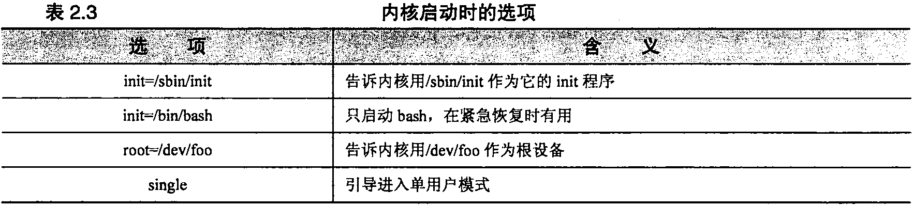  <b></b>

#### 2.3.4 PC上的多重引导 ####

- 由于PC上可以运行多种操作系统，因此配置一台机器使它能够引导几种不同的系统就成为相当 常见的做法。要实现这一点，需要配置一个引导加载程序能认出磁盘上所有不同的操作系统
- 每个磁盘分区都可以拥有自己的第二阶段的引导加载程序。但是，整个磁盘却只有一个MBR。 在建立多重引导配置时，必须决定哪一个引导加载程序将成为“主"引导加载程序。不管如何，您所做出的选择将取决于涉及到的各个操作系统的特性。对于有一个Linux分区的系统来说，LILO和GRUB 通常是最佳选择。在多重引导的情况下，GRUB要比LILO更好。

#### 2.3.5	GRUB的多重引导配置 ####

多重引导的GRUB系统和单一引导的GRUB系统很相像。先装好所有想要的操作系统，然后再 对/boot/grub/grub.conf做相应的修改。弓I导Windows的grub.eonf配置看上去和引导UNIX或者Linux系统的配置不一样：

	title Windows XP

		  rootnoverify (hd0,0) 

		  chainloader +1
chainloader这个选项从一个指定的位置加载引导加载程序(本例中是主IDE驱动器上第一个分区 的第一个扇区rootnoverify选项确保GRUB不会尝试安装指定的分区。这个选项避免了 GRUB 被它所不能理解的分区搞糊涂，比如NTFS分区或者GRUB所能读取的范围之外的其他分区。
下面的grub.conf文件能够从分区1引导Windows XP，从分区2引导Red Hat Enterprise Linux, 还能从分区3引导Fedora:

	default=0
	
	timeout=5
	
	splashimage=(hd0,2)/boot/grub/splash.xpm.gz
	
	hiddenmenu
	
	title Windows XP	
		  rootnoverify (hd0,0) 
		  chainloader +1
	
	title Red Hat 
		  root (hd0,l) 
		  kernel /boot/vmlinuz
	
	title Fedora	
		  root (hd0,2)
		  kernel /boot/vmlinuz

#### 2.3.6 LILO的多重引导配置 ####

要配置一个使用MBR中LILO的多重引导系统（例如，Linux和Windows XP共存的情况），可以拿前面给出的标准LILO配置作为基础,然后返回去向/etc/lilo.conf中添加用于其他操作系统的条目。下面是从第一个IDE硬盘的第一个分区引导Windows所需的lilo.conf配置项：

	other = /dev/hda1 
	label = windows 
	table = /dev/hda

从第一个分区引导Windows,从第二个分区引导Linux,从第三个分区引导FreeBSD的完整的lilo.conf文件如下：

	boot = /dev/hda	#	install on the MBR of 1st IDE drive
	delay = 20	#	Wait 2 sec. for user’s boot choice
	default = linux	# If no input, boot linux from 2nd partition
	
	image = /boot/vmlinuz-2.6.9	
			root = /dev/hda2 label = linux
			read-only
	
	other = /dev/hdal # boot from 1st partition 
			label = windows 
			table = /dev/hda
	
	other = /dev/hda3 # boot from 3rd partition 
			label = freebsd 
			table = /dev/hda

- 把这些配置项加到liloxonf文件以后，需要重新运行lilo命令。记得先运行lilo -t,测试一下这个配置文件。（**有关分区的信息参见7.4节**）  
- 发行商（或者是志愿者）经常发布针对Linux发行版本的补丁，内核也不例外。安全漏洞、bug 以及新功能都会定期补充到内核中来。但是和其他软件包不一样的是，内核补丁并不对原来内核进行 更新，而是与现有的内核平行安装。随着时间的推移，LILO和GRUB的启动菜单中就会充满各种不 同版本的内核。使用默认的选择通常是安全的，但是如果系统在打过补丁之后无法启动了，就要意识 到可能要简单地对此做些修正。

### 2.4 引导单用户模式 ###

单用户模式是一种在不影响其他用户（或者不被其他用户影响）的情况下，修改系统配置或者实施维护工作的好方式。单用户模式也是在受损系统上展开恢复工作所采用的模式。  

向引导加载程序传递参数是进入单用户模式最常用的做法。不过，用户也可以在其他运行级内通过执行telinit 1命令进入单用户模式。除非正在调试和引导有关的问题，否则没必要重新启动系统。  

文件系统的根目录在系统引导时以只读方式安装，这是一种预防系统不稳定的手段。如果需要通 过修改位于根文件系统中的一个配置文件或者命令来解决问题，或者需要执行一条会修改这些文件的 命令，那么上述手段就会妨碍我们达到预期的目的。为了解决这个问题，可以用下面的命令重新按读 写模式安装根文件系统：

	# mount -o remount-w /

GRUB和LILO在系统引导过程中进入单用户模式的确切步骤不一样。

#### 2.4.1用GRUB引导单用户模式 ####

在GRUB下，不需要使用命令行就能进入单用户模式。GRUB的作者们认识到，引导选项应该很 容易就能修改，并且用“a”键作为相应的工具来设定引导选项，在GRUB的启动画面中，加亮显示 所需的内核，按下“a”键后添加引导选项即可。要引导单用户模式，就在现有的内核选项之后再加上 single标志。下面是_个典型的配置例子：

	grub append> ro root=LABEL=/ rhgb quiet single

#### 2.4.2用LILO引导单用户模式 ####

各个发行版本提供了不同的访问LILO命令行的途径。如果在偏爱GRUB的Red Hat、Fedora 或者SUSE上安装了 LILO,那么就就要从绚丽的全彩色启动界面上选择“command line”这个菜单 选项。Debian和Ubuntu的用户则应该在BIOS刚执行完内存检査和其他系统自检之后马上按下shift键不松手。  

在LILO提示符处，键入想要引导的配置的标签名（按照lilo.conf中指定的名字），后跟-s或者single。例如，Debian自带的默认配置叫做“linux”，所以要引导该配置进入单用户模式，应该使用:

	LILO: linux single

### 2.5启动脚本 ###

从单用户模式退出以后（或者，在自动引导过程中要运行单用户shell的时刻），init执行系统的启动脚本。这些脚本实际上只是由sh （实际是bash）解释的普通shell脚本。在不同的系统中，这些 脚本的确切位置、内容和组织结构有相当大的区别。  
经常在启动脚本中执行的一些任务如下：

- 设置计算机的名称
- 设置时区
- 采用fsck检査磁盘（只在自动模式下)
- 安装系统的磁盘
- 从/trap目录删除旧文件
- 配置网络接口
- 启动守护进程和网络服务

大多数启动脚本的内容相当详尽，而且能打印出正在做的每件事情的描述。如果系统在引导过程 中出现问题而挂起，或者用户正试图确定错误在某个脚本中的位置时，这种打印信息的啰嗦做法将会 有莫大帮助。  

在以前的系统上，系统管理员常做的一件事是修改启动脚本，使得脚本为特定的环境做合适的事 情。不过，由于软件打包的粒度更细，而且会频繁从Internet进行更新.迫使系统采用了一种更可靠 的方式.现在，系统装了由各个软件安装的大量启动小脚本，这些脚本从若干独立的文件读它们的 本地配置信息。这些本地配置文件通常采用微小sh脚本的形式来设置shell变量的值，然后启动脚本 再用这些变量的取值。

#### 2.5.1 init和运行级 ####

传统的init定义了 7个“运行级（run level）",每一个级别都代表系统应该补充运行的某些特定服务：

- 0级是完全关闭系统的级别；
- 1级或S级代表单用户模式；
- 2〜5级是多用户级别；
- 6级是“重新引导（reboot）”的级别。

0级和6级比较特殊，因为系统实际上不能留在这两个级别里，进入这两个级别的效果是关闭系统或者重新引导系统。在大多数系统上，正常的多用户运行级别是2或3级。运行级5经常用于X Windows的登录进程，比如xdm。运行级4很少使用，运行级1和S的定义在每种系统上是不同的。  

单用户模式传统上是init的级别1。它关闭所有的多用户和远程登录进程，确保系统运行在最小 软件组合的模式下。不过，由于单用户模式提供对系统的超级用户访问权限,.因此只要引导系统进入 到单用户模式，管理员都要让系统提示用户输入root的口令。创建S运行级是为了解决下面的需要： 它产生一个进程提示输入root的口令。在Linux上，这一级别只是用来提示输入root的口令，而它本 身并不是最终的运行目的。

/etc/inittab文件告诉init在它的每个运行级上要做什么事情。它的格式随系统的不同而异，但基本思想是：inittab规定了系统进入到每一级别时要运行（或者要保持运行）的命令。

在机器引导时，init从运行级0开始，一级一级往上运行到在/etc/inittab中所设置的默认运行级别。为了完成在每一对相邻运行级别之间的过渡，init运行在/etc/inittab中为这种过渡而说明的一些操作。当机器关闭时，以相反的顺序执行同样的处理过程。  

遗憾的是，inittab文件的语义有点儿不那么完善，为了把inittab文件的功能映射成为某种更为灵活的形式，Linux系统实现了另一层抽象，它通常采用“改变运行级”脚本的形式（通常为 /etc/init.d/rc）,由inittab来调用。这一脚本接下来执行位于与运行级有关的目录下的其他脚本，从而 把系统带入到新的状态。（[ubuntu中没有/etc/inittab文件探究](https://blog.csdn.net/gavinr/article/details/6584582)）  

现在，大多数Linux发行版本默认启动到运行级5,对于不需要运行X的服务器来说这个级别并不合适。默认运行级很容易修改。下面这个从SUSE主机上的inittab文件中截取的片段设置默认启动到运行级5:

	id:5:initdefault

系统管理员通常不必直接处理/etc/inittab,因为几乎对于任何应用程序来说，基于脚本的接口就足够了。

启动脚本的主拷贝位于/etc/initd这个目录下。每个脚本负责一个守护进程或者系统的某个特定方面。这些脚本都认识参数start和stop,从而知道它们所处理的服务是应该启动还是应该停止。大多数脚本还认识参数restart,通常该参数等同于在stop后面再接start。作为系统管理员，要启动和停止各个服务，只要手工运行与之有关的init.d脚本就可以了。  
例如，下面是一个简单的启动脚本，它可以启动、停止或重新启动sshd:

	#! /bin/sh

	test -f /usr/bin/sshd || exit 0 
	case "$1" in
	
		start)
		
			echo -n "Starting sshd: sshd"	
			/usr/sbin/sshd	
			echo "."
			;;
		stop)
		
			echo -n "Stopping sshd: sshd" 
			kill `cat /var/run/sshd.pid`
			echo "."
			;;
		
		restart)
		
			echo -n "Stopping sshd: sshd" 
			kill `cat /var/run/sshd.pid`
			echo "."
			echo -n "Starting sshd: sshd"
			
			/usr/sbin/sshd	
			echo "."
		*)
			echo "Usage: /etc/init.d/sshd start|stop|restart" 
			exit 1
			;;
	esac

尽管/etc/init.d中的脚本能够启动和停止各个服务，但是由init运行的主控制脚本需要知道其他一 些信息，这些信息说明了要进入任何指定的运行级别需运行哪些脚本（并带什么参数）。当主脚本把系统引入到一个新的运行级别时，它不是直接在initd目录下找，而是查找叫做rclevel.d的目录，这里 的level就是要进入的运行级别编号（例如，rc0.d, rc1.d等）。

在典型情况下，这些rclevel.d目录包含的符号链接都链接到了 init.d目录中的脚本上。这些符号 链接的名称都以S或K开头，后跟一个数字以及该脚本所控制的服务名（例如，S34named）。当init**从低的运行级别向髙**的运行级别过渡时，它按照**数字递增**的顺序运行所有以S(表示Strart)开头的、带有start参数的脚本。当init**从髙的运行级别向低**的运行级别过渡时，它按照**数字递减**的顺序运行所有以K（表示kill）开头的、带有stop参数的脚本。

这一机制让系统管理员可以细粒度地控制启动服务的顺序。例如，在网络接口启动之前先启动SSH就没有意义。在Fedora系统上，虽然network和sshd都配置了在运行级2启动，但是network 的脚本序号为10,而sshd的脚本序号为55，所以network肯定先运行。在加入新服务的时候，一定要考虑到这种依赖关系。要告诉系统什么时候启动一个守护进程，我们必须在适当的目录下创建符号链接。例如，要告诉系统在运行级2期间启动CUPS并在系统关闭以前妥善地停止这个守护进程，那么创建下面这一对链接就够了：

	#	In -s /etc/init.d/cups /etc/rc2.d/S80cups	
	#	In -s /etc/init.d/cups /etc/rc0.d/K80cups

第一行命令告诉系统：当进入运行级2时，把运行启动脚本/etc/initd/cups作为最后要做的事情之一，并且带start参数去运行这个脚本。第二行告诉系统：当关闭系统时，要较早运行/etc/initd/cups, 并且带stop参数来运行这个脚本。有些系统以不同方式处理系统关闭（shutdown）和重新引导（reboot）, 所以我们需要在/etc/rc6.d目录中也放一个符号链接，以确保当系统重新引导时，该守护进程能够被正确关闭。

#### 2.5.2	Red Hat和Fedora的启动脚本 ####

在每个运行级上，init都把新运行级作为参数来调用脚本/etc/rc.d/rc。/etc/rc.d/rc—般运行在"正 常”模式下，在这种模式下，它只做它自己的事情。它也可以运行在“确认”模式下，在这种模式下， 它在运行每个单独的启动脚本以前询问用户。

Red Hat和Fedora有一个chkconfig命令来帮助用户管理服务。这条命令可以在系统中增删启动脚本，也可以管理这些脚本执行的运行级，还能列出一个脚本目前为哪些运行级做了配置。

Red Hat还有一个rc.local脚本，和在BSD系统上看到的非常类似。rc.local是作为启动过程的一部分而运行的最后一个脚本。以前initscripts这个软件包会覆盖rc.local的内容。不过现在已经不这样了，向rc.local中添加用户自己定制的启动内容也很安全。  
下面是Red Hat启动会话的一个例子：

	[kernel information]
	
	INIT: version 2.85 booting
	
	Setting default font (latarcyrhev-sunl6):	[ OK ]
	
				Welcome to Red Hat Linux
	
			Press 'I' to enter interactive startup.
	
	Starting udev:	[ OK ]
	
	Initializing hardware... storage network audio done
	
	Configuring kernel parameters:	[ OK ]
	
	Setting clock (localtime): Tue Mar 29 20:50:41 MST 2005: [ OK ]

—旦看到“Welcome to Red Hat Enterprise Linux”送则消息，用户就可以接“i”键进入“确认”模式。 遗憾的是，Red Hat并没有让用户确认是否已经按下了正确的键。它继续安装本地文件系统、激活交换分区、加载键映射文件并定位它的内核模块。只有当它切换到运行级3时，才真正开始提示用户进行确认：
	
		Welcome to Red Hat Enterprise Linux WS 
			Press 'I' to enter interactive startup.
	
	Starting udev:	[ OK ]
	
	Initializing hardware... storage network audio done Configuring kernel parameters:	[ OK ]
	
	setting clock (localtime): tue mar 29 20:50:41 mst 2005:	[ OK ]
	
	Setting hostname rhel4:	[ OK ]
	
	Checking root filesystem
	
	/dev/hdal: clean, 73355/191616 files, 214536/383032 blocks [OK ]
	
	Remounting root filesystem in read-write mode:	[	OK	]
	
	Setting up Logical Volume Management:	[	OK	]
	
	Checking filesystems
	
	Mounting local filesystems:	[	OK	]
	
	Enabling local filesystem quotas:	[	OK	]
	
	Enabling swap space:	[	OK	]
	
	INIT: Entering runlevel: 3
	
	Entering interactive startup
	
	Start service kudzu (Y) es/(N)o/(C)ontinue ? [Y]

交互式启动模式和单用户模式在引导过程中的起点是相同的。当启动过程被中断而使得用户不能够安全地到达这个起点时，就可以使用应急软盘或者光盘去引导。

也可以给LILO传递参数init=/bin/sh，用技巧让它在init启动以前运行一个单用户的shell2。如果采用后面这种方案，那么必须手工完成全部的启动工作，包括手工用fsck命令检査本地文件系统以及安装它们。

Red Hat引导过程的大多数配置应该通过操作/etc/sysconfig中的配置文件来完成。表2.4总结了 /etc/sysconfig目录中各项的功能。

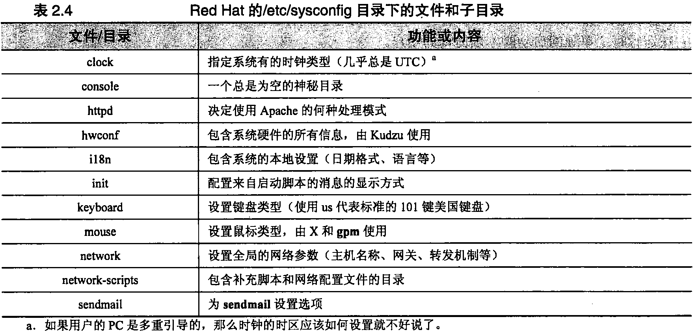  <b></b>

我们将对表2.4中的几个选项进行进一步的说明：  

- hwconf包含了所有的硬件信息。Kudzu服务检査它来看看用户是否已经添加或者删除了任何硬件，并询问用户对所做的改动采取什么措施。用户很可能想在一个工作系统上禁用这个服务，因为只要这个服务检测硬件配置有了变化，它都会延迟引导过程，造成为每个硬件变化额外多等30s以上的时间。
- network-scripts目录包，含与网络配置有关的补充信息。用户需要改动的惟一地方是名为 ifcfg-interface的文件。例如，network-scripts/ifcft-eth0包含接口eth0的配置参数。它设置接口的IP地址和连网参数。（**有关配置网络接口的更多信息请参见第12.7节**）

- sendmail文件包含两个变量：DAEMON和QUEUE。如果DAEMON变量设置为yes，那么系统将在系统引导时就以守护进程模式（-bd）启动sendmail。QUEUE告诉sendmail，在两次邮件排队操作（-q）之间间隔多长时间；默认是一小时。

#### 2.5.3	SUSE的启动脚本 ####

虽然SUSE的启动脚本类似于RHEL和Fedora的启动脚本,但是SUSE的启动脚本确 实是它比其他Linux变体显得耀眼的一个领域。

同Red Hat和Fedora系统里的情况一样,init在每个运行级都要把新运行级作为参数来调用/etc/init.d/rc脚本。针对软件的脚本都在/etc/init.d目录下，它们的配置文件则在/etc/sysconfig目录下。 /etc/init.d/README里可以找到对SUSE引导过程很好的介绍。

虽然SUSE和RHEL/Fedora都把它们的引导配置文件放在了/etc/sysconfig目录下，但是在这个目录下的具体文件则大有不同。(首先，SUSE的文件一般都有很好的文档说明。)通过设置shell的环境变量就能调用配置选项，而这些变量接下来供/etc/init.d里的脚本访问。有些子系统比别的子系统需要更多的配置，那些需要多个配置文件的子系统有专门的子目录，比如sysconfig/network 目录。  
windowmanager文件是sysconfig目录下的一个典型例子：

windowmanager文件是sysconfig目录下的一个典型例子：

	## Path：	Desktop/Window manager
	## Description:
	## Type:	string(kde,fvwm,gnome,windowmaker)
	## Default:	kde
	## Config:	profiles,kde,susewm
	# 
	# Here you can set the default window manager (kde, fvwm, ...)
	# changes here require at least a re-login
	DEFAULT_WM="kde"
	## Type:	yesno
	## Default:	yes
	#
	# install the SUSE extension for new users
	# (theme and additional functions)
	#
	
	INSTALL_DESKTOP_EXTENSIONS=”yes”

每个变量前面都有**YaST**(YaST是SUSE特有的一种图形化配置工具，它可以维护一个SUSE系统许多方面的配罝,参考第11章了解更多信息
)可以读懂的配置信息，还有对这个变量用途的详细说明。例如，在 windowmanager文件里，DEFAULT_WM这个变量设置了由X使用的桌面窗口管理器。

SUSE在/etc/sysconfig/network目录下的网络配置文件组织得格外不错。这个目录既包含全局配置文件(设置与所有网络接口有关的配置选项)，也有特定于网络的文件。例如，network/routes这个 文件保存有全局的路由信息，在一个典型安装的SUSE系统上，它的内容类似下面的情况:

	#	Destination Dummy/Gateway Netmask Device
	
	default	192.168.10.254 0.0.0.0 eth0

仅当一个特定网络接口启动且正在运行的时候应该出现的路由，在一个叫做ifroute-ifname的文 件里指定。例如，对于名为eth1的接口，这个文件就成了 ifroute-eth1,其内容可以是：

	#	Destination	Dummy/Gateway Netmask Device
	
	10.10.0.0/24	10.10.0.254

如果愿意，Netmask和Device也能指定，但是启动脚本会推断出正确的值。

SUSE也带一个管理启动脚本的chkconflg命令。它和Red Hat提供的版本完全不同，不过它仍然 是一个有效的工具.在偏好手工管理脚本的情况下应该使用它。

不论选择使用YaST还是chkconfig,或者手工维护启动脚本，浏览/etc/sysconfig目录并且琢磨一下它的内容将会是一个好主意。

下面是一个典型的SUSE引导会话的例子：

	[kernel information]
	
	INIT: version 2.85 booting
	
	System Boot Control: Running /etc/init.d/boot
	
	Mounting /proc filesystem	done
	
	Mounting sysfs on /sys	done
	
	Mounting /dev/pts	done
	
	Boot logging started on /dev/ttyl(/dev/console) at Tue Mar 29 14:04:12 2005 Mounting shared memory FS on /dev/sh	done
	
	Activating swap-devices in /etc/fstab...
	
	Adding 1052248k swap on /dev/hda2. Priority:42 extents:1	done
	
	Checking root file system...

#### 2.5.4	Debian和Ubuntu的启动脚本 ####

如果说SUSE是对管理启动脚本有良好设计、良好执行规划的典型，那么Debian却正 好相反。Debian的脚本脆弱、缺少文档。

在每个运行级中，init都以新的运行级作为参数来调用脚本/etc/init.d/rc。每个脚本负责找到它自己的配置信息，这些信息可能是在/etc、/etc/default、以及/etc下其他子目录里，或者在脚本自身中的什么地方。

如果用户正在查找系统的主机名，那它保存在/etc/hostname里，供脚本/etc/init.d/hostname.sh读 取。网络接口和默认网关的参数保存在/etc/network/interfaces里，由从/etc/init.d/networking里调用的 ifup命令读取。有些网络选项也会在/etc/network/options中设置。

Debian和Utuntu有一种神秘的启动脚本管理程序，其形式为update-rc.d。虽然它的man手册警告说不要以交互的方式使用它，但是我们发现它虽然有点儿不友好，但还是能用的，可以替代chkconfig。例如，要在运行级2、3、4和5都启动sshd，而在运行级0、1和6停止它，就可以用：

	$ sudo /usc/sbin/update-rc.d sshd start 0123 stop 456

### 2.6重新引导和关机 ###

Linux的文件系统缓冲一般在内存中变化，只是偶尔才把它们写回磁盘。这种方案使得磁盘I/O 速度更快，但是当系统被粗暴地中止时，这种方案也更容易使文件系统丢失数据。

传统的UNIX和Linux机器要非常小心地处理关机方式才行。现代的系统已经变得不那么敏感了 （尤其是当用户使用一个像ext3fs这样强健的文件系统时），但有可能的话，妥善关机总是一个好主意。 不恰当的关机可能产生隐蔽的小问题，从而导致重大灾难事故。

在面向消费级用户的操作系统上，重新引导操作系统是适合处理几乎任何故障的第一课。而在Linux系统上，最好首先考虑清楚，然后再重新引导机器。Linux的故障更微妙、更复杂一些，因此， 盲目地重新引导系统只会在很小比例的场合下起作用。还有，Linux系统引导所花费的时间很长，这 对于多用户来说是不太方便的。

当添加一种新硬件或现有硬件出现问题甚至不能够复位时，通常需要重新引导系统。如果所修改的 配置文件只有在引导过程中才使用的话，那么，要让改动起作用，也必须重新引导系统。如果系统出现 故障，使得用户不能够登录进入系统去正确地诊断故障，这时显然除了重新引导系统以外别无选择。

只要修改启动脚本，就应该重新引导系统，以确保系统能够成功地运行起来。如果时隔几个星期之后才发现问题，那么就不太可能回想起最近所做修改的细节。

引导系统本质上只能用一种方法来完成，与此不同的是，关闭或重新引导系统有许多种方法。这些方法如下：

- 关闭电源（尽量避免）
- 使用shutdown命令（最安全、周到、彻底）
- 使用halt和reboot命令（最简单）
- 使用telinit来改变init的运行级别
- 使用poweroff命令告诉系统关闭电源

[What is the difference between these commands for bringing down a Linux server?](https://unix.stackexchange.com/questions/195898/what-is-the-difference-between-these-commands-for-bringing-down-a-linux-server)

### 2.7 习题 ###

- E2.1 为什么在安装LILO引导加载程序之前先运行lilo -t很重要？该怎样引导一个名字不是vmlinuz的内核？    

- E2.2 为什么不应该用计算机机箱上的电源开关来关闭Linux系统？有什么别的替代方法吗？  

- E2.3 用GRUB的命令行引导一个grub.conf文件中没有的内核。   

- E2.4 试描述运行级的概念。列出Linux中定义的运行级，并简短描述以下每个运行级。运行级1和S之间有什么关系？

- E2.5 编写一个启动脚本，启动名为“foo”的守护进程（/usr/local/sbin/foo），它是一项网络服务。说明如何把它融入系统，在引导时刻自动启动。

- E2.6 取得并安装Dan Farmer和Wietse Venema所写的程序mactime（TCT工具集的一部分）。运行mactime，创建一个与系统文件相关联的时间戳初始化数据库。重启机器。再次运行mactime，判断因为引导机器而被修改的文件有哪些。哪些文件访问了而没有被修改？（需要root权限）

- E2.7 如果一个系统处于运行级4，而用户运行了命令telinit 1，init会采取哪些步骤？命令最终的结果将会是什么？

- E2.8 绘制一张依赖关系图，画出在你的Linux系统上启动别的守护进程之前，必须启动哪些守护进程？

- E2.9 顺序列出创建一个能工作的多OS系统——包含Linux和Windows——所用到的步骤。使用GRUB和Windows的引导加载程序。
 
### 2.8 参考资料 ###

- [Linux 的启动流程](http://www.ruanyifeng.com/blog/2013/08/linux_boot_process.html)

## 第 3 章 超级用户的权力 ##

Linux系统上的每个文件和进程都属于特定的用户账号。如果没有得到属主的许可，其他用户就不能访问这些对象，因此，这条约定有助于防止用户彼此之间不管是有意还是无意的错误行为。

系统文件和进程属于一个称为root的虚拟用户，也叫做超级用户。与任何其他账号一样，root拥有的东西也受到保护，不受来自其他用户的干扰。要进行系统管理上的改动，需要使用本章中所描述的访问root账号的各种方法中的一种。

root账号具有几个“神奇"特性。root可以充当任何文件或进程的属主，还可以执行一些特殊操作，而其他用户是无权执行这些操作的。这个账号的权限非常大。

本章介紹管理员使用超级用户身份的基础知识。**第20章**介绍怎样避免出现不 必要和令人为难的由他人使用超级用户身份的情况。第30章介绍相关的政策和策略 方面的内容。

### 3.1文件和进程的归属关系 ###

每个文件都同时有一个属主(owner)和一个“属组(group owner)”。文件的属主拥有一种不和系统上任何用户共享的特殊权限，那就是修改文件访问权限的能力。具体而言，就是属主可以严格地设置文件的访问权限，让其他任何人都不能够访问这个文件匕我们将在**第5章**中讨论文件权限。

尽管文件的属主总是一个人，但许多人都可以成为文件的属组成员，只要他们全部是一个Linux组的成员即可。组原本在/etc/group文件中进行定义，但是现在用户组的信息保存在网络中的NIS或者LDAP服务器上的情形更为常见，参考第17章的内容了解详情。有关组的更多信息请参见6.1节。

文件的属主指定属组成员可以对文件进行哪些操作。这种机制能让同一个项目的成员之间共享文件。  一个文件的这两种归属关系都可以用ls filename命令来了解，例如：

	$ Is -1 /staff/scott/todo

	-rw	 1 scott staff 1258 Jun 4	18:15 /staff/scott/todo

这个文件的属主是用户“scott”，属组是“staff”组。

Linux实际上用数字来确定属主和属组，而不是用它们的文字名称。在最基本的情况下，用户标 识号（user identification numbers，简记为UID）被映射到/etc/passwd文件中的用户名上，而组标识号 （group identification numbers, GID）被映射到/etc/group文件中的组名上。定义与UID和GID相对应 的文字名称只是为了方便系统的现实用户使用。当诸如k这样的命令要以人们可以阅读的格式来显示 归属关系信息时，这些命令就必须在相应的文件或数据库中查出每个名字。

一个进程的属主可以向该进程发送信号（**参见4.3节**），还可以减小（降低）该进程的调度优先级。 进程实际上至少有7个与之相关的标识：一个真实（real） UID、一个有效（effective） UID和一个保 存（saved） UID； 一个真实GID、一个有效GID和一个保存GID;在Linux下，还有一个“文件系统 （filesystem） UID”，它只用来确定文件的访问权限。概括地说，“真实” ID用作记账，而“有效” ID 用来确定访问权限。一般情况下，真实ID和有效ID是相同的。

保存ID没有直接作用。它们能让程序“记下” 一个不活动的ID供以后使用，减少需要用过大特 权的机会。文件系统ID—般按NFS的实现细节来解释，通常和有效ID相同。

尽管通常对于一个进程来说不太可能会改变它自己的归属关系状态，但在一种特殊情形下，可以修改进程的有效UID和有效GID。**当执行设置了 “setuid”或“setgid”权限位的命令时，所得到的进程其有效UID或GID可以设置为包含该程序的映像文件的UID或GID,而不是设置为运行该命令的 用户的UID和GID。**这样一来，用户的权限就为此次执行该特定命令而得到“提升”。有关权限位的更多信息，请参见第5.5节。

利用Linux的setuid功能，普通用户可以以一种受限的并被严格控制的方式来使用root账号去运行程 序。例如，用户运行用来修改其登录口令的passwd命令就是一个setuid的程序。它以一种严格限定的方式去修改/etc/shadow （或者/etc/passwd）文件，然后退出执行。当然，即使是这类受限任务也有着被滥用的潜在可能，因此passwd命令在同意执行所请求的修改以前，要求用户证实他们知道当前账号的口令。

### 3.2超级用户 ###

root账号在定义上的特征是它的UID为0» Linux并没有不许用户修改这个账号上的用户名，也没有不许创建UID为0的其他账号，但这两种做法都是非常不好的。像这样的修改有可能无意中破坏 系统的安全性。同时，当其他人不得不适应以这种奇怪方式配置的系统时，也容易给他们带来混乱。

传统的UNIX允许超级用户（也就是有效UID为0的任何进程）在任何文件或进程上执行正当的操作2。此外，有些系统调用（对内核的请求）只能够由超级用户来执行，这类受限操作的一些例子有：

- 采用chroot命令来改变进程的根目录
- 创建设备文件
- 设置系统时钟
- 提高资源使用率的限度和进程的优先级3
- 设置系统的主机名称
- 配置网络接口
- 打开特权网络端口（那些编号小于1024的端口）
- 关闭系统
  
例如，超级用户有权改变属主为root的进程的UID和GID。login程序及其采用窗口形式的等价 程序都是这样的例子，这个在用户登录到系统时提示用户输入口令的进程起初就是以root权限运行的。 如果所输入的用户名和口令是合法的话，login就把它的UID和GID改变成为该用户的UID和GID并 启动该用户的用户环境。一旦一个以root权限执行的进程已经改变了它的归属关系而成为一个普通的 用户进程，那么它就不能再恢复它以前的特权状态了。

Linux系统从理论上说也能把root账号的特权按照POSIX标准中有关“权力（capability）”的规定再做细分。出于各种原因，其中也包括当前实现存在的问题，这项功能并没有其最初体现的那样有帮助，对于系统管理员来说也没有那么适合使用。有关权力的更多介绍，请参见20.6节。

### 3.3选择root的口令 ###

要牢记root口令，应该改变root的口令：

- 至少每3个月左右
- 每次当有个知道口令的人离开您的工作站点时
- 在认为安全性可能己经受到威胁的任何时候
- 当某一天，您没有料到晚上的聚会很累以致于第二天早上会忘记口令时

### 3.4成为root用户 ###

root不过是另一个用户而己，所以可以直接以root账号登录进入系统。然而，这种做法显得非常 糟糕。首先，这样做没有留下以root身份执行的操作的记录。当管理员意识到自己昨天夜里凌晨3:00 时损坏了某项内容，但又记不起来自己当时到底改变了什么时，这可就不妙了。当访问没有经过授权，而要试图找出入侵者对系统到底做了什么操作时，情况可能更糟。另外一个不利因素是以root身份登录进入系统的做法没有留下当时是谁真正做这项工作的记录。如果有几个人都有访问root账号的权限， 那么将不能够区分到底是谁在什么时候使用了root账号。

基于上述原因，**大多数系统禁止root在终端上以及通过网络来登录系统，或者说除了系统控制台之外的其他任何地方都禁止root登录**(4 Ubuntu Linux的限制更严。在默认情况下，系统没有合法的root 口令，要用sudo来获得root访问权，后面会详细介绍)。我们建议您使用这项特性，请参见20.9节以确定在您的特定系统上需要编辑哪个文件来配置这一功能。

#### 3.4.1	su：替换用户身份 ####

访问root账号稍好一些的方式是使用su命令。如果不带任何参数来调用su命令，那么它会提示 用户输入root的口令，然后启动一个root shell。这个shell的特权一直到shell终止（通过<Control-D> 或exit命令来终止）以前都保持有效。su不记录以root身份执行了哪些命令，但它确实会创建一条日志记录来说明是谁在什么时候变成了 root。

su命令也可以替代除了root以外的其他用户身份。有时候，重现或者调试用户问题的惟一方法就是su为该用户的账号，以便能够重现发生问题的环境。

如果知道某人的口令，那么通过执行su username就能够直接访问这个人的账号。与su到root账号的情况一样，此时也会提示用户输入username的口令。你也可以首先su到root账号，然后再su到其他账号，root账号不需提供密码就可以su到其他任何账号。

最好是键入su命令的完整路径（例如，/bin/su）,而不是依靠shell为你找到这个命令。这将在一定程度上防范己经溜入到搜索路径下的名为su的程序，它们带有想要获取口令的企图(**由于相同的原因，我们强烈建议您在shell的搜索路径中不要包括"."（当前目录）。虽然这样做会带来方便，但是该配置很容易意外地运行用户或入侵者作为陷阱留下的系统命令的特殊版本。自然，本忠告对于root用户加倍重要**)。

#### 3.4.2	sudo：受限的 su ####

由于超级用户账号的特权不可分割（至少不能随意分割），所以很难既给某个人完成一件任务的权力（例如，备份）而又不给这个人自由运行系统的权力。而且如果root账号由几个管理员使用，那么对于是谁正在使用这个账号或者谁使用这个账号做了什么事情就只有非常模糊的认识了。

针对这些问题，最广泛采用的解决方案是使用一个叫做sudo的程序，这个程序目前由Todd Miller 维护。我们所举的Linux发行版本都提供了这个软件。

sudo采用命令行作为参数，然后以root身份（或另外一个受限用户）执行。sudo读取文件 **/etc/sudoers**,这个文件列出了授权使用sudo的人以及允许他们在每台主机上运行的命令。如果提供 给sudo的命令允许运行，那么sudo就提示输入这个用户自己的口令并执行命令。

使用sudo的用户随后可以执行其他一些sudo命令而不用再输入口令，除非在超过5min （时间长度是可以配置的）的时间内该用户没有再使用sudo。这段超时时间可以作为一种最友善的保护，防止 具有sudo特权的用户由于不注意而长时间地离开终端所造成的安全隐患。

sudo保存有一个日志，它记录执行的命令行、命令行执行的主机、请求执行命令行的人、运行命令行的目录以及命令行被调用的时间。这些信息可以通过syslog进行记录或者被放入选定的文件中。 我们推荐使用**syslog**把日志项转发给一个安全的中央主机。

用户randy执行sudo/bin/cat/etc/sudoers命令会产生类似下面的一条日志记录：

	Dec 7 10:57:19 tigger sudo: randy: TTY=ttypO ; PWD=/tigger/users/randy; USER=root ; COMMAND=/bin/cat /etc/sudoers

文件sudoers的设计做到了仅用一个版本就可以立即用在许多不同的主机上。下面是一个典型的例子：

	#	Define aliases for machines in CS & Physics departments
	
	Host_Alias CS = tigger, anchor, piper, moet, sigi 
	Host_Alias PHYSICS = eprince, pprince, icarus
	
	#	Define collections of commands 
	
	Cmnd_Alias DUMP = /sbin/dump, /sbin/restore Cmnd_Alias PRINTING = /usr/sbin/Ipc, /usr/bin/lprm	
	Cmnd_Alias SHELLS = /bin/sh, /bin/tcsh, /bin/bash, /bin/ash, /bin/bsh
	
	#	Permissions	.
	
	mark, ed	PHYSICS = ALL	
	herb	CS = /usr/sbin/tcpdump : PHYSICS = （operator） DUMP	
	lynda	ALL = （ALL） ALL, !SHELLS	
	%wheel ALL, !PHYSICS = NOPASSWD: PRINTING

前5个非注释行定义了主机组和命令组，这些组供这个文件后面的权限说明来引用。这个列表可 以原封不动地逐字包括在说明中，但使用别名会让sodners文件更容易阅读和理解，还能让文件以后 更容易更新。还可以为用户集合或以其身份运行命令的用户集合定义别名。

每一行权限说明包括的信息如下:

- 这一行所适用的用户
- 应该注意这一行的主机
- 指定用户可以运行的命令
- 可以以其身份执行命令的用户

第1行权限说明适用于PHYSICS组机器（eprince、pprince和icarus）上的用户mark和ed。sudo 内建的命令别名ALL允许他们运行任何命令。由于在小括号中没有指定用户列表，所以sudo将只以 root身份运行命令。

第2行权限说明允许用户herb在CS组机器上运行tcpdump,并在PHYSICS组机器上运行与dump 有关的命令。不过，dump命令只能够以operator的身份而不能以root身份运行。用户herb键入的实际命令行则类似下面这样：

	$ sudo -u operator /sbin/dump Ou /dev/hda2

用户lynda能够以任何用户的身份在任何机器上运行命令，但不能够运行几个普通的shell,难道 这就意味着lynda不能够得到一个root shell?当然不是：

	$ cp -p /bin/bash /tmp/bash	
	$ sudo /tmp/bash

一般说来，任何试图设定"除……以外的所有命令”的做法都注定要失败，至少在技术角度来看 是这样。但是，按照这种方式建立一个sudoers文件，作为不鼓励使用root shell的提醒信息仍然是值得的。这种做法可能会避免用户不经意的使用。

最后一行允许组“wheel”中的用户以root身份在除了 eprince, pprince和icarus之外的任何机器上运行Ipc和Iprm。而且运行这些命令不需要任何口令。

注意，/etc/sudoers中的命令采用完整路径来指定，这样做是为了防止人们以root身份去执行他们自己的程序和脚本。尽管上面没有给出例子，但可以为每个命令指定允许的参数。事实上，sudoers 文件的功能相当强大，这个简单的配置只涉及到它的一点点功能，

**要修改/etc/sudoers,请使用visudo命令**，这个命令检査以确保没有其他人正在编辑这个文件，接着调用一个编辑器编辑该文件，然后先验证文件编辑修改后的语法无误，再安装它。最后这一步骤尤其重要，因为无效的sudoers文件可能会不让用户再用sudo去修复它。

使用sudo具有以下一些好处：

- 由于有命令日志，因而极大地提髙了安全审计的能力
- 操作员不需要不受限制的root特权就能够完成许多任务
- 真正的root 口令可以只让一两个人知道
- 使用sudo比运行SU或者以root身份登录进入系统要快
- 不需要改变root的口令就能够收回一些特权
- 维护一个具有root特权的所有用户的规范列表
- 不经意遗留root shell的概率降低了许多
- 可以使用单个文件来控制对整个网络的访问权限

sudo当然也有一些不足之处。其中最糟糕的是，如果突破了能执行sudo命令的个人账号的安全防线，就等同于突破了 root账号本身的安全防线。对付这种威胁除了提醒能执行sodo命令的用户在他们暂时成为root时保护好自己的账号之外，就没有其他什么措施了。也可用John the Ripper程序尝试破解一下sudoer的口令,确保用户选择了良好的口令。参考20.10节了解有关John the Ripper 程序的更多知识。

sudo的命令日志机制可以用一些技巧暗中破坏，比如在允许执行的程序中使用shell的转义字符， 或者如果允许sudo sh和sudo su的话，则利用它们来破坏。

### 3.5其他的伪用户 ###

在内核看来，root是具有特殊地位的惟一用户，但系统还定义了另外几个伪用户。惯用的做法是用星号来替代这些特殊用户在/etc/passwd中被加密的口令字段，从而让这些用户的账号不能用来登录进入系统。

#### 3.5.1	bin：系统命令的老属主 ####

在一些比较老的UNIX系统上，bin用户是包含系统命令的那些目录的属主，还是大多数命令本身的属主。如今这种账号经常被看作是多余的（或者甚至可能有些不安全），因此现代系统（包括Linux）通常就只使用root账号了。另一方面，既然bin账号是“标准”账号，所以还真的不能废除它。

#### 3.5.2	daemon：无特权系统软件的属主 ####

有些文件和进程是操作系统的一部分，但不需要由root做其属主，这样的文件和进程就给了daemon。其中的道理是，这种约定能有助于避免采用root做属主所带来的危险。出于类似的原因，还有一个叫做“daemon”的组。和bin账号类似，大多数Linux发行版本也不怎么用daemon账号。

#### 3.5.3	nobody:普通 NFS 用户 ####

网络文件系统（Network File System, NFS）在进行文件共享的时候，使用nobody账号代表其他 系统上的root用户。为了去掉远程root用户的特权，远程UID为0的用户必须被映射成本地UID 0 之外的某个用户。nobody账号就充当了这些远程root用户的一般替身。参考16.1节了解有关nobody 账号的更多信息=

由于nobody账号应该代表一个普通的、权力相对来说比较小的用户，因此这个账号不应该拥有 任何文件。如果nobody账号确实拥有文件的话，那么远程的root就可以控制这些文件。nobody不应 该拥有任何文件！

传统上给nobody用户的UID是-1或者-2, Linux内核仍然默认用UID 65534 （-2的16位二进制补码）。有些发行版本给nobody指派一个小编号的UID（例如，Red Hat和Fedora使用9），这样做比 65534更合理，因为UID是32位的。惟一有问题的地方是exportfs命令似乎不去看passwd文件，所以必须用anonuid选项明确告诉它给nobody用一个不同的UID

### 3.6习题 ###

- E3.1使用带有-perm选项的find命令在您的系统上找到5个setuid文件。对于每个文件， 试述为什么对于让命令正确发挥其功能来说，setuid机制是必要的。

- E3.2创建三个“出人意料的废话”式口令词，但是要保密。通过运行md5sUm程序处理 这三个口令词，报告结果。为什么公开MD5结果是安全的？

- E3.3列举一系列修改某个用户口令的命令，展示如何掩盖修改的痕迹。假定您只有sudo 的权利（允许使用除shell或者su之外的所有命令）。

- E3.4为sudoers配置文件创建两项：

	a）	—项让用户matt、adam和drew负责在printserver这台机器上为打印机服务，消 除夹纸，然后重新启动打印机的守护进程；

	b）	一项让drew、smithgr和jimlane终止学生机房里机器上的任务并重启机器。 

- E3.5安装sudo,配置成让它把有关误用的邮件发给您。以本地用户名和机器名来测试上一个问题中的sudo配置项；验证sudo是香能正滴地把日志写到syslog。检查测试在syslog中生成的日志项（需要root访问权限，很可能述要调整一下**/etc/syslog.conf**）。

## 第 4 章 进程控制 ##

进程是Linux用来表示正在运行的程序的一种抽象概念。程序的内存使用、处理器时间和I/O资源就是通过这个对象进行管理和监视的。

Linux和UNIX设计思想的一部分内容就是让尽可能多的工作在进程的上下文 (context)中完成，而不是由内核专门来进行处理。系统进程和用户进程都遵守同样 的规则，因此用户可以使用一套工具控制这两种进程。

### 4.1进程的组成部分 ###

一个进程由一个地址空间和内核内部的一组数据结构组成。地址空间是由内核 标记出来供进程使用的一组内存页面1。它包含进程正在执行的代码和库、进程变量、 进程堆桟以及在进程运行的同时内核所需要的各种其他信息。因为Linux是一种采 用虚拟内存的系统，因此内存页面在地址空间中的位置和它在机器的物理内存或交 换空间中的位置之间并不一定相关。

内核的内部数据结构记录了有关每个进程的各种信息，其中一些非常重要的信息有：

- 进程的地址空间映射
- 进程的当前状态(睡眠状态、停止状态、可运行状态等)
- 进程执行的优先级
- 进程已用资源的信息
- 进程已打开的文件和网络端口的信息
- 进程的信号掩码（一个记录，确定要封锁哪些信号）
- 进程的属主

这些属性有些可以由构成“线程组”的几个进程所共享，Linux中的线程组和传统UNIX中的多 线程进程类似。虽然它们共享同一个地址空间，但是一个线程组的成员们却有各自的执行权限和执行 状态。实际上，系统管理员所关注的进程很少使用多线程执行机制，而且即便是那些采用了多线程机 制的进程（比如BIND 9的named）, —般也不会要求管理员去关注线程那么细的粒度。

与进程有关的许多参数直接影响进程的执行：进程所获处理器的时间量、进程能够访问的文件等。 在下面各小节中，我们将讨论系统管理员最感兴趣的那些参数的意义及其重要性。这些属性对于所有 版本的UNIX和Linux来说都是相同的。

#### 4.1.1	PID：进程的ID号 ####

内核给每个进程分配一个独一无二的ID号。控制进程的大多数命令和系统调用需要用户指定PID 来标识操作的目标。PID按照创建进程的顺序来分配。

#### 4.1.2	PPID：父 PID ####

Linux没有提供创建新进程去运行某个特定程序的系统调用，现有进程必须克隆自身去创建一个 新进程。克隆出的进程能够把它正在运行的那个程序替换成另一个不同程序。

当一个进程被克隆时，原来的进程就叫做父进程，而克隆出的副本则叫做子进程。进程的PPID 属性就是克隆它的父进程的PID2。

当遇到无法辨认（以及可能运行失常）的进程时，父进程PID就成了一项很有用的信息。回溯该 进程的父进程，有助于了解它的目的和作用。

#### 4.1.3 UID和EUID:真实的和有效的用户ID ####

进程的UID就是其创建者的用户标识号，或者更确切地说，就是复制了父进程的UID值。通常， 只允许创建者（也称为属主）和超级用户对进程进行操作。有关UID的更多信息，请参见6.1节。

EUID是“有效（effective）”的用户ID,这是一个额外的UID,用来确定进程在任何给定的时刻 对哪些资源和文件具有访问权限。对于大多数进程来说，UID和EUID是一样的，例外的情况是setuid 程序。

为什么同时采用UID和EUID呢？这只是因为保持标识和权限之间的区别很有用，还因为setuid 程序可能不希望一直以扩大了的权限执行操作。可以设置和重置进程的有效UID以便启用或限制它所 享有的额外权限。

Linux还有一种“保存UID （saved UID）”，它是进程刚开始执行时刻，进程EUID的副本。除非进程采取措施删除这个保存下来的UID,否则它就留了下来，作为真实的或者有效的UID来用。因此， 编写严谨的setuid程序可以让其大部执行操作与它的特殊权限无关，只有在需要额外特权的特定时刻 才用上它们。

Linux还定义了一种非标准的进程参数FSUID,它控制着对文件系统权限的判断，但在内核之外 并不常用。

这种多UID体系的用意相当巧妙。如果用户需要深入了解细节，那么有一个特别好的资源——由David A. Wheeler 维护的免费网络在线图书 Secure Programming for Linux and Unix HOWTO。读书可以 从 www.dwheeler.com 得到。

#### 4.1.4 GID和EGID:真实的和有效的组ID ####

GID就是进程的组标识号。EGID与GID的关系跟EUID与UID的关系相同，因为它可以由一个 setgid程序来“转换”。Linux有一种保存(saved) GID,就像有保存UID—样。

进程的GID属性基本没什么用处了。从确定访问权限这样的目的来说，一个进程可以同时是多个 组的成员。完整的组清单区分GID和EGID独立保存。决定访问权限一般要考虑EGID和追加的组清 单，但不考虑GID。有关组的更多内容请**参见6.1节**。

只有当一个进程要创建新文件的时候，GID才会起作用。文件系统权限是如何设定的，决定了新 的文件可能要采用创建该文件的进程的GID。**参考5.4**节的内容了解更多资料。

#### 4.1.5谦让度 ####

进程的调度优先级决定了它所接收到的CPU时间有多少。内核使用动态算法来计算优先级，它 考虑一个进程近来已经消耗CPU的时间量以及考虑该进程已经等待运行的时间等因素。内核还会关注 为管理目的而设置的值，这种值通常叫做“谦让值(nice value)”或“谦让度(niceness)”，之所以这 么叫是因为它表明了管理员计划对待系统其他用户的友好程度。我们将在4.6节中详细介绍这个主题。

为了给响应快的应用提供更好的支持，Linux向传统的UNIX调度模型中增加了 “调度类 (scheduling class)”的概念。目前有三种调度类，每个进程都属于一种调度类。遗憾的是，实时类 (real-time class)既没有广泛使用，也没有很好地从命令行给予支持。系统进程都使用传统的基于谦让 度的调度机制。我们在本书里只讨论标准的调度机制。参考了解有关[实时调度机制](www.realtimelinuxfoundation.org)的更多知识。 

#### 4.1.6控制终端 ####

大多数不是守护进程(daemon)的进程都有一个与自己相关联的控制终端。控制终端决定了为标 准输入、标准输出和标准错误通道而提供的默认链接。当用户从shell启动一个命令时，他的终端通常就成为该进程的控制终端。控制终端的概念还影响到信号的发布，有关信号的概念将在4.3节中讨论。

### 4.2进程的生命周期 ###

为了创建一个新进程，一个进程就会用系统调用**fork**来复制自身。fork创建原进程的一个副本， 这个副本在很大程度上与父进程相同。新进程拥有一个不同的PID和它自己的记账信息。

fork具有能够返回两个不同值的特性。从子进程的角度来看，它返回0。另一方面，对于父进程 来说，则返回新创建的子进程的PID。由于这两个进程在其他方面是相團的，所以它们都必须检查返 回值来确定它们要扮演什么角色。

在fork以后，子进程经常使用exec族系统调用中的一个成员开始执行新的程序3。这些调用能改 变进程正在执行的程序正文(text),并把数据和堆栈段重新设定到预先定义的初始状态。exec各种不同形式的区别仅在于它们为新程序指定命令行参数和环境时采用的方式不同。

Linux定义fork的另一种实现**clone**。这个调用创建的进程组共享内存和I/O空间，这一特性与大 多数版本的UNIX上有的多线程机制类似，但是执行的每个线程都表现为一个完整的进程而不是一个 专门的“线程”。

当系统引导时，内核会自主创建并安装几个进程。其中最知名的就是init，它的进程号总是1。init 负责执行系统的启动脚本。除了内核创建的那几个进程以外，其他所有进程都是init的后代。有关init 守护进程的更多信息，请参考第2章。

init在进程管理中还担负着另外一个重要角色。当一个进程执行完毕时，它调用一个名为**_exit**的 例程来通知内核它已经做好“消亡”的准备了。它提供一个退出码（一个整数）表明它准备退出的原因。按照惯例，0用来表示正常的或者说"成功”的终止。

在允许进程完全消失以前，Linux要求该进程的消亡得到其父进程的确认，父进程是通过调用 wait来确认的。父进程接收到子进程退出码的一个副本（或者是_个通知，在子进程不是自愿退出的情况下，说明子进程被终止的原因）.如果父进程愿意，它还可以得到子进程对资源使用情况的一个总结。

如果父进程比子进程的生命期长并能负责地调用wait清理死亡的进程,那么这种方案可以工作得 很好。但是，如果父进程比子进程先消亡.那么内核则会意识到将来不会有wait调用处理子进程了， 于是就调整子进程使它这个“孤儿”成为init的子进程。内核要求init接受这些“孤儿”进程，并在 它们消亡的时候执行所需的wait调用淸除它们。

### 4.3信号 ###

信号是进程级的中断请求。系统定义了大约30种不同种类的信号，使用这些信号的方式可以有 以下几种：

- 作为一种通信手段在进程之间发送信号
- 当键入特殊的按键时，例如＜Control-C＞»＜Control-Z＞,可以由终端驱动程序发送信号去终止、 中断或挂起进程
- 可以由管理员（使用kill）发送信号来达到各种结果
- 当进程出错，例如出现被零除的错误时，可以由内核发送信号
- 可以由内核发送信号，通知一个进程有某种"受关注的”条件出现，比如一个子进程死亡或者在I/O通道上有数据

当收到信号时，可能发生两种情况之一。如果接收进程己经为这个特定的信号指派了一个信号处理例程，那么就使用和传递该信号的上下文有关的信息来调用这个信号处理例程，否则，内核代表该 进程采取某种默认措施。根据信号的不同，采取的默认措施也不同。许多信号会终止进程，有些信号 也会产成一次内存转储（译者注：core dump就是一个进程的内存映像。它可以用来调试进程。core 代表老式计算机上用作主存储器的磁芯"magneticcore”。现代计算机已经不再使用磁芯存储器了，或许称之为memory dump会更恰当些，但是导线core —词却沿袭下来，而且人们常常把core同kernel 这个词混淆，以为是内核或核心的同义词，但实际上两者的含义大相径庭）。

在一个程序内为信号指定信号处理例程的做法通常叫做“捕获"该信号。当信号处理例程完成时，执行流程从接收到信号的位置重新开始。

为了防止收到信号，程序可以要求忽略（ignore）信号或者封锁（block）信号。被忽略的信号被简单地丢弃，它对进程没有什么影响。被封锁的信号排队等待发送，但内核不要求进程对该信号采取 措施，一直到该信号被明确地解除封锁为止。处理新的不被封锁的信号的信号处理器只被调用一次， 即使在封锁接收的同时多次接收到该信号的情况下，也只调用一次。

表4.1列出了所有管理员都应该知道的信号。信号名称采用大写的约定来源于C语言的传统，有时候还可能看到信号名称带有前缀SIG（例如，SIGHUP）,也是出于类似原因。

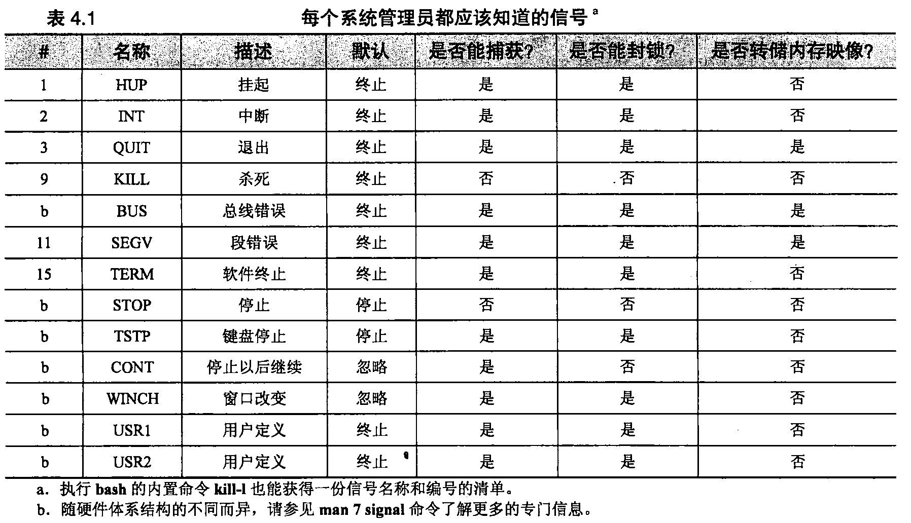  <b></b>

还有其他一些信号没有在表4.1中列出来，其中大多数用来报告一些含糊的错误，例如“illegal instruction （非法指令）”。对这类信号的默认处理方式是终止其执行并产生一个内存转储。通常 也允许捕获和封锁信号，因为有些程序可能足够聪明，先尝试清除导致错误的任何问题，再继 续运行。

BUS和SEGV信号也是错误信号。我们之所以把这两个信号包括在表中，是因为这两个信号非常 常见：一个程序崩溃的次数中有99%最终都可以归结为是这两种错误中的一种导致的。这两个信号本 身并没有特定的诊断值，它们都表明有不正确地使用或访问内存的企图。

KILL和STOP信号不能够被捕获、封锁或忽略。KILL信号清除接收到它的进程。STOP信号挂起正在执行的进程，一直到该进程接收到CONT信号为止。CONT信号可以被捕获和忽略，但不能够被封锁。

TSTP信号是STOP信号的一个“软”版本，把它描述为对“停止”的请求是最合适不过的了。这是当用户在键盘上键入＜Control-Z＞时由终端驱动程序生成的信号。捕获到这个信号的程序通常清除 它们的状态，然后给自己发送一个STOP信号来完成停止操作。另外，TSTP可以被简单地忽略，以 防止程序被来自键盘的输入所停止。

终端模拟器在其配置参数（例如虚拟终端中的行数）改变时，都将发送一个WINCH信号。这项 约定可以让那些理解模拟器的程序（比如文本编辑器）根据相应的变化而自动对自身进行重新配置。如果不能够让窗口正确地改变大小，那么请确认WINCH是否正确地产生和发送了6。

信号KILL、INT、TERM、HUP和QUIT听起来似乎表示同一回事，但实际上它们的使用方法非常不同。遗憾的是，人们竟然为这些信号选择了那样含义模糊的术语，下面是确切的解释。

- KILL不可以封锁，它在内核的层面上终止进程。进程实际上从来就不能够“接收”到这个信号。
- INT是当用户键入＜Control-C＞时由终端驱动程序发送的信号。这是一个终止当前操作的请求。 如果捕获了这个信号，一些简单的程序应该退出，或者只是让自己被杀死，这也是程序没有 捕捉到这个信号时的默认处理方法。拥有命令行模式的那些程序应该停止它们正在做的事情， 清除状态，并等待用户的再次输入。
- TERM请求彻底终止某项执行操作。它期望接收进程清除自己的状态并退出。
- HUP有两种常见的解释。第一种，它被许多守护进程理解为一个重置的请求。如果一个守护 进程不用重新启动就能够重新读取它自己的配置文件并调整自己以适应变化，那么HUP信号 通常可以用来触发这种行为。第二种，HUP信号有时候由终端驱动程序生成，试團用来"清除”（也就是“杀死”）跟某个特定终端相连接的那些进程。例如，当一个终端会话结束时， 或者当一个调制解调器连接被不经意地断开（因而得名为“挂断”）时，就可能出现这种情况。 各种不同的系统在具体的处理细节上有些区别。C shell系列（tcsh等）中的shell通常让后台 程序不受HUP信号的影响，这样，它们可以在用户注销后继续运行。Bourn风格shell （ksh、 bash等）的用户可以使用nohup命令来模仿这种行为。
- QUIT与TERM类似，不同之处在于，如果没有被捕获的话，它的默认行为是产生一个内存转储。有一些程序把这个信号解释为其他意思。
- 信号USR1和USR2没有设定意义。程序可以按照自己需要的方式，任意使用这两个信号，例如，Apache web服务器把信号USR1解释为一次要求妥善重启的请求。

### 4.4 KILL和KILLALL:发送信号 ###

顾名思义，kill命令最常见的用法是终止一个进程。kill能够发送任何信号，但在默认情况下，它发送一个TERM信号。kill可以被普通用户用在他们自己的进程上，或者被超级用户用在任何进程上。语法是：

	kill [-signal] pid

这里的就是要发送信号的编号或符号名称（如表4.1所示），P似就是目标进程的进程标识 号。pid为-1会把这个信号广播给除了 init以外的所有进程。  
没有信号编号的kill命令不保证进程会被杀死，因为TERM信号可能被捕获、封锁或忽略。下面的命令：

	kill - KILL pid

将“保证"进程的消亡，因为信号9, +即KILL不能够被捕获到。我们给“保证”加引号是因为 进程的生命力有时候能够变得相当“旺盛”，以致于连KILL也不能够影响到它们（通常是由于有些退化的I/O虚假锁定，例如等待已经停止旋转的磁盘）。重新启动系统通常是解决这些“不听话”的进程 的惟一方法。

大多数shell都内建有遵循上述语法规则的kill实现。根据独立的kill命令的man手册页的说法， 信号名称或者编号之前实际上都有-s标志（例如，kill-s HUP pid）。但是因为有些shell不理解这种语法，我们建议读者还是坚持采用-HUP的形式，独立的kill命令也理解它。那样一来，用户就不需要关心正在用的是哪一个版本的kill 了。

如果用户不知道要发信号的进程的PID, —般应该用ps命令査出来，ps命令将在**4.7节**介绍。另一种做法是使用killall命令，该命令替用户査出进程的PID。例如，要刷新守护进程xinetd的配置，可以运行

	$ sudo killall -USR1 xinetd

注意，如果用户的输入匹配多个进程，那么就会把killall信号发给所有匹配的进程。普通的kill命令实际上有类似的功能，但是在匹配命令名上似乎没有killall那么聪明。还是坚持用killall吧。

### 4.5进程的状态 ###

进程不会仅仅因为其存在就自动地具有获得CPU时间的资格。管理员需要注意4种最基本的执 行状态，这些状态将在表4.2中列出。

  <b></b>

处于可运行状态的进程只要有CPU时间可用，就准备执行。处于这种状态的进程已经得到它需 要的全部资源，而只是在等待获得CPU时间去处理它的数据。一旦进程执行了一个不能够立即完成的 系统调用（例如请求读取文件的一部分），Linux将把这个进程转入睡眠状态。

处于睡眠状态的进程等待特定的事件发生。交互式的shell和系统守护进程把它们的大多数时间花 费在睡眠、等待终端输入或网络连接上。由于正在睡眠的进程被有效地阻塞，直到它的请求被满足为止，所以，除非它接收到一个信号，否则它将得不到CPU时间。

有些操作让进程进入到一种不能中断的睡眠状态。这种状态通常是临时性的，从ps命令的输出 看不到（在STAT列用一个D来指示，参见4.7节）。不过，在个别不对劲儿的情形下，会让这种状态保持下去。最常见的原因是，以“hard”选项通过NFS安装文件系统时，服务器出现问题。因为处于 不能中断睡眠状态的进程甚至不能被唤醒去处理一个信号，那么也就不能去杀死它们。为了清除这样的进程，必须纠正底下的问题，或者重启系统。

僵进程是已经执行完毕但还没有让它们的状态被收集起来的进程。如果看到有僵进程挂在那里，那么就要用ps査看它们的PPID，找出它们的来源。

处于停止状态的进程从管理上来说是被禁止运行的。进程一接收到STOP或TSTP信号，就进入 停止状态，并可以使用CONT信号来重新启动处于停止状态的进程。处于停止状态与睡眠状态类似， 但除了让另外某个进程来唤醒（或者终止）进程以外，它是不能够脱离停止状态的。

### 4.6 nice和renice:影响调度优先级 ###

进程的"谦让度”是以数字形式给内核的暗示，通过它来表明一个进程在同其他进程竞争CPU 时应该如何对待这个进程。它的这个奇怪名称源自于这样的事实：它确定了您准备对待系统上其他用 户的谦让程度。髙谦让值表示进程具有低优先级：您准备很友好地对待其他进程。低谦让值或者负值 表示进程具有髙优先级：对其他进程就不那么谦让了。谦让值的允许范围是-20〜+19。

除非用户采取特殊动作，否则，新创建的进程就从它的父进程那里继承谦让值。进程的属主可以增加其谦让值，但不能够降低谦让值，哪怕是让进程返回到默认谦让值也不行。这种限制防止了具有 低优先级的进程派生出高优先级的子进程。超级用户可以任意设置谦让值。

如今己经很少通过手工设置进程的优先级了。在20世纪70、80年代那些功能并不强大的系统上，影响性能的最重要因素就是在CPU上运行的是什么进程。现在，由于多数台式机具备了功能足够强大的CPU,调度程序通常能够很好地完成服务所有进程的工作。在需要快速响应的情况下，开发人员可以使用新增的调度类型做更进一步的控制。I/O性能还没有跟上不断加速的CPU,所以现在大多数系统上的主要瓶颈己经变成了磁盘驱动器的速度问题了。遗憾的是，一个进程的谦让值并不会影响内核对其内存或I/O的管理，髙谦让度的进程仍然比例不当地垄断了这些共享资源中的一部分。

进程的谦让值可以在创建进程时用nice命令来设置，并可以在执行时使用renice命令进行调整。nice带一个命令行作为参数，而renice带PID或用户名作为参数。让人迷惑的是，renice需要一个绝对优先级，而nice需要的则是优先级增量，然后把它加上shell的当前优先级，或者从shell的当前优 先级中减去。

下面举几个例子：

	$ nice -n 5 **/bin/longtask 	//把优先级條低（提髙谦让度）5
	$ sudo renice -5 8829 			 //把谦让值设为-5 
	$ sudo renice 5 -u boggs			//把boggs的进程的谦让值设为5

C shell和另外一些常见的shell中（但不是bash）内置了一种nice版本，使得情况变得复杂起来。 如果不键入nice命令的完整路径，将得到nice的shell版本而不是操作系统的版本。这可能会令人困惑，因为shell的nice和操作系统的nice几乎总是使用不同的语法。shell的nice要求它的优先级增量 用+incr或者-incr来表达，而独立的nice命令则要求用-n标志，后跟优先级增量(实际上情况甚至更糟：独立的nice命令把nice-5解释成值为正5的増量，而shell的内置nice命令会把同一形式解释成值
为负5的増量)。

在现代世界中，最常见的使用nice的进程是xntpd，它是时钟同步守护进程。由于CPU的及时性对它的任务非常重要，因此它通常运行在比默认值低12左右的谦让值上（也就是说，它的优先级比 普通进程更高）。

如果某个进程“发狂"而使得系统的负荷平均值达到65的话，在能够运行命令去调查问题以前, 可能需要使用nice来启动一个高优先级的shell,否则，命令可能永远得不到运行的机会。

### 4.7 PS:监视进程 ###

ps是系统管理员监视进程的主要工具。用户可以用它显示进程的PED、UID,优先级和控制终端。它还给出了有关一个进程正在使用多少内存、己经消耗了多少CPU时间以及它的当前状态（运行中、 已停止、在睡眠等）的信息。在ps中，僵进程显示为＜defunct＞。

[ps aux 输出参数含义详解](https://my.oschina.net/stefanzhlg/blog/317294)

### 4.8 TOP：更好地监视进程 ###

由于ps这样的命令只提供系统过去时间的一次性快照，因此，要获得系统上正在发生事情的“全景" 往往是非常困难的。top命令对活动进程以及其所使用的资源情况提供定期更新的汇总信息。

[linux top命令详解](https://blog.csdn.net/sanshiqiduer/article/details/1933625)  

### 4.9 /PROC文件系统 ###

Linux版的ps和top命令都从/proc目录读取进程的状态信息，内核把有关系统状态的各种有意义的信息都放在这个伪目录里。虽然这个目录叫做/proc （下面的文件系统类型也叫做“proc”），但是它里面的信息却并不局限于进程信息——内核产生的所有状态信息和统计数据都在这里。用户可以通 过向/proc下的适当文件写入数据的方法来某&参数————**参见28.4节**的例子。

虽然使用诸如vmstat和ps这样的前端命令是访问某些信息最方便的办法，但是有些不那么常用的信息就必须从/proc目录下直接读取。应该花时间多浏览一下这个目录，以熟悉里面的各项内容。 man proc命令也能给出一些有用处的技巧和奇门。

由于内核随时都在创建/proc下文件的内容（在读它们的同时），所以/proc下的大多数文件在用Is -1 命令列出时都显示为空。用户应该用cat或者more去看这些文件里的内容是什么。但是要注意—— 有几个文件包含或者链接到了二进制数据，如果直接去看的话，会搞乱终端模拟程序的显示。

进程特有的信息都分别被放到了按PID起名字的子目录里。例如，/proc/1 一定是包含init信息的目录。

[Linux /proc/pid目录下相应文件的信息说明和含义](https://blog.csdn.net/enweitech/article/details/53391567)  
[Linux下的proc目录详解](https://blog.csdn.net/hackstoic/article/details/49966491)  

- 在cmdline和environ文件里的各个部分用空字符（null）而不是换行符（newline）分隔用户可 以借助命令**tr "\000" "\n”**过滤这些文件- 的内容，使之可读性更好。
- 子目录fd里以符号链接形式表示进程打开的文件。连接到管道或者网络套接口的文件描述符没有 相关联的文件名。内核提供一种通用的描述形式作为链接目标。
- maps文件用于确定一个程序链接到哪些库或者依赖于哪些库。

### 4.10 STRACE：追踪信号和系统调用 ###

在传统的UNIX系统上，判断一个进程实际正在做什么相当困难。用户可能不得不根据从文件系统以 及ps这样的工具取得的间接数据和经验来推测。与此相对照，Linux能让用户通过strace命令直接观察一个进程，进程每调用一次系统调用，以及每接收到一个信号,这个命令都能显示出来。用户甚至可以把strace 附在一个正在执行的进程上，监视一会儿该进程，再从进程上脱离，整个过程都不会影响那个进程。

虽然系统调用出现在相当底层的地方，但是用户通常都可以从strace的输出里相当清楚地了解到 进程的活动情况。例如，下面的记录是由strace附在一个活动的top进程上获得的：

	$ sudo strace -p 5810
	
	gettimeofday((1116193814, 213881]L {300, 0])			  = 0
	
	open(7proc", O_RDONLY|O_NONBLOCK]O_LARGEFILE|O_DIRECTORY) = 7 

	fstat64(7, {st_mode=SJFDIR|0555, st_size=O,...]}		  = 0
	
	fcntl64(7, F.SETFD, FD_CLOEXEC)							  = 0
	
	getdents64(7, /* 36 entries */, 1024)					  = 1016
	
	getdents64(7, /* 39 entries */, 1024)					  = 1016
	
	stat64("/proc/1", {st_mode=S_IFDIR|0555, st_size=O}		  = 0
	
	open("/proc/1/stat,,1 O_RDONLY)							  = 8
	
	read(8, "1 (init) S 0 0 0 0 -1 4194560 73”…，1023)		  = 191
	
	close(8)												  =0

strace不仅能够显示进程每次调用的系统调用名，它还能解析参数，给出由内核返回的结果代码。   
在本例中，top先检査当前时间。然后打开/proc目录，用fstat获得其信息，然后读取该目录的内容，由此获得当前正在运行的进程清单。top接着用stat获得代表init进程的那个目录的信息，然后打开/proc/1/stat读取init的状态信息。

### 4.11失控进程 ###

失控进程有两类：一类是过度占用了某种系统资源（例如CPU时间或磁盘空间等）的用户进程，另一类是突然发狂并呈现狂暴行为的系统进程。第一种失去控制的类型未必是一种故障，它可能仅仅 是资源被过度占用了。系统进程总是被要求应该具有合理的行为方式。要了解有关失控进程的更多信 息，请**参见25.4节**。

通过查看ps或者top的输出，能够确认是哪些进程占用了过多的CPU时间。如果明显发现某个 用户进程正在消耗的CPU时间比预计的合理值多，那么请调査这个进程。在一台服务器或者一个共享 系统上，第一步是联系该进程的属主，询问正在发生的事情。如果找不到属主，那么需要自己到周围 去找找。尽管管理员通常应该避免查看用户的主目录，但在试图跟踪某个失控进程的源代码来査明它 正在做什么的时候，这种做法是可以接受的。

之所以要在针对进程做出反应以前，先査明该进程正试图要做的事情，原因有两个。第一，该进 程可能不但是合法的，而且对用户来说非常重要，这时候仅仅因为进程碰巧占用了大量的CPU时间而 杀死它们并不合理。第二，进程可能是恶意的或具有破坏性的，如果是这样的话，管理员已经知道进 程正在做的是什么事情（例如破译口令），因此就能够制止破坏行为。

如果不能够确定失控进程存在的原因，那么可以采用STOP信号把它挂起，并发送电子邮件给该 进程的属主，解释所发生的事情。以后可以采用CONT信号来重新启动该进程。请注意，有些进程在 长期睡眠以后可能被损坏，因此这种处理方法并不一定完全无风险。例如，某个进程醒来以后，可能 会发现它的某些网络连接已经被断开。

如果某个进程使用CPU过量，但看起来又是在做合理的事情并工作正常，那么应该用renice命 令给它更髙的谦让值（也就是更低的优先级），并告诉该进程的属主以后再调整回该进程的谦让值。

相对于系统的物理存储器而言，过多占用内存的进程会导致严重的性能问题。用户可以使用top 来检査进程占用内存的多少。top输出的VIRT列给出了每个进程分配的虚拟内存量，RES列给出了当 前映射到特定内存页的那部分内存（驻留集）。

这两个数字都包括了像库这样的共享资源，从而让它们可能有误导性。在DATA列里能找到进程 专门的内存消耗量更为直接的测定值。为了在top的输出里加上这一列的显示，要在运行top之后键入f，从列表中选择DATA。DATA值表明了每个进程的数据和堆栈段占用的内存量，所以这个值对单个进程的针对性相当强（模块共享的内存段）。在观察随时间的增加情况的同时，也要观察绝对的 内存量。

那些产生输出信息的失控进程能够填满整个文件系统，从而导致出现大量问题。当文件系统被填 满时，控制台上将记录大量的消息，而试图向文件系统写入数据则会产生错误消息。

在这种情况下，要做的第一件事情是停止正在填满磁盘的那个进程。如果管理员在磁盘上一直保持着数量合理的空余空间作为回旋余地，那么当磁盘突然填满时，就能相当肯定地知道是出现了问题。 没有类似于ps那样的命令可以告诉管理员哪个进程正在以最快的速度消耗掉磁盘空间，但有几种工具 可以用来找到那些当前已打开的并且有进程正在使用它们的文件。更多的信息请参见后面对**fuser**和 **lsof**的介绍。

作为管理员，可能想把所有看起来有问题的进程都挂起，一直到自己找到导致故障的那个进程为止。但当确定问题症结所在以后，要记得把其他没有问题的进程重新启动起来。一旦找到导致故障的 那个进程，就要删除该进程创建的所有文件。

一个古老而又有名的"恶作剧”程序是从shell启动一个无限循环，做下面的事情：

	while 1
		mkdir a dir 
		cd a dir 
		touch a file	
	end

有时，如果因为系统留下了己登录进入系统的终端，使得放开了对系统的访问，就可能会有人来运行这个循环，它并不消耗多少实际的磁盘空间，但它填满了文件系统的索引节点表（inode table）, 从而阻止其他用户创建新文件。对此，管理员除了清除错误结果并警告用户保护好自己的账号以外. 并没有其他更多的措施可用，因为这个程序遗留下来的目录树通常非常大，用rm -r 命令处理起来很费劲，所以可能需要编写一个脚本，先进入该目录树的底部，然后以回溯的方式删除各级目录。

如果问题出现在/tmp中，并且您已经把/tmp设置为一个单独的文件系统，那么可以采用mkfs 命令来重新初始化/tmp，而不用试着删除所有的单个文件。有关文件系统管理的更多信息，**请参见第7章**。

### 4.12推荐读物 ###

BOVET, DANIEL P. AND MARCO CESATI. Understanding the Linux Kernel (3rd Edition). Sebastopol, CA: O’Reilly Media, 2006.

### 4.13习题 ###

- E4.1解释一个文件的UID和一个正在运行的进程的真实UID以及有效UID之间的关系。 除了文件的访问控制之外，进程的有效UID有什么用途？

- E4.2假定您所负责的站点中，有一个用户己经启动了一个长期运行的进程，它消耗了机 器的很大一部分资源。

	a）	您如何意识到某个进程正在消耗资源？

	b）	假定异常的进程可能是合法的，不应该杀死它，给出您要把它“冻结”起来（在 您调査期间，暂时停止它的运行）应该使用的命令。

	c）	随后，您发现这个进程属于您的老板，必须继续运行下去。给出您要继续执行这 个任务应该使用的命令。

	d）	另一种可能是假定需要杀死这个进程。您会发送什么信号？为什么？如果您要保 证这个进程确实已经被杀死了，该怎么做？

- E4.3找出一个能导致内存泄漏的进程（如果手头没有，就自己写一个）。用ps或者top 来监视程序运行时的内存使用情况。

- E4.4编写一个处理ps输出的Perl脚本，确定在系统上正在运行的进程总的VSZ和RSS 值。这些数字和系统物理内存和交换空间的实际量有什么要的关系？

## 第 5 章 文件系统 ##

在Linux“文件系统”中，我们可以找到下面这些：

- 进程
- 串打端口（串口）
- 内核数据结构和调整参数
- 进程间的通信通道

尽管文件系统的基本目的是表示和组织系统的存储资源，但程序员一直渴望在处理其他类型对象时，避免重新设计表示结构。事实已经多次证明，把那些对象映 射到文件系统的名字空间里是自然和方便的做法。这种统一既有优点（一致的编程 接口、易于从shell访问），也有一些缺点（有“自作自受”之嫌的文件系统实现）。

可以认为文件系统包括4种主要的组成部分：

- 名字空间——给事物取名，并按一种层次结构组织它们；
- API——用来遍历和操作对象的一套系统调用；
- 安全模型——用来保护、隐藏和共享事物的方案；
- 实现一把逻辑模型同实际硬件联系到一起的软件。

Linux定义了一个抽象的内核级接口，能够适应多种不同的后端文件系统。文件树的有些部分由 传统的基于磁盘的实现来处理；其他部分则由内核中单独的驱动程序来负责，例如，NFS文件系统由 一个驱动程序来处理，这个驱动程序把被请求的操作转发到另外一台计算机的服务器。NFS （网络文 件系统）将在第16章介绍。

遗憾的是，体系结构上的界线划分并不清晰，因此还有许多特殊的情形。例如，设备文件的存在 给程序提供了一种同内核内部的驱动程序进行通信的方式。这些设备文件不是真正的数据文件，但它们由基本的文件系统驱动程序来处理，并且它们的特征都存储在磁盘上。如果现在根据过去几十年的 经验重新实现文件系统的话，那么在细节方面会有些区别。

另外还有一个因素使问题变复杂（但最终还是有益的），即Linux支持不只一种基于磁盘的文件系统。现在最好的一类文件系统包括：作为大多数Linux发行版本默认文件系统的ext3fs,还有ReiserFS 、IBM的JFS和SGI的XFSo ext3fs之前的 ext2fs比较老了，但所有的发行版本都支持它，将来很长一段时间里也仍然会保持对它的支持。

在Linux上也实现了许多外来的文件系统,比如在微软Windows上使用的文件系统FAT和NTFS, 以及CD-ROM上使用的ISO-9660文件系统。Linux支持的文件系统数量超过了任何一种别的UNIX 变体。它提供的丰富选择赋予了用户更多的灵活性，而且更易于和别的系统共享文件。

文件系统讨论起来是个内容很丰富的话题，我们要从几个不同的角度来介绍。本章告诉读者可以从系统上的什么地方找到什么样的文件，还告诉读者文件的特性、权限位的含义，以及一些查看和设置属性的基本命令的用法。在第7章里，读者会找到有关文件系统方面技术性更强的内容，比如磁盘分区。**第16章**将介绍Linux上常用的文件共享系统。读者还可以看看**第26章**，这一章讨论Linux为 了和运行微软Windows的计算机共享文件所使用的软件。

虽然Linux上有那么多种不同文件系统的实现，可本章内容读起来就好像只有一种Linux文件系 统一样，是不是有点奇怪呢。因为对于大多数现代的文件系统来说，要么是为了能以更快和更可靠的方式提供传统文件系统的功能，要么就是通过在标准文件系统的语义上加一层来增加更多的特性（有 的文件系统两者都有），所以我们对诸多文件系统的实现不怎么了解。

### 5.1路径名称 ###

文件系统表现为单个统一的层次结构（这种单一层次结构的系统和Windows所采用的不一样，Windows保留了特定于磁盘的名字空间概念）:从目录/开始并通过若干数量的子目录继续向下扩展，/也 叫做根目录。

为了找到某个特定文件而必须遍历的一系列目录，再加上文件名就形成了 “路径名"。路径名既 可以是绝对的（/tmp/foo），也可以是相对的（book4/filesystem）。相对路径认为是从当前目录开始。 用户可能习惯于把当前目录看作是shell的特色，但实际上每个进程也都拥有一个当前目录。

术语文件（file）、文件名（filename）、路径名（pathname）、路径（path）或多或少都可以互换使用（或者至少在本书中可以互换使用）。文件名和路径可以用来指绝对路径和相对路径，路径名通常表示绝对路径。

文件系统的深度可以任意。不过，路径名每部分的长度一定不能超过255个字符，并且单个路径总长不能超过4095个字符。要访问超过这个长度的路径名，就必须cd到中间的目录并使用相对路径(这里再说明一下以防不清楚：多数文件系统的磁盘格式本身并没有对路径名称的总体长度进行限制。但是，访问文件系统的系统调用不允许它们的字符串参数的长度超过4095个字符)。

除了名称在长度上有限制和不能够包含字符或空值以外，对文件和目录的命名基本上没有什么其他限制。特别是在一定程度上允许使用空格。由于UNIX长期以来有着以空白来分隔命令行参数 的传统，所以当文件名中出现空格时，老软件可能会出现问题。

在文件名中有空白的情况过去主要出现在与Mac和PC共享的文件系统上，但是现在已经蔓延到 Linux的文化之中，在一些标准的软件包里也能看到这样的文件名了。没别的办法，负责系统管理的 脚本必须做好处理空白的准备。

在shell和在脚本中，只需用引号扩起带有空白的文件名，就能保持其完整性。例如，命令：

	$ less "My excellent file.txt"

会把My excellent file.txt当作是less的单个参数。还可以用反斜线转移空格。常用shell所带的文件名补全功能（通常绑定到＜tab＞键上）就能替用户做转移。

在编写脚本的时候，要知道一个很有用的工具，这就是find命令的-print0选项。这个选项和xargs-0 一起使用就能让find/xargs命令组合不管文件名是否包含有空白都能争取执行。例如，下面的命令：

	$ find /home -size +1M -print0 | xargs -0 ls -1

找到/home分区下大小超过1MB的每个文件，按ls命令的长格式列出。

### 5.2安装和卸载文件系统 ###

文件系统由更小一些的块所组成，这些块儿也叫文件系统，每个这样的块都是由一个目录及其子目录和文件所组成的。正常情况下，根据上下文就可以明确判断出正在讨论的是哪种类型的“文件系统”，但为了清楚起见，我们将使用术语“文件树"来指文件系统的整个结构，而保留“文件系统"一 词用来表示附加到文件树的块。

大多数文件系统是磁盘分区，但正如我们前面提到的那样，文件系统可以是遵循适当API的任何 事物：网络文件服务器、内核组件、基于内存的磁盘模拟器等。Linux甚至有一个不错的“loopback（环回）”文件系统，能让用户安装单个文件，就好像它们是独立的设备一样。

使用mount命令把文件系统附加到文件树上。mount把现有文件树中的一个目录映射为新加入的文件系统的根，这个目录叫做安装点（mountpoint）。只要有另一个文件系统被安装在安装点上，那么 就不能再访问到这个安装点以前的内容了。不过安装点通常是一些空目录。

例如，命令：

	mount /dev/hda4 /users

将把存储在磁盘分区上由/dev/hda4表示的文件系统安装到路径/users下。随后可以使用ls /users 来査看这个文件系统的内容。

根据惯例，安装在某个特定系统上的文件系统清单保存在/etc/fstab文件中。包含在这个文件中的 信息让这些文件系统在引导时先检査（fsck-A）再自动安装（mount-a）到系统中。它还充当了磁盘上文件系统布局的文档资料这一角色，并可以使用像mount/usr这样的简写命令（文件系统要安装的位置可以在fstab中査到）。有关fstab文件的完整讨论，请参见7.4节。

umount命令用来卸载文件系统。在大多数系统上，不能卸载正处于“busy（繁忙）”状态的文件系统。在该文件系统中不能有任何打开的文件，也不能有任何进程的当前目录，并且如果文件系统包含有可执行的程序，那么这些程序也不能够处于运行状态。

2.4.11版以后的Linux内核定义了一种“lazy（缓慢）”的卸载方式（用umount-l命令调甩），在从目录名的层次结构中删除某个文件系统的时候，先要让当前所有对该文件系统内文件的访问都关闭，才能真正卸载这个文件系统。首先，不能保证当前的访问都会自行关闭。其次，“半卸载”状态也给使用文件系统的程序带来了不一致的文件系统语义。它们可以通过已有的文件句柄执行读写操作，却不 能打开新文件或者执行其他文件系统操作。

如果内核抱怨说用户正在试图卸载处于繁忙状态的文件系统，可以运行fuser命令来查明原因。 当以-mv标志加一个安装点为参数来调用fuser命令时，它会显示出正在使用该文件系统上的文件或 目录的每个进程的PID:

	$ fuser -mv /usr

			USER	PID	ACCESS	COMMAND
	/usr	root	444	....m	atd
			root	499	....m	sshd
			root	520	....m	lpd

ACCESS列的字母代码表示每个进程对umount命令产生的反应。表5.1介绍了每种代码的含义。

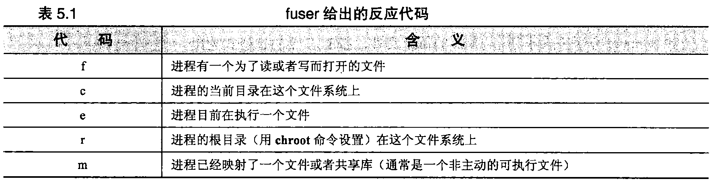  <b></b>

为了准确地判断带来麻烦的进程是什么，只要用fuser返回的PID清单运行一下ps就行了。例如:

	$ ps -fp "444 499 520"

	UID		PID	PPID C	STIME	TTY	TIME		CMD
	
	daemon	444	1	0	April	?	00:00:00	/usr/sbin/atd
	
	root	499	1	0	April	?	00:00:23	/usr/sbin/sshd
	
	lp		520	1	0	April	?	00:00:00	[lpd]

引号强迫shell将PID清单作为一个参数传递给ps。

fuser也能报告特定文件（与整个文件系统相反）的使用，语法是fuser -v filename。fuser也接受 -k选项，杀死每个带来麻烦的进程（或者向它们发送一个信号）。危险——您必须是root（或者使用 sudo,参见 3.4.2 节）。

fuser的替代工具是程序lsof，它是由普渡大学（Purdue University）的Vie Abell编写的。lsof在许多不同的UNIX和Linux变体上都能运行，这使得它很适合由必须在多种系统上运行的脚本调用。 lsof是一种比fuser更复杂和先进的程序，它的输出相应地也详细一些。

脚本在搜索特殊信息的时候也可以直接去读/proc下的文件。不过，更简单、移植性更好的一种做法是使用lsof -F命令让lsof的输出有格式，从而易于分析。再加上其他命令行标志来限定只请求所需的信息。

### 5.3文件树的组织 ###

  <b></b>

UNIX家族的文件系统还从来没有被很好地组织过。各种互不兼容的命名约定在同时使用，整个名字空间中随意散落着不同类型的文件。在许多情况下，文件是按照其功能而不是按照被修改的可能性进行划分的，这使得操作系统的升级变得困难起来。例如，/etc目录中既包含了一些从来就不需要 定制的文件，又包含了一些完全是本地性的文件。如何知道哪些文件在升级过程中应该保存呢？是的， 管理员确实必须知道……

像/var这样的新增目录已经帮助解决了一些问题，但是大多数系统仍然处于缺乏组织的状态。尽管如此，每一个文件还都有其从文化意义上看是合适的位置。在Linux下，不要弄乱文件树的默认结构尤其重要，因为软件包和它们的安装工具经常对文件的位置做出大胆的假设（就像其他系统管理员 那样！）。

根文件系统包括根目录和最小的一组文件和子目录，包含内核的那个文件位于根文件系统中的 /boot目录下，它的名字通常以vmlinuz开头(以前/boot—度常作为一个独立的文件系统.这样做大多是因为内核必须放在靠近启动盘的开头处，好让BIOS能访问到. 现代的PC不再有这个问题了，/boot更常作为根文件系统的一部分)。存放设备文件的/dev目录（除了/dev/pts,它单独安装）、存放关键系统文件的/etc目录、存放重要工具的/sbin和/bin目录，有时候还有用来存放临时文件的/tmp 目录都是根文件系统的一部分。**有关配置内核的更多信息请参见第28章**。

目录/usr和/var也非常重要。/usr是存放大多数标准程序的地方，它还有其他一些内容，例如在 线用户手册和绝大多数数库文件。把/usr作为单独的文件系统并非严格要求，但出于管理上的方便， 几乎总是这么设置。为了让系统能够最终启动到多用户模式，必须有/usr和/var这两个目录。参考7.4 节了解为什么最好进行分区，以及进行分区的一些指导。

/var存放有假脱机目录、日志文件、记账信息和其他各种快速增长或变化的东西以及随主机不同 而有所不同的东西。由于/var包含有日志文件，而日志文件会随着故障出现的次数增多而增长，所以，如果可行的话，把/var放置在它自己的文件系统上是一个好主意。

用户的主目录应该保存在单独的文件系统上，这个单独的文件系统通常安装在根目录中。还可以 用单独的文件系统存储占用空间较大的东西，例如源代码库和数据库等。

表5.2中列出了一些比较重要的标准目录，

处于不断发展中的文件系统层次结构标准（Filesystem Hierarchy Standard）正在努力编制标准目录，使之合理，并加以说明，在要确定该把什么东西放在哪儿的时候，最好参考一下这个资源。我们在11.6 节开始讨论设计本地文件系统结构时还要考虑的其他一些问题。

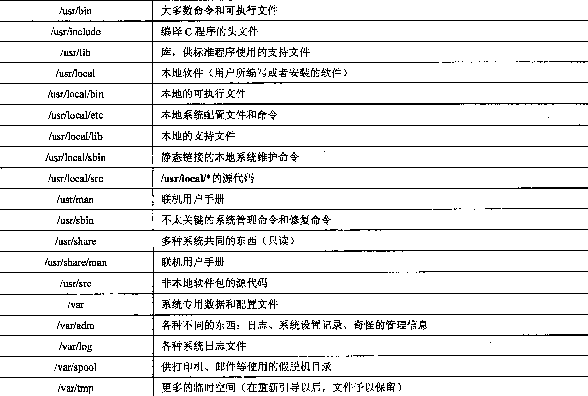

### 5.4文件类型 ###

Linux定义了7种文件类型。即使在开发人员把精彩的新内容添加到文件树中（比如在/proc下列出的进程信息）的时候，仍然必须让新内容看起来像下面7种类型之一：

- 普通文件
- 目录
- 字符设备文件
- 块设备文件
- 本地域套接口
- 有名管道（FIFO）
- 符号链接

用户可以用命令ls -ld来判断现有文件的类型。ls命令输出的第一个字符表示类型。下面的例子表明/usr/include 是一个目录：

	$ Is -Id /usr/include

	wxr-xr-x 27 root root	4096 Jul 15 20:57 /usr/include

ls使用表5.3中给出的代码来表示文件的各种类型。

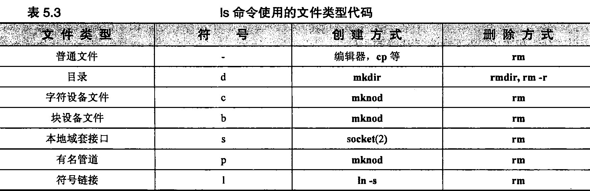  <b></b>

rm是删除不要文件的通用工具。不过，怎样删除一个名为-f的文件呢？它在大多 数文件系统中都是一个完全合法的文件名，但是rm-f却不能起作用，因为-f被解释成了一个rm的标 志。答案是，要么用更完整的路径名（比如./-f）来指出文件，要么用rm的--参数来告诉它后面的所 有东西都是文件名而不是选项（例如，rm--f）

在采用模式匹配的时候，使用rm的-i选项，让rm确认每个文件的删除操作是一个好主意。这项功能可以防止删除 偶然匹配模式但又是“好”的任何文件。例如，要删除一个名为foo<Control-D>bar的文件，可以使用：

	$ ls
	
	foo?bar foose kde-root
	
	$ rm -i foo*
	
	rm: remove 'foo\004bar? y 
	rm: remove 'foose? n

注意，ls将控制字符显示为一个问号，这会有点儿欺骗性(ls -b命令以八进制数显示特殊字符，如果需要特意辨别它们的话，这个命令就可以帮上忙。<Control-A>是1 （八进制为 \001）、<Control-B>是2,以此类推)。如果忘记了 “？”是一个shell要进行模式匹配的字符，而试着用rm foo?bar，那么可能会删除不只一个文件（虽然本例中不是这样）。-i 应该是常用的选项！

为了删除名字最难对付的文件，可能需要求助rm -i *这条命令。

还有一种方法能删除名字古怪的文件，就是通过访问文件系统的其他接口，比如emacs的dired 模式，或者像Nautilus这样的可视化工具。

#### 5.4.1普通文件 ####

普通文件只是一个装字节的包而已；Linux并没有就其内容规定任何结构。文本文件、数据文件、 可执行程序和共享库都作为普通文件存储，普通文件既能顺序存取，也能随机存取。

#### 5.4.2目录 ####

目录包含按名字对其他文件的引用。用户可以使用mkdir命令来创建目录，使用rmdir命令来删除空目录，使用rm-r命令来删除非空目录。

特殊项"."和".."分别代表目录本身和它的父目录，它们不可以移动。由于根目录没有父目录， 所以"/."和"/.."是等价的（都等同于/）。

文件的名称实际上存储在它的父目录中，而不是和文件本身存储在一起。事实上，在同一时间，不只一个目录（或者是单个目录中的不只一个目录项）能够引用一个文件，并且引用可以拥有不同的名称。这样的安排产生了这样的错觉：一个文件同时存在于多个位置。

这些多出来的引用（链接）跟原来的文件是没有什么区别的；在Linux看来，它们都是等同的。 Linux维护着指向每个文件的链接的计数，在该文件的最后一个链接被删除之前不释放该文件的数据块。Linux的链接不能够跨过文件系统的边界。

现在，这种类型的引用通常叫做"硬链接”，以此把它们同符号链接区分开来，符号链接将在下面介绍。我们采用ln命令来创建硬链接，采用rm命令来删除硬链接。

如果记住ln是cp的镜像，那么就很容易记住ln的语法。命令cp oldfile newfile创建oldfile的一个副本，该副本叫做newfile。 ln oldfile newfile让名称newfile成为对oldfile新增的一个引用。

要理解硬链接并不是文件的一种独特类型，这一点很重要。文件系统只是允许不只一个目录项指 向某个特定的文件，而不是定义了一个单独的称为硬链接的“事物”。除了文件的内容之外，所有链接 之间还共享这个文件的根本属性，比如归属关系和访问权限。

#### 5.4.3字符设备文件和块设备文件 ####

设备文件让程序能够同系统的硬件和外围设备进行通信。在配置内核的时候，那些知道怎样同系 统的每个设备进行通信的模块就被链入内核（这些模块也可以被内核动态地加载）。用于某个特定设备的模块叫做设备驱动程序，它负责管 理该设备的凌乱细节。有关设备及其驱动程序的更多信息，请**参见第28章**。

设备驱动程序提供了一个标准的通信接口，该接口看起来就好像是一个普通文件。当内核接到一 个对字符或块设备文件的请求时，它就简单地把这个请求传递给适当的设备驱动程序。不过，区分设 备文件和设备驱动程序是很重要的。设备文件只是用来同设备驱动程序进行通信的结合点。它们并不 是设备驱动程序本身。

字符设备文件让与之相关的驱动程序做它们自己的输入和输出缓冲。块设备文件由处理块数据 I/O的驱动程序使用，并要求内核为它们提供缓冲。以前，有些类型的硬件既可以表示为块设备文件， 也可以表示为字符设备文件。但是现在很少有这样的配置了。

设备文件用两个数字来表示其特征，这两个数字分别叫做主设备号和次设备号。主设备号告 诉内核该文件访问哪个驱动程序，次设备号告诉驱动程序对哪个物理单元寻址。例如，Linux系统上的主设备号6表示并行端口驱动程序。第一个并行端口 C/dev/lp0）的主设备号为6,次设备号为0。

有些设备驱动程序以它们高兴的方式来解释传给它们的次设备号。例如，磁带驱动程序经常使用 次设备号来确定关闭该设备文件时是否应该回卷磁带。

设备文件可以使用mknod命令来创建，使用rm来删除。不过基本上没有必要手工创建设备文件。 大多数发行版本使用udev根据内核对硬件的检测结果自动创建和删除设备文件。通过限制/dev目录 下虚设的设备文件数量，以及确保分配给文件的设备号符合内核期望的做法，udev就能保持/dev目录 的整洁。参见第28章了解更多这方面的知识。

万一需要手工创建设备文件时，有个叫做/dev/MAKEDEV的老脚本作为udev的备用工具挺不错 的。这个脚本能为各类设备定出符合规范的设备文件名和设备号，因此用户不必亲自去检查结果。例如，**MAKEDEV pty**这条命令能给伪终端创建设备文件。

如果需要得知一个驱动程序的主次设备号，在该驱动程序的手册页中第4节（例如，**man 4 tty**）里就能找到这方面的信息。

#### 5.4.4本地域套接口 ####

套接口 （socket）就是在进程之间让它们以"干净卫生”的方式进行通信的连接。Linux提供了几 种不同类型的套接口，其中大多数涉及使用网络。本地域套接口只能从本地主机访问，并且是通过文件系统对象而不是网络端口来使用。它们有时称为“UNIX域套接口（UNIX domain socket）”。

尽管套接口文件对于其他进程是可见的目录项，但是通信连接之外的进程不能够读写它们。使用 本地域套接口的一些标准工具有打印系统、X Windows系统和syslog。有关系统日志的更多信息，请 参见第10章。

本地域套接口由系统调用socket创建，当套接口不再有任何用户时，可以使用rm命令或系统调 用unlink来删除它。

#### 5.4.5有名管道 ####

与本地域套接口类似，有名管道能让运行在同一主机上的两个进程之间进行通信。它们也称为 “FIFO文件”（FIFO是“first in, first out［先入先出］”的缩写）。有名管道使用mknod来创建，使用rm 命令来删除。

#### 5.4.6符号链接 ####

符号链接或者叫做“软”链接通过名字指向文件。当内核在查找路径名的过程中遇到符号链接时， 它就把它的注意力重定向到作为该链接的内容而存储的路径名上。硬链接和符号链接之间的区别在于： 硬链接是直接引用，而符号链接是通过名称进行引用，符号链接跟它们指向的文件是不同的。

符号链接使用In-s来创建，使用rm来删除。由于符号链接能够包含任意的路径，所以它们可以指向其他文件系统上的文件或者指向不存在的文件。几个符号链接还可以形成一个环。

符号链接既可以包含绝对路径，也可以包含相对路径，例如:

	# ln -s archived/secure /var/log/secure

S个命令釆用相对路径把/var/log/secure链接到/var/achived/secure。它用一个目标路径“archived/ secure”创建了一个符号链接/var/log/secure，结果见下面这条ls命令的输出：

	$ ls -l /var/log/secure
	
	lrwxrwxrwx 1 root root 18 2005-07-05 12:54 /var/log/secure -> archived/secure
(ls显示的符号链接的文件权限为lrwxrwxrwx,这个权限是虚设的。创建、删除链接或者跟随链接的权限都由包含链接的目录控制，而读写和执行链接目标的权限由目标自己的权限决定。因此，符号链接不需要（也没有）它自己的任何权限信息)

整个/var/log目录可以移动到另外某个位置而不会让这个符号链接不起作用（建议不要移动那个目录）。

认为ln -s的第一个参数与自己的当前工作目录有关是一个常见错误。In不把它解析为一个文件名，它只是被逐字用作符号链接的目标。

### 5.5文件属性 ###

在传统的UNIX和Linux文件系统模型中，每个文件都有一组9个权限位用来控制谁能够读写和 执行该文件的内容。这9位和另外影响到可执行程序运行的3个权限位一起，构成了文件的“模式” （mode）.

这12个模式位和4位的文件类型信息一起保存在一个16位的字中。这4个文件类型位在文件创建时设定并且不能修改，但是12个模式位可以由文件的属主或超级用户使用chmod（改变模式）命令来修改。使用ls -l（对于目录来说，使用ls -ld）可以査看这些位的值。5.5.4节中给出了一个例子。

#### 5.5.1 权限位 ####

9个权限位用来确定可以由谁对文件执行什么样的操作。（尽管Linux现在在所有主要的文件系统上都支持访问控制列表，参见5.6节），传统的UNIX不能逐个用户地去设置权限，而是为文件的属主、文件的属组和其他每个人设置访问权限集合。每个集合有3位：读取位、写入位和执行位。

采用八进制数字来讨论文件的访问权限很方便，因为一个八进制数字的每一位代表3位，而每组权限位中正好有3位。最前面的3位（对应的八进制值为400、200和100）控制属主的访问权限。第二个三位组（40、20和10）控制组的访问权限。最后面的三位组（4、2和1）控制其他每个人的访问 权限。在每个三位组中，髙位是读取位，中间位是写入位，低位是执行位。

每个用户只能够划归为这3个三位组中的一组，使用最具体的权限。例如，一个文件的属主（owner）拥有的访问权限由属主权限位而不是组权限位所确定。"其他"（other）和"组"（group）类别有可能拥有比属主更多的访问权限，但这样的配置很少使用。

在普通文件上，读取位允许打开该文件并读取它的内容。写入位允许修改或删截该文件的内容。 不过，能否删除和重命名（或者删除后再重建）该文件则由该文件父目录上的权限设置所控制（因为 名字到数据空间的映射关系实际上存储在父目录中）。

执行位允许执行文件。可执行文件有两种类型：一种是二进制的，CPU能够直接运行它；另外一种是脚本，脚本必须由shell或其他某种程序来解释。按照惯例，脚本以下面形式的一行代码开始：

	#!/usr/bin/perl

这行代码指定了一个合适的解释程序。没有指定解释程序的那些非二进制可执行文件（由用户的 shell）假定为bash或者sh脚本文件（内核能够理解#!语法，碰到它后会直接开始操作•不过，如果没有完全和正确地指定解释程序，那么内核将拒绝执行文件• 接下来shell会通过调用ih来再次尝试执行这个脚本）。

对于目录来说，当分析路径名时，执行位（在这种上下文环境中，也经常叫做“搜索[search]”位 或“扫描[scan]”位）的作用是控制是否能够进入或通过该目录，而不是控制能否列出它的内容。读取 位和执行位的组合的作用才是控制是否列出目录中的内容，写入位和执行位的组合则允许在目录中创 建、删除和重新命名文件。

#### 5.5.2	setuid 和 setgid 位 ####

八进制值为4000和2000的两位是setuid位和setgid位。如果在可执行文件上设置这两位，那么它们能让程序访问运行它们的用户本来无权访问的文件和进程。可执行文件的setuid/setgid机制在3.1 节介绍。

在某个目录上设置了 setgid位以后，在这个目录中新创建的文件具有该目录的属组权限而不是创建该文件的用户的默认属组。这项约定使得在几个用户之间（只要这些用户都属于一个共同的组）共享一个目录中的文件变得更加简单。对setgid位的这种解释跟它在可执行文件上设置时的含义没有什 么关系，但不要混淆了这两种意义。

您还可以在非可执行的纯文本文件上设置setgid位，在该文件被打开时请求特殊的锁定操作，但很少用。

#### 5.5.3粘附位 ####

八进制值为1000的位叫做“粘附位”。在早期的UNIX系统上，它作为限定符对于可执行文件来说很重要。不过，粘附位的含义现在已经过时了，现代操作系统已经悄然地忽略了它。

如果在目录上设置了这个粘附位，那么除非您是该目录的属主、该文件的属主或者是超级用户，否则文件系统不会允许删除或重新命名该目录中的文件。在这个目录上拥有写入权限是不够的。这项约定有助于让像/tmp之类的目录变得多少有些隐私性和安全性。

#### 5.5.4查看文件属性 ####

文件系统为每个文件维护大约40项单独的信息，但其中的大多数只是对于文件系统本身有用。作为系统管理员，主要关心的是链接数、属主、属组、模式、大小、最后访问时间、最后修改时间和 类型=所有信息可以使用ls -l（或者对于目录来说是ls -ld）来査看。

文件系统还为每个文件维护了属性改变的时间。给这个时间起的习惯名称（ctime，代表change time）使得一些人以为它是文件的创建时间。遗憾的是，它不是，它只是记录文件属性（属主、模式 等）最后改变的时间（注意跟修改文件内容的时间区分开来）。

考虑下面的例子：

	$ Is -1 /bin/gzip
	
	-rwxr-xr-x	3 root root	57136 Jun 15	2004 /bin/gzip

第一个字段指定该文件的类型和模式。第一个字符是短划线，因此这个文件是普通文件。参考表5.3了解其他文件类型的代码。

这个字段中接下来的9个字符就是3组权限位。这些组的顺序是“属主-属组-其他”，每组中位的 次序是“读-写-执行”=尽管这些位只有二进制的值，但Is用字母来显示它们：字母r表示读取、字母 w表示写入、字母x表示执行。在这个例子中，属主对该文件拥有全部的访问权限，其他每个人只拥有读取和执行的权限。

如果已经设置了 setuid位，那么，表示属主的执行权限的x将用一个s来替代。如果setgid位已经被设置的话，那么表示组执行权限的x也会被s所替代。如果该文件的粘附位己经被打开，那么权 限的最后那个字符（就是规定“其他人”执行权限的字符）显示为t。如果设置了 setuid、setgid或粘 附位中的一个，但又没有设置其相应的执行位，那么这些位就显示为S或T。

列表中的下一个字段是该文件的链接数目。在示例中是3,表示/bin/grip是这个文件3个名字中的 一个（另外两个名字是/bin/gunzip和/bin/zcat）。每次建立一个该文件的硬链接时，链接数目就增加1。

所有目录将至少拥有两个硬链接：来自父目录的链接和来自目录本身内部的特殊文件的链接。符号链接不影响链接数目

在ls输出中接下来的两个字段是文件的属主和属组。在这个例子中，该文件的属主是root,该文件又属于组root。文件系统实际上保存的是用户ID和组ID的编号，而不是字符串名。如果不能够确定数字ID号对应的文字（名字），那么这些字段将包含数字ID号。如果拥有该文件的用户或组己经 从/etc/passwd或/etc/group文件中删除的话，那么可能会出现这种情况。出现这种情况还可能预示着 NIS或者LDAP数据库（如果用到这个数据库的话）有问题，具体请参见第17章。

接下来的字段是文件以字节为单位的大小。示例中的文件长度是57136字节，大约56K，接下来的字节是文件最后被修改的日期:2004年6月15日。列表中最后那个字段是该文件的名称/bin/gzip。

如果是设备文件，ls的输出稍微有些不同，例如：

	$ Is -1 /dev/tty0
	
	crw-rw		1 root root 4,	0 Jun 11	20:41 /dev/tty0

大多数字段是一样的，但不显示文件的大小，而是显示其主设备号和次设备号。/dev/tty0是设备驱动程序4（在这个系统上，是终端驱动程序）所控制的第一个虚拟控制台。

ls有一个选项-i，它用于查看硬链接，这个选项让ls显示每个文件的“索引节点号”。我们没有必要过多地深究有关文件系统实现的具体细节，我们只是说索引节点号是列出文件系统里所有文件的一 张表中的一个索引。索引节点就是目录项所指向的东西，同一文件的硬链接项具有相同的索引节点号。 要勾勒出链接复杂的网状关系，需要使用Is -li命令来给出链接数目和索引节点号，和find —起来找到匹配结果。

系统自动跟踪修改时间戳、链接数目和文件大小信息的变化。相反地，权限位、归属关系和属组 权只有当它们分别采用chmod、chown和chgrp命令修改时才改变。

其他一些应该知道的Is重要选项有：-a列出一个目录的所有项（包括名字以点开头的文件），-t按照时间对文件排序（或者-tr，按照时间逆序排列），-F以区分目录和可执行文件的方式显示文件名，-R逆序显示，以及-h以方便人们阅读的形式显示文件大小（例如，8K或者53M）。

#### 5.5.5	chmod：改变权限 ####

chmod命令改变文件的权限。只有文件的属主和超级用户才能够修改它的权限。如果想要打开setuid、setgid或粘附位，则要使用4个而不是3个八进制位，由3个特殊位来构成第一个八进制位。

表5.4说明了每个三位组的8种可能组合，其中的r、w和x分别代表读取、写入和执行。

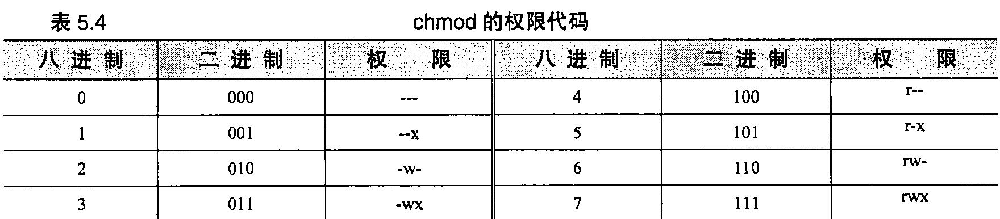  <b></b>

例如，chmod 711 myprog赋予属主所有的极限，而只给其他每个人赋予执行权限（如果myprog是一个shell脚本，那么它需要同时打开读取和执行的权限=为了让解释程序运行这个脚本，这个脚本必须像文本文件一样被打开和读取=二进制文件是由内核直接执行的，因此不需要打开读取权限）。

chmod的助记语法的全部信息可以在chmod的手册页中找到。其规则的一些示例如表5.5所示。

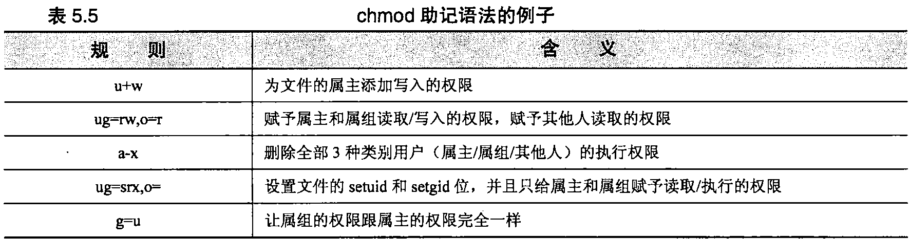  <b></b>

使用助记语法的困难之处在于要记住o代表“owner（属主）”还是“other （其他人）”（正确答案 是其他人）。只要类比UID和GID记住u和g，那么就只剩下一种可能了。

您还可以通过类比一个现有的文件来指定要分配的权限模式。例如，chmod -reference=filea fileb 让fileb的权限模式和filea的权限模式一样。

chmod可以使归地更新某个目录下文件的权限。不过，这可比它看上去更需慎重对待，因为包含进来可能不是全都有相同的属性（例如，有些文件可能是可执行文件，而 别的文件可能是文本文件）。采用-R选项时使用助记语法格外有用，因为没有明确设置的任何位，其 值都保持不变。例如：

$ chmod -R g+w mydir

给mydir及其所有内容増加了属组的写入权限，同时又不会弄错目录以及程序的执行位。

#### 5.5.6 chown:改变归属关系和组 ####

chown命令改变文件和文件的属组所有权。chown的语法跟chmod类似，只不过它的第一个参数以user:group的形式指定了新的属主和属组。属主和属组之一都可以为空。如果没有属组，也就不需要冒号（:）了，但是带上冒号，会让chown命令把user的属组设为默认组。出于历史原因，user.group 这样的形式也能接受，但是由于用户名可以包括点，所以这种形式不够通用。

要改变一个文件的属组，您必须是该文件的属主而且属于目标属组的成员，或者必须是超级用户。您必须是超级用户才能改变文件的属主。

类似chmod, chown也提供了递归的-R标志，能够改变一个目录以及在它之下所有文件的设定。例如，命令序列：

	#	chmod 755 ~matt
	
	#	chown -R matt:staff ~matt

可以在复制了默认启动文件以后用来建立一个新用户的主目录。一定不要采用类似下面的命令来chown新用户的点文件（.）：

	#	chown -R matt:staff -*matt/.*

这个模式将匹导致其父目录的归属关系被修改，而且很可能还会造成其他用户主目录 归属关系被修改。

传统的UNIX系统使用一个单独的命令（chgrp）去改变一个文件的属组。Linux也一样提供了chgrp 命令。它的用法与chown命令基本相同。

#### 5.5.7 umask:分配默认的权限 ####

用户可以使用内建的shell命令umask来影响分配给新创建文件的默认权限。umask用一个三位数字的八进制值形式来指定，这个值代表要“剥夺”的权限。当创建文件时，它的权限就设置为创建 程序请求的任何权限去掉umask禁止的权限。因此umask的三位数字所对应的权限如表5.6所示。

例如，umask 027允许属主具有所有权限，但禁止属组的写入权限，并且不允许其他任何用户有 任何权限。默认的umask值是022,它不允许属组和其他用户有写入权限。

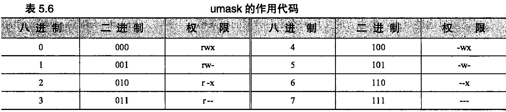  <b></b>

没有办法强制用户拥有某个特定的umask值，因为用户能够把这个值重设为他们想要的任何值。 但是，在给新用户提供的.cshrc和.profile样本文件中，可以提供一个合适的默认值。有关启动文件的 更多信息请参见第6章。

#### 5.5.8额外的标志 ####

Linux的ext2fs和ext3fs文件系统定义了一些补充属性，您可以打开它们来请求获得特殊的文件 系统语义一“请求”是操作字，因为许多标志实际上还没有实现。例如，一个标志让文件只能追加 （append）,另一个标志让文件不可变动和不可删除。

既然这些标志不能用于ext*系列以外的其他文件系统，所以Linux使用了特殊命令lsattr和chattr 来查看和改变它们。表5.7列出了当前能用的标志（目前大约只占在手册页中提到的那些标志的50%）。

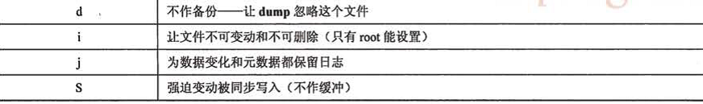

除了 “不作备份”标志可能有所例外，还不清楚它们中间别的功能可以提供多少日用价值。"不可改变”和“仅限追加”标志多被认为能让系统对黑客或者恶意代码损坏的抵抗力更强。遗憾的是，它们会搞乱软件，并且只能防止还不知道使用chattr-ia的黑客的攻击(在20.6节介绍的“权力（capability）”机制使得关闭这些附加标志位变得更困难.但是这项功能目前还没有广泛使用)。实际经验已经表明，这些标 志往往黑客用得比防黑客的还多。

启动同步写的S和D选项也应引起特别注意，由于它们迫使与某个文件和目录有关的所有文件系 统页面都要随变动而立即写出到硬盘上，所以似乎能在发生崩溃的时候提供额外的保护,防止数据丢 失。但是同步更新的操作次序不固定，而且已经知道这会把fsck搞糊涂，因此，可能导致受损文件系 统的恢复更困难而不是更可靠，随ext3fs提供的文件系统日志机制通常是更好的选项。j选项强制对特定文件的数据做日志，但这样会带来一些性能上的开销。

### 5.6访问控制列表 ###

9位的属主/属组/其他人访问控制系统己得到证明是强大的，足以满足大多数管理方面的需求。虽然这种系统有明显的局限性，但是它却非常好地保持了UNIX简洁和可预测的传统（有人可能会说是 “前传统”）。

事实上，在所有非UNIX的操作系统上都采用了一种实质上更为复杂的方式来管理对于文件的访问：访问控制列表（access control list）,简称ACL。ACL不限长度，可以包含用于多个 用户或者用户组的权限规定。更先进的系统能让系统管理员指定部分权限的集合或者否定方式 的权限。有些系统还有继承特性，可以一次依靠多个ACL来指定访问权限。这些系统显然比传 统的UNIX模型功能更强，但是对于系统管理员和软件开发人员来说，它们的复杂性也增加了一个数量级，

因为在POSIX规范中增加了 ACL,所以许多UNIX的变体也开始支持一种相当标准的ACL机制, 这种机制和传统的UNIX 9位权限模式平行地发挥作用。在Linux下，ext2、ext3、ReiserFS、XFS和 JFS都支持ACL。通常在默认情况下会禁用它们，在调用mount命令时加h, acl选项就可以启用ACL。 **参考7.4.5节**了解有关mount命令的更多知识，

为了内容的完整性，我们在这里介绍Linux的ACL模型。但是不要被其华丽的外表所迷惑一 ACL不一定比传统的文件权限更好，在行的系统管理员应该在一定程度上谨慎地使用它们。不仅因为它们用起来复杂而且费事，而且它们在和NFS、备份系统以及文本编辑器这样的程序联用的时候也会 造成问题。ACL在不断变化，所以随着时间推移在变得不可维护。

使用ACL表面上看起来圾能让人接受的理由或许就是增强与其他操作系统的兼容性。具体来说，用来和Windows系统共享文件的Samba软件能够识别ACL,实实在在地在Linux和Windows的ACL 之间进行转换。**参考26.6节了解有关Samba的更多信息**。

#### 5.6.1	ACL 概述 ####

Linux的ACL主要是对标准的9位权限模型直接进行扩展。读写和执行权限只是系统能够处理的 权力(capability)。而像setuid和粘附位这样的功能还是通过传统的模式位专门处理。

ACL可以按照用户和用户组的任意组合独立地设置rwx权限位。表5.8列出了 ACL各组成项的 样子。

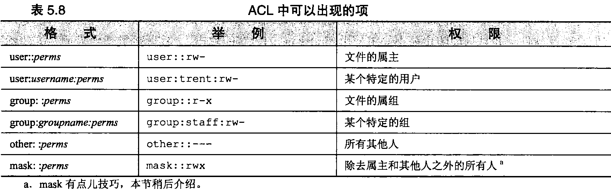  <b></b>

user和group可以用名字或者UID/GID来标识。一个ACL能包含的组成项的数量随着文件系统 实现的不同而不同，范围从XFS的最低25项，到ReiserFS和JFS的最多可以没有限制。ext2和ext3 文件系统可以有32项，对于在任何情况下都能管理来说，这或许是一个比较合理的上限。

getfacl命令可以显示一个文件当前的ACL, setfacl命令可以修改或者设置文件当前的ACL。setfacl -b file 命令可以清除 ACL, setfacl -m aclspec file 可以修改或者扩展 ACL，而 setfacl -x aclspec yz/e可以删除ACL中的特定项(使用-x选项时省略权限说明部分)。只要在aclspec中用逗号分隔ACL项，就能够在其中包含多个ACL项。

带有ACL的文件仍然保留有它们原来的权限模式位，但是会自动在两套权限设置之间强制保持 一致，使它们一定不发生冲突。下面的例子展示了 ACL项随着chmod命令对权限模式位的修改而自 动更新的情况：

	$ touch /tmp/example
	
	$ ls -1 /tmp/example
	
	-rw-rw-r- 1 garth garth 0 Jun 14 15:57 /tmp/example
	
	$ getfacl /tmp/example
	
	getfacl: Removing leading '/' from absolute path names
	
	#	file: tmp/example
	
	#	owner: garth
	
	#	group: garth user::rw-group::rw-other::r-
	
	$ chmod 640 /tmp/example
	
	$ getfacl —omit-header /tmp/example
	
	user::rw-
	
	group::r--
	
	other::---

这种强制保持一致的做法让不知道ACL的老软件在有ACL的情况下也能很好地工作。不过有一点问题。虽然前面例子中group::这个ACL项似乎对应了传统权限模式的中间一组权限位，但情况不一定总是这样。

为了理解其中的原委，假定有个老程序清除了传统权限模式中所有三组权限位中的写权限位（例 如，chmod ugo-w file）。这样做的目的很清楚，就是不让任何人能够写这个文件。但是如果产生的ACL将会是下面这个样子该怎么办？

	user::r-
	
	group::r-
	
	group:staff:rw-
	
	other::r-

从老程序的角度来看，文件不能修改，但是staff组中的任何成员实际上都对文件有写权。为了减 少出现二义性和误会的机会，Linux采用了下面的规则。

- ACL项user::和other::定义为等价于传统文件模式中“owner（属主）”和“other（其他人）” 的权限位。权限模式改变，对应的ACL项也改变。反之亦然。

- 在所有情况下，对于文件的属主以及没有以别的方式提到的用户，给它们赋予的有效访问权 限就是在user::和other::这两个ACL项中分别指定的权限。

- 如果一个文件没有显示规定的ACL,或者一个ACL只包含一个user::、一个group::和一个other:: 项，那么这几个ACL项等同于传统的三组权限位。上面给出的getfacl的例子就属于这种情况。（这样的ACL称为“最小” ACL，实际上不需要按一个逻辑上独立的ACL来实现。）

- 在更复杂的ACL里，传统的组权限位对应于一个称为“mask”的特殊ACL项，而不是group:: 那个ACL项。ACL的mask项限制了 ACL能够赋予所有有名字的用户、所有有名字的组以 及默认组的访问权限。

换句话说，mask规定了 ACL能够给单个组和用户访问权限的上限。它在概念上类似于umask, 不同之处在于ACL的mask始终有效，而且规定的是允许的权限，而不是不允许的权限。给有名字的 用户、有名字的组以及默认组的ACL项包括mask中没有出现的权限位，但是内核会忽略它们。

因此，传统的权限模式位不会描述不了 ACL所允许的访问权限。而且从传统权限模式的组权限位中清除一位，也会清除ACL mask中对应的位，因而让除了该文件的属主以及处于“other”类的用 户之外的所有人都没有该权限。

扩充前面例子里的ACL，使它包括对某个特定用户和组的ACL项，setfacl会自动提供一个合适 的 mask：

	$ setfacl -m user::r,user:trent:rw,group:admin:rw /tmp/example
	
	$ ls -1 /tmp/example
	
	-r--rw——+ 1 garth staff 0 Jun 14 15:57 /tmp/example
	
	$ getfacl —omit-header /tmp/example
	
	user::r--
	
	user:trent:rw-
	
	group::r-
	
	group:admin:rw-
	
	mask::rw-
	
	other::--

如前所示，setfacl命令产生了一个mask,让ACL中赋予的所有权限都发生作用。如果不想手工设置mask,可以在给setfacl命令的ACL项清单中包含这个mask,或者使用-n选项避免setfacl命令重复产生它。

在尝试访问文件的时候，要把有效UID同该文件属主的UID进行比较。如果它们两者一样，那么ACL中的user:项权限就决定了能否访问。否则，如果匹配某个特定于用户的ACL项，那么那个ACL项连同ACL的mask就一起决定了能否访问。如果没有特定于某个用户的ACL项，那么文件系统就尝试找到一个有效的组ACL项，能提供所请求的访问。这样的ACL也要和ACL的mask一起处理。如果没有找割匹配项，那么再用other::这个ACL项。

如果在一个有ACL的文件上使用传统的chmod命令来控制组的访问权限，那么要注意修改只对mask有影响。继续用前面的例子来说明：

	$ chmod 770 /tmp/example
	
	$ ls -1 /tmp/example
	
	-rwxrwx—+ 1 garth staff 0 Jun 14 15:57 /tmp/example
	
	$ getfacl —omit-header /tmp/example
	
	user::rwx
	
	user:trent:rw-
	
	group::r--
	
	group:admin:rw-
	
	mask::rwx
	
	other::--

这里ls命令的输出有点误导性。尽管表面上看给组权限，但是没有人因为是组成员而有权执行该文件。为了让组有这样的权限，必须编辑ACL本身。

#### 5.6.2默认项 ####

除了表5.8列出的ACL项之外，目录的ACL可以包括一个“default（默认）”项，加到在目录下新创建的文件和子目录的ACL上。子目录能接收主动和默认形式的ACL项。因此，最初的默认项最后会向下加给几层子目录。

在复制了默认项之后，父子ACL之间就不再有联系。如果父亲的默认项发生变化，不会反映到现有子目录的ACL上。

### 5.7习题 ###

- E5.1什么是umask?创建一个umask，对于属组或者其他人什么权限也不给。

- E5.2硬链接和符号（软）链接之间有什么不同？什么时候适用哪一种链接？

- ★E5.3阅读/etc/fstab文件的手册页。编写一行配置，在启动时自动安装一个Windows NTFS 分区/dev/hdal。使用/mnt/win_c作为安装点。

- ★E5.4在安装一个Linux系统的时候，对硬盘驱动器分区用来给每个文件系统（/var、/nsr 等）分配足够的空间很重要。“Foobar Linux”发行版本（译者注：这是作者为举例 而随便杜撰的一个发行版本）使用下面的默认设置：

	/	100MB
	
	/var 50MB /boot 10MB <swap> 128MB /usr 剩余的空间在一个繁忙的服务器上采用这样的安排会有什么样的潜在问题？

- ★E5.5为什么说将有些分区（比如/var、/home和交换分区）放到一个和其他数据文件以及 程序不同的单独驱动器上是个好主意？ /trap呢？对于列出的每种文件系统给出有针对性的理由。

- ★E5.6写一个脚本，找到一个文件系统上所有的硬链接=

- ★E5.7给出完成下面任务的命令：

	a）	把README的权限设置为对属主有读/写权，而其他每个人有读权；
	
	b）	在不需要改变（或者知道）目前权限的情况下，打开一个文件的setuid位;
	
	c）	列出当前目录的内容，按照修改时间排序，把最近修改的文件放在最后；
	
	d）	将一个叫做shared的文件的属组从“user”改成“friends”。

# 第二部分 —— 网络管理技术 #

描述了Linux系统使用的各种协议，介绍了用来安装、扩展和维护网络所使用的各种技术。在这个部分中还介绍了高层网络软件。各章的专题内容包括域名系统、网络文件系统、路由技术、sendmail和网络管理。

# 第三部分 —— 其它管理技术 #

包括各种各样的补充信息，例如Linux的打印系统。
